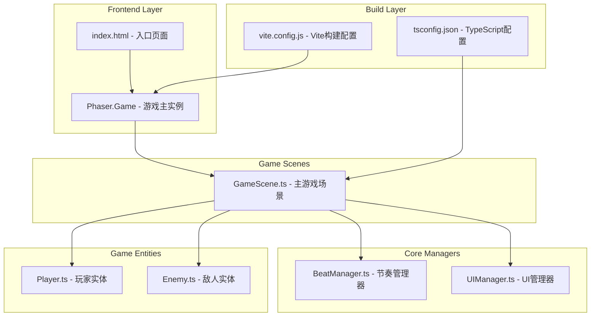

## 1. 架构设计



## 2. 技术选型说明

- **前端框架**：Phaser.js@3.60.0 - 专门用于2D游戏开发的框架，内置物理引擎、动画系统、粒子系统
- **开发语言**：TypeScript (ES2020) - 提供类型安全，提升代码可维护性
- **构建工具**：Vite - 快速的开发构建工具，支持热重载
- **状态管理**：Phaser 内置事件系统 (EventEmitter) - 轻量级事件通信
- **渲染**：Phaser WebGL/Canvas 自动降级 - 保证在各种设备上的兼容性

## 3. 目录结构

```
auto2/
├── .trae/documents/
│   ├── PRD.md                 # 产品需求文档
│   └── TECH-ARCHITECTURE.md   # 技术架构文档
├── src/
│   ├── GameScene.ts           # 主游戏场景
│   ├── BeatManager.ts         # 节奏管理器
│   ├── Player.ts              # 玩家实体
│   ├── Enemy.ts               # 敌人实体
│   └── UIManager.ts           # UI管理器
├── index.html                 # 入口HTML
├── package.json               # 依赖配置
├── vite.config.js             # Vite构建配置
└── tsconfig.json              # TypeScript配置
```

## 4. 核心类与模块定义

### 4.1 BeatManager（节奏管理器）
```typescript
interface IBeatManager {
  bpm: number;                      // 节拍速度
  beatInterval: number;             // 节拍间隔(ms)
  onBeat: Phaser.Events.EventEmitter;
  start(): void;                    // 开始节拍
  stop(): void;                     // 停止节拍
  isOnBeat(tolerance?: number): boolean;  // 当前是否在节拍点
  getBeatProgress(): number;        // 当前节拍进度(0-1)
}
```

### 4.2 Player（玩家实体）
```typescript
interface IPlayer {
  gridX: number;
  gridY: number;
  health: number;
  attackPower: number;
  move(direction: 'up'|'down'|'left'|'right'): boolean;  // 在节拍点移动
  attack(targetEnemy: Enemy): boolean;                   // 在节拍点攻击
  onBeatHit(): void;     // 命中节拍回调
  onBeatMiss(): void;    // 错过节拍回调
}
```

### 4.3 Enemy（敌人实体）
```typescript
interface IEnemy {
  gridX: number;
  gridY: number;
  health: number;
  damage: number;
  takeDamage(amount: number): boolean;  // 受击，返回是否死亡
  moveTowardsPlayer(playerGridX: number, playerGridY: number): void;  // AI追踪
  onDeath(): void;                       // 死亡回调
}
```

### 4.4 UIManager（UI管理器）
```typescript
interface IUIManager {
  score: number;
  combo: number;
  createBeatIndicator(): void;    // 创建节拍指示器（同心圆环）
  updateBeatIndicator(progress: number): void;  // 更新节拍动画
  flashScreen(): void;            // 节拍点屏幕闪烁
  addScore(points: number): void;
  incrementCombo(): void;
  resetCombo(): void;
  createParticles(x: number, y: number, type: 'hit'|'death'|'note'): void;
}
```

### 4.5 GameScene（主游戏场景）
```typescript
interface IGameScene {
  tileSize: number;               // 格子大小
  mapWidth: number;               // 地图宽度(格子数)
  mapHeight: number;              // 地图高度(格子数)
  generateMap(): void;            // 生成随机地牢
  setupInput(): void;             // 注册键盘/触摸输入
  onPlayerAction(): void;         // 玩家行动节拍判定
  onEnemyTurn(): void;            // 敌人回合
  checkGameState(): void;         // 检查游戏胜负
}
```

## 5. 地图数据结构

```typescript
enum TileType {
  WALL = 0,
  FLOOR = 1,
  CHEST = 2,
  PLAYER_SPAWN = 3,
  ENEMY_SPAWN = 4,
}

interface GameMap {
  width: number;
  height: number;
  tiles: TileType[][];
  playerSpawn: { x: number; y: number };
  enemySpawns: { x: number; y: number }[];
  chests: { x: number; y: number }[];
}
```

## 6. 事件系统（Phaser EventEmitter）

| 事件名 | 触发时机 | 数据 |
|--------|----------|------|
| 'beat' | 每个节拍点触发 | { beatCount: number } |
| 'player-move' | 玩家成功移动 | { x, y, hit: boolean } |
| 'player-attack' | 玩家攻击 | { target, damage, hit: boolean } |
| 'enemy-death' | 敌人死亡 | { enemy, score } |
| 'combo-update' | 连击变化 | { combo, score } |
| 'game-over' | 游戏结束 | { win: boolean, finalScore } |

## 7. 性能优化策略

1. **对象池模式**：粒子特效、敌人实体使用对象池复用，避免频繁GC
2. **瓦片地图**：使用 Phaser Tilemap 渲染地图，而非单独Sprite
3. **事件驱动**：节拍判定使用定时器事件，而非每帧检查
4. **脏矩形渲染**：UI层仅在数据变化时重绘
5. **纹理图集**：所有UI元素使用单一纹理图集，减少Draw Call
6. **节流更新**：非关键逻辑（如敌人AI）降低更新频率
