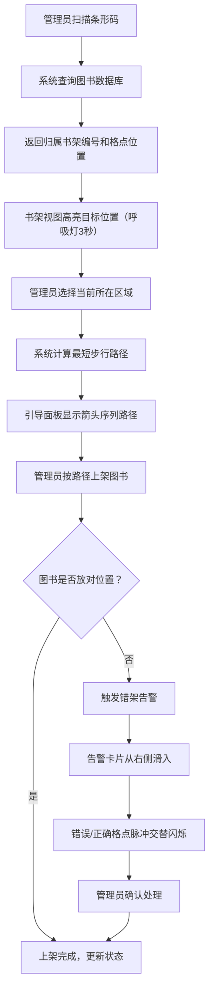

## 1. 产品概述

智能书架管理系统是一套面向社区图书馆管理员的图书位置追踪与上架引导工具，解决读者还书时放错书架的痛点。系统通过扫描条形码自动识别图书归属位置、计算最短上架路径、生成借阅热力图、实时检测错架并告警，同时提供读者行为分析和可视化报表导出功能。

- 目标用户：社区图书馆管理员
- 核心价值：减少图书错架率、提升上架效率、可视化借阅行为以优化书架布局

## 2. 核心功能

### 2.1 用户角色

| 角色 | 注册方式 | 核心权限 |
|------|----------|----------|
| 管理员 | 系统预设账号 | 扫描识别、上架引导、错架处理、报表导出、读者分析 |
| 访客 | 无需注册 | 查看借阅热力图和书架状态（只读） |

### 2.2 功能模块

1. **书架管理主页面**：2.5D等距书架视图、条形码扫描输入、上架引导面板、借阅热力图覆盖层
2. **读者行为分析面板**：圆形辐射图、年龄段借阅偏好、扇形展开详情

### 2.3 页面详情

| 页面名称 | 模块名称 | 功能描述 |
|----------|----------|----------|
| 书架管理主页 | 书架2.5D视图 | 以等距视角渲染书架，每本书以彩色书脊表示分类，支持拖拽图书到格点、高亮目标位置（呼吸灯3秒） |
| 书架管理主页 | 条形码扫描输入 | 管理员输入条形码模拟扫描，系统实时返回归属书架编号和格点位置，书架视图高亮目标 |
| 书架管理主页 | 上架引导面板 | 毛玻璃侧边栏，显示待上架书籍列表和最佳路径，箭头序列在平面图上逐步移动并更新距离 |
| 书架管理主页 | 借阅热力图 | 按书架格点生成热力图覆盖层，红色为高频借阅区（前20%），蓝色为低频区，渐入渐出过渡 |
| 书架管理主页 | 错架检测告警 | 拖拽图书到错误格点时，右侧滑入告警卡片（含封面缩略图、错误/正确位置），脉冲光晕交替闪烁 |
| 书架管理主页 | 读者行为分析 | 圆形辐射图展示不同年龄段借阅偏好，扇形可点击展开详情（占比、TOP5书籍），缩放+透明度动画 |
| 书架管理主页 | 报表导出 | 导出书架状态、错架统计和借阅热力图为PDF，显示0-100%平滑填充进度条，完成后自动下载 |

## 3. 核心流程

**图书上架流程**：管理员扫描条形码 → 系统查询图书数据库 → 返回归属书架和格点 → 书架视图高亮目标（呼吸灯3秒） → 管理员选择当前位置 → 系统计算最短路径 → 箭头序列引导上架

**错架检测流程**：管理员拖拽图书到格点 → 系统比对图书分类与格点归属 → 如果不匹配则触发告警 → 右侧滑入告警卡片 → 错误和正确格点交替脉冲闪烁 → 管理员确认处理

**热力图更新流程**：系统统计每本书借阅次数 → 按格点聚合计算频率 → 前20%标红、其余渐变至蓝色 → 覆盖层渲染在书架视图上

## 4. 用户界面设计

### 4.1 设计风格

- 主色调：木质暖色 #8B5A2B，辅助色：米白 #F5F0E8，点缀色：淡金 #D4AF37
- 按钮风格：圆角（8px），柔和阴影，按压时0.1秒缩放反馈（scale 0.95）
- 字体：系统无衬线字体（-apple-system, BlinkMacSystemFont, "Segoe UI", sans-serif）
- 布局风格：左侧书架视图（主区域）+ 右侧引导面板（毛玻璃效果）
- 图标风格：线性图标库（Lucide Icons），颜色从主题色板提取
- 书脊颜色分类：文学蓝 #4A90D9、科技绿 #27AE60、历史橙 #E67E22、艺术紫 #8E44AD、少儿黄 #F1C40F、生活粉 #E91E8B

### 4.2 页面设计概览

| 页面名称 | 模块名称 | UI元素 |
|----------|----------|--------|
| 书架管理主页 | 书架2.5D视图 | 等距视角书架层板，木纹纹理背景，轻微投影，书脊彩色矩形，呼吸灯动画（box-shadow脉冲3秒），拖拽交互 |
| 书架管理主页 | 上架引导面板 | 毛玻璃侧边栏（backdrop-filter blur + 半透明背景），圆角卡片，柔和阴影，箭头路径图，步数和距离文字 |
| 书架管理主页 | 借阅热力图 | 渐变色彩覆盖层（红→黄→蓝），0.4秒淡入淡出过渡，格点hover显示借阅次数 |
| 书架管理主页 | 错架告警卡片 | 右侧滑入动画（translateX 100%→0），封面缩略图，脉冲光晕（box-shadow红/绿交替闪烁），确认按钮 |
| 书架管理主页 | 读者行为分析 | 圆形辐射图（SVG/Canvas），扇形点击展开缩放+透明度动画，年龄段标签，TOP5书籍列表 |
| 书架管理主页 | 报表导出 | 进度条（0%→100%平滑填充），导出按钮，加载遮罩 |

### 4.3 响应式适配

- 桌面端（≥1024px）：左侧书架视图 + 右侧引导面板并排
- 平板端（768px-1023px）：保持正常布局，字体和控件放大1.2倍
- 移动端（<768px）：书架视图切换为2D俯视图，隐藏侧边面板，改为底部可收起抽屉

### 4.4 交互微动效

- 按钮按压：0.1秒 scale(0.95) 缩放反馈
- 卡片悬停：translateY(-2px) + shadow加深
- 热力图切换：0.4秒淡入淡出
- 透视图切换：0.4秒淡入淡出
- 告警卡片：从右侧滑入（0.3秒 ease-out）
- 呼吸灯：3秒 box-shadow 脉冲动画
- 脉冲光晕：红/绿交替闪烁，1秒周期
