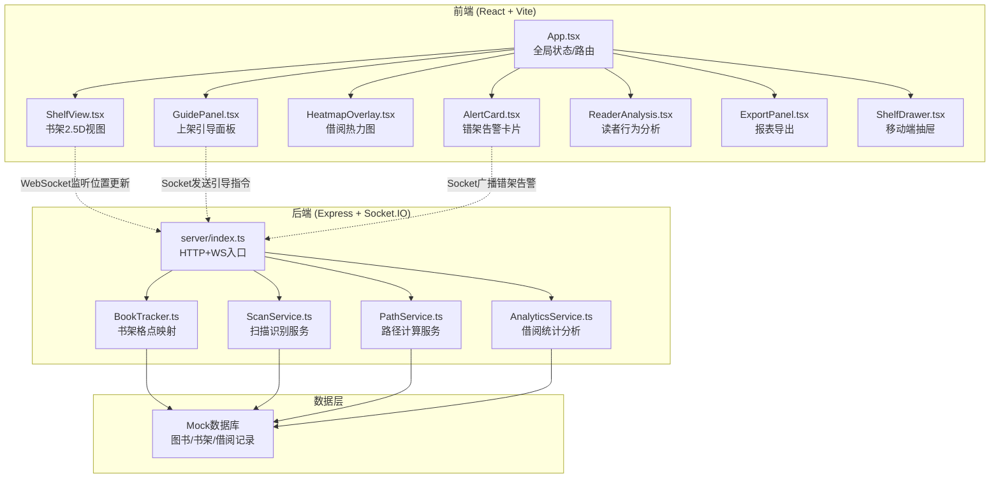
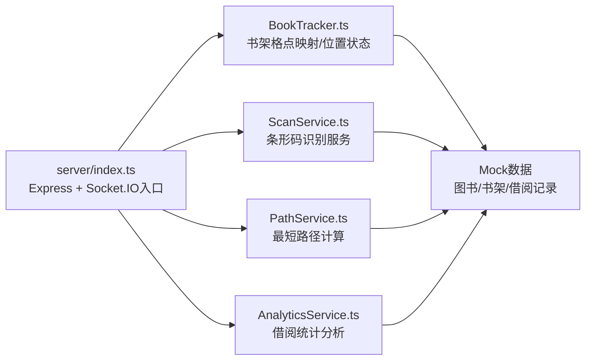
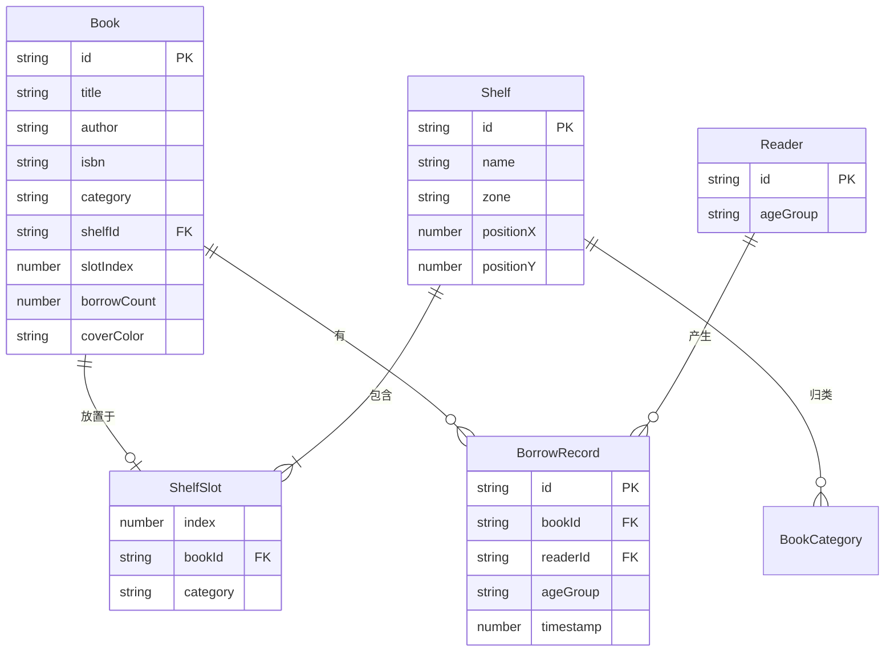

## 1. 架构设计



## 2. 技术说明

- 前端：React@18 + TypeScript + Tailwind CSS + Vite
- 初始化工具：vite-init (react-express-ts 模板)
- 后端：Express@4 + Socket.IO
- 数据库：Mock数据（内存中维护图书、书架和借阅记录数组）
- 实时通信：Socket.IO（WebSocket推送位置更新、告警、热力图数据）
- 状态管理：Zustand（前端全局状态）
- 图表渲染：Canvas/SVG（热力图、辐射图）
- PDF导出：浏览器端Canvas截图 + jsPDF

## 3. 路由定义

| 路由 | 用途 |
|------|------|
| / | 书架管理主页面（包含书架视图、引导面板、热力图、告警、分析面板、导出） |

## 4. API定义

### 4.1 共享类型 (src/types.ts)

```typescript
interface Book {
  id: string;
  title: string;
  author: string;
  isbn: string;
  category: BookCategory;
  shelfId: string;
  slotIndex: number;
  borrowCount: number;
  coverColor: string;
}

type BookCategory = 'literature' | 'science' | 'history' | 'art' | 'children' | 'lifestyle';

interface Shelf {
  id: string;
  name: string;
  zone: string;
  categories: BookCategory[];
  slots: ShelfSlot[];
  position: { x: number; y: number };
}

interface ShelfSlot {
  index: number;
  bookId: string | null;
  category: BookCategory;
}

interface LocationEvent {
  bookId: string;
  targetShelfId: string;
  targetSlotIndex: number;
  timestamp: number;
}

interface MisplaceAlert {
  id: string;
  book: Book;
  wrongShelfId: string;
  wrongSlotIndex: number;
  correctShelfId: string;
  correctSlotIndex: number;
  timestamp: number;
  acknowledged: boolean;
}

interface GuidePath {
  steps: PathStep[];
  totalDistance: number;
}

interface PathStep {
  from: { x: number; y: number };
  to: { x: number; y: number };
  direction: 'up' | 'down' | 'left' | 'right';
  distance: number;
}

interface ReaderProfile {
  ageGroup: 'children' | 'youth' | 'adult' | 'senior';
  borrowCount: number;
  topBooks: Book[];
  percentage: number;
}
```

### 4.2 Socket.IO 事件

| 事件名 | 方向 | 数据类型 | 描述 |
|--------|------|----------|------|
| scan:book | Client→Server | { barcode: string } | 扫描条形码请求 |
| scan:result | Server→Client | { book: Book, location: ShelfSlot } | 扫描识别结果 |
| guide:request | Client→Server | { bookId: string, currentZone: string } | 请求上架路径 |
| guide:path | Server→Client | GuidePath | 上架引导路径 |
| misplace:alert | Server→Client | MisplaceAlert | 错架告警 |
| misplace:acknowledge | Client→Server | { alertId: string } | 确认处理告警 |
| heatmap:update | Server→Client | { slots: { shelfId: string, slotIndex: number, intensity: number }[] } | 热力图数据更新 |
| analytics:request | Client→Server | {} | 请求读者行为分析数据 |
| analytics:result | Server→Client | ReaderProfile[] | 读者行为分析结果 |

## 5. 服务端架构图



## 6. 数据模型

### 6.1 数据模型定义



### 6.2 Mock初始数据

系统预置6个书架（A-F区），每个书架10个格点，共60本书覆盖6个分类，以及200条模拟借阅记录，覆盖少儿/青年/成人/老年四个年龄段。
