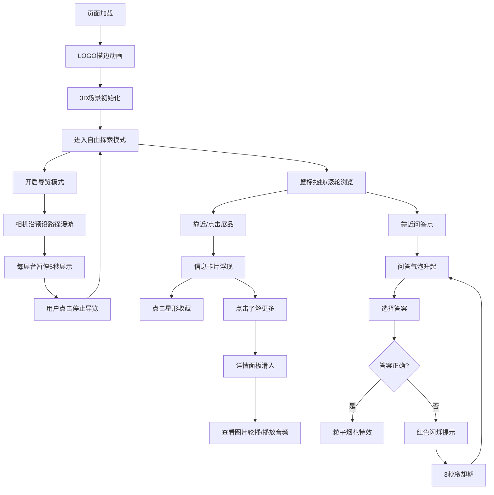

## 1. 产品概述

在线虚拟博物馆探索应用，用户可在3D沉浸式展厅中自由浏览艺术展品、查看详细信息并参与互动问答挑战。应用结合Three.js构建的高品质3D场景与实时WebSocket交互，为用户提供足不出户的博物馆体验。

- **核心价值**：打破时空限制，让艺术珍品触手可及，通过互动元素提升学习趣味性
- **目标用户**：艺术爱好者、学生、文化旅行者
- **市场定位**：高端文化艺术类Web应用，兼顾教育性与观赏性

## 2. 核心功能

### 2.1 用户角色
| 角色 | 注册方式 | 核心权限 |
|------|----------|----------|
| 游客用户 | 无需注册 | 浏览展厅、查看展品、参与问答 |

### 2.2 功能模块
1. **3D虚拟展厅**：沉浸式3D空间，包含多个展台、走廊、暖色调环境
2. **展品互动系统**：点击/靠近展品显示信息卡片，详情面板展示完整内容
3. **实时问答挑战**：三个随机分布问答点，WebSocket实时同步答题状态
4. **收藏与进度系统**：星形收藏按钮，可折叠收藏抽屉，相机快速跳转
5. **自动导览模式**：预设路径漫游，自动暂停展示，可随时退出

### 2.3 页面详情
| 页面名称 | 模块名称 | 功能描述 |
|----------|----------|----------|
| 主展厅 | 3D场景渲染 | Three.js渲染室内空间，6个展品展台，3个问答点，灯光系统 |
| 主展厅 | 相机控制系统 | 鼠标拖拽旋转、滚轮缩放、平滑阻尼效果 |
| 主展厅 | 信息卡片组件 | 半透明毛玻璃卡片，淡入浮动动画，星形收藏按钮 |
| 主展厅 | 详情面板 | 右侧滑入，包含文字描述、图片轮播、音频播放 |
| 主展厅 | 问答气泡 | 地面升起对话框，答题反馈粒子特效 |
| 主展厅 | 收藏抽屉 | 左侧滑出，弹性回弹动画，列表项跳转功能 |
| 主展厅 | 导览控制 | 开始/停止导览按钮，相机路径动画 |

## 3. 核心流程

用户进入应用后，首先看到博物馆LOGO描边动画，加载完成后进入3D展厅。用户可自由探索或开启导览模式，浏览过程中可点击展品查看详情、收藏喜欢的展品，靠近问答点参与互动挑战。

## 4. 用户界面设计

### 4.1 设计风格
- **主色调**：暖米色 #F5E6D0（背景）、深棕色 #5D4037（文字/边框）、金色 #FFD700（点缀/高亮）
- **按钮风格**：圆角8px，深棕色填充配金色文字，悬停时金色边框发光
- **字体**：标题使用 "Playfair Display" 衬线字体，正文使用 "Cormorant Garamond" 优雅衬线体
- **布局**：卡片式布局，3D场景全屏展示，UI元素悬浮覆盖
- **视觉细节**：所有元素圆角设计，背景叠加极细微纸纹理，毛玻璃效果（backdrop-filter）

### 4.2 页面设计概述
| 页面名称 | 模块名称 | UI元素 |
|----------|----------|----------|
| 主展厅 | 加载界面 | 博物馆轮廓LOGO描边绘制动画，金色渐变进度条 |
| 主展厅 | 信息卡片 | 半透明白色毛玻璃，12px圆角，向上浮动0.3秒淡入 |
| 主展厅 | 详情面板 | 右侧滑入，宽度30%，16px圆角，内嵌阴影，图片轮播指示器 |
| 主展厅 | 收藏抽屉 | 左侧滑出，弹性回弹，列表项悬停金色边框 |
| 主展厅 | 问答气泡 | 底部升起，圆角对话框，选项按钮金色高亮 |
| 主展厅 | 导览按钮 | 右上角悬浮，金色图标，深棕色背景 |
| 主展厅 | 粒子特效 | 彩色粒子向上喷射，金色为主，缓慢下落消散 |

### 4.3 响应式设计
- **宽屏 (>1024px)**：全屏3D场景，完整功能体验
- **平板 (768-1024px)**：3D场景保持完整，UI元素适当缩放，交互功能完整
- **手机 (<768px)**：自动切换为2D列表视图，隐藏3D场景，展品以卡片列表形式展示

### 4.4 3D场景设计
- **环境**：室内博物馆展厅，暖米色墙面，深棕色木纹地板，隐形天花板
- **灯光**：环境光(0xffffff, 0.6) + 半球光(暖米色, 深棕色, 0.4) + 每个展品独立聚光灯(0xffd700, 1.0)
- **相机**：PerspectiveCamera，fov 60，位置 [0, 2, 8]，OrbitControls 带阻尼效果(0.08)
- **构图**：中心对称布局，6个展台分两排排列，3个问答点穿插其间
- **交互**：OrbitControls 自由控制，最小距离3，最大距离15，极角限制10°-85°
- **后处理**：轻微Bloom效果，ACES电影色调映射，抗锯齿
- **性能**：展品模型单模型<5000三角面，总加载时间<3秒，帧率>30FPS
