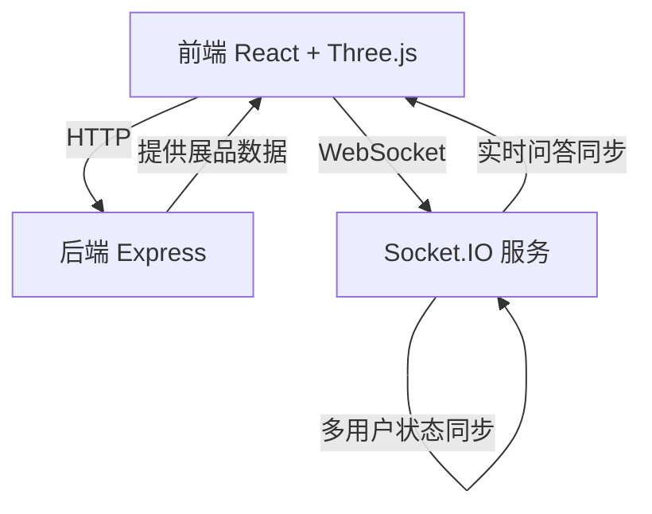
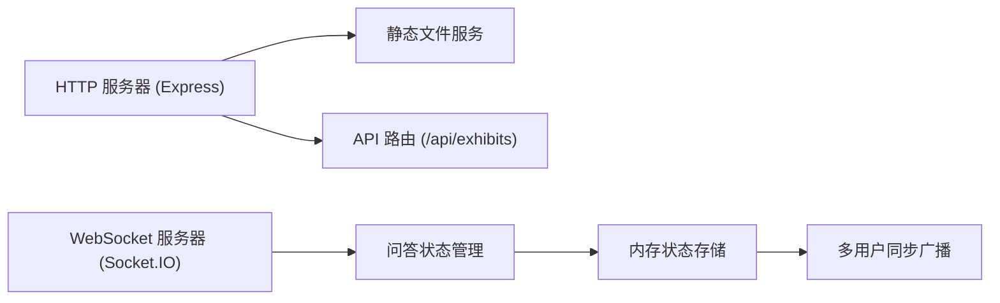
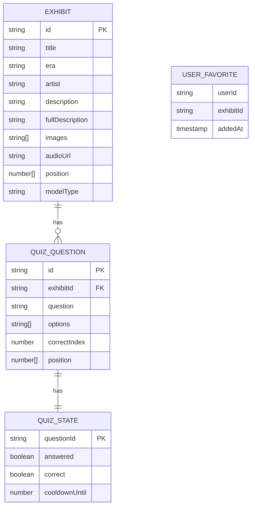

## 1. 架构设计



## 2. 技术描述

- **前端**：React 18 + TypeScript + Vite 5 + Three.js 0.160 + @react-three/fiber 8 + @react-three/drei 9 + Zustand 4 + Framer Motion 11
- **构建工具**：Vite 5，代理API请求到后端 `/api` 路径
- **后端**：Node.js + Express 4 + Socket.IO 4 + TypeScript + ts-node
- **数据层**：内存数据存储（展品数据、问答题库），WebSocket实时状态同步
- **状态管理**：Zustand 管理应用全局状态（收藏夹、当前展品、导览状态）

## 3. 目录结构

```
auto22/
├── src/                          # 前端代码
│   ├── main.tsx                  # 入口文件
│   ├── App.tsx                   # 根组件
│   ├── components/
│   │   ├── Museum.tsx            # 3D展厅主组件
│   │   ├── ExhibitCard.tsx       # 展品信息卡片
│   │   ├── ExhibitDetail.tsx     # 展品详情面板
│   │   ├── FavoritesDrawer.tsx   # 收藏夹抽屉
│   │   ├── QuizBubble.tsx        # 问答气泡
│   │   ├── TourControls.tsx      # 导览控制按钮
│   │   ├── LoadingScreen.tsx     # 加载动画
│   │   └── Particles.tsx         # 粒子特效组件
│   ├── hooks/
│   │   ├── useSocket.ts          # WebSocket连接钩子
│   │   └── useExhibits.ts        # 展品数据钩子
│   ├── store/
│   │   └── useAppStore.ts        # Zustand 全局状态
│   ├── types/
│   │   └── index.ts              # TypeScript 类型定义
│   ├── data/
│   │   └── exhibits.ts           # 展品模拟数据
│   └── utils/
│       └── helpers.ts            # 工具函数
├── server/                       # 后端代码
│   ├── index.ts                  # 服务器入口
│   ├── exhibits.ts               # 展品数据API
│   └── quiz.ts                   # 问答Socket服务
├── shared/                       # 共享类型
│   └── types.ts
├── index.html
├── vite.config.ts
├── tsconfig.json
├── tsconfig.node.json
├── package.json
└── tailwind.config.js
```

## 4. 路由定义
| 路由 | 用途 |
|------|------|
| / | 主展厅页面（3D场景或2D列表，根据设备自动切换） |

## 5. API 定义

### 5.1 REST API
```typescript
// GET /api/exhibits
// 响应:
interface Exhibit {
  id: string;
  title: string;
  era: string;
  artist: string;
  description: string;
  fullDescription: string;
  images: string[];
  audioUrl?: string;
  position: [number, number, number];
  modelType: 'sculpture' | 'painting' | 'artifact';
}

// GET /api/quiz/questions
// 响应:
interface QuizQuestion {
  id: string;
  exhibitId: string;
  question: string;
  options: string[];
  correctIndex: number;
  position: [number, number, number];
}
```

### 5.2 WebSocket 事件
```typescript
// 客户端 -> 服务器
interface ClientEvents {
  'quiz:answer': (data: { questionId: string; answerIndex: number; userId: string }) => void;
  'quiz:reset': (questionId: string) => void;
}

// 服务器 -> 客户端
interface ServerEvents {
  'quiz:state': (data: { 
    questionId: string; 
    answered: boolean; 
    correct?: boolean;
    cooldownUntil?: number;
  }) => void;
  'quiz:allStates': (states: QuizState[]) => void;
}
```

## 6. 服务器架构



## 7. 核心数据模型

### 7.1 数据模型定义



### 7.2 导览路径点数据
```typescript
interface TourWaypoint {
  position: [number, number, number];
  target: [number, number, number];
  duration: number;
  pauseDuration: number;
  exhibitId?: string;
}

const tourPath: TourWaypoint[] = [
  { position: [0, 2, 8], target: [0, 1.5, 0], duration: 0, pauseDuration: 3 },
  { position: [-4, 2, 5], target: [-4, 1.5, 0], duration: 2, pauseDuration: 5 },
  { position: [-4, 2, -3], target: [-4, 1.5, -3], duration: 2, pauseDuration: 5 },
  { position: [0, 2, -5], target: [0, 1.5, -3], duration: 2, pauseDuration: 5 },
  { position: [4, 2, -3], target: [4, 1.5, -3], duration: 2, pauseDuration: 5 },
  { position: [4, 2, 5], target: [4, 1.5, 0], duration: 2, pauseDuration: 5 },
  { position: [0, 2, 8], target: [0, 1.5, 0], duration: 2, pauseDuration: 3 },
];
```

## 8. 性能优化策略

1. **3D渲染优化**：
   - 几何体复用（InstancedMesh）
   - 纹理压缩（KTX2格式）
   - 视锥体剔除（默认开启）
   - 像素比限制（maxDPR: 2）

2. **模型优化**：
   - 程序化生成低多边形模型（<5000面）
   - LOD（细节层次）控制
   - 阴影贴图分辨率限制（1024x1024）

3. **前端优化**：
   - React Three Fiber 自动渲染优化
   - Zustand 状态选择器避免不必要重渲染
   - Framer Motion GPU加速动画

4. **网络优化**：
   - WebSocket 消息压缩
   - 图片懒加载
   - 代码分割（按需加载3D组件）
