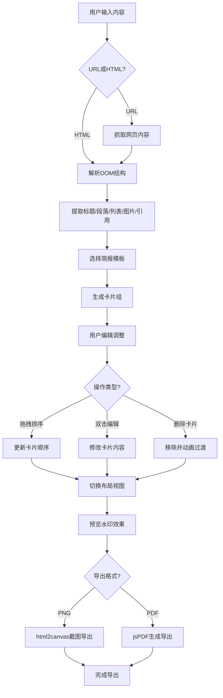

## 1. 产品概述

网页视觉简报生成器是一款将任意网页内容一键转换为结构化视觉简报的Web应用。解决用户手动整理和排版网页要点耗时、缺乏视觉吸引力的痛点，帮助内容创作者、研究员和商务人士快速生成精美简报。

- 核心价值：自动化内容提取 + 精美模板渲染 + 灵活编辑导出
- 目标用户：内容运营、市场分析师、产品经理、学术研究者

## 2. 核心特性

### 2.1 功能模块

1. **内容输入与解析模块**：URL输入框、HTML文本粘贴区、自动内容提取引擎
2. **模板选择模块**：简洁商务、创意卡片、暗色科技三种预设风格模板
3. **简报卡片组件**：标题区、文字摘要区、来源引用区、操作按钮组
4. **实时编辑模块**：拖拽重排序、双击编辑、删除动画、自动重排
5. **布局切换模块**：瀑布流、网格、时间线三种视图 + 平滑过渡动画
6. **导出预览模块**：水印预览、PNG导出、PDF导出

### 2.2 页面详情

| 页面名称 | 模块名称 | 功能描述 |
|---------|---------|---------|
| 主应用页 | 顶部导航栏 | URL/HTML输入、模板选择、视图切换、导出入口 |
| 主应用页 | 内容解析区 | 解析状态提示、内容提取进度反馈 |
| 主应用页 | 简报展示区 | 卡片列表渲染、布局容器、拖拽画布 |
| 主应用页 | 导出预览弹窗 | 水印效果预览、格式选择、确认导出 |

## 3. 核心流程

用户输入URL或粘贴HTML → 系统解析提取主要内容（标题/段落/列表/图片/引用）→ 选择模板风格生成卡片组 → 用户拖拽/编辑/删除调整卡片 → 切换布局视图 → 预览带水印效果 → 导出PNG/PDF文件

## 4. 用户界面设计

### 4.1 设计风格

- **主色调**：渐变靛蓝到紫罗兰 (#667eea → #764ba2)，用于导航栏、按钮、强调元素
- **次色调**：半透明白色 (rgba(255,255,255,0.85))、浅灰色 (#f5f5f5)，用于卡片背景
- **文字主色**：深灰色 (#2d2d2d)，辅助文字 #666，次要文字 #999
- **毛玻璃效果**：导航栏和卡片背景使用 backdrop-filter: blur(10px)
- **卡片圆角**：16px，按钮圆角 12px，输入框圆角 24px
- **阴影系统**：默认卡片阴影 0 4px 20px rgba(102,126,234,0.1)，悬停时 0 8px 32px rgba(102,126,234,0.2)

### 4.2 字体与排版

- **普通文字**：系统无衬线字体 -apple-system, BlinkMacSystemFont, "Segoe UI", Roboto, sans-serif
- **代码片段**：等宽字体 "SF Mono", Monaco, "Cascadia Code", Consolas, monospace
- **标题层级**：卡片标题 18px/600，摘要 14px/400，来源引用 12px/400

### 4.3 页面设计概览

| 区域 | 模块 | UI元素与动效 |
|------|------|-------------|
| 顶部导航 | Logo区域 | 渐变文字Logo + 毛玻璃底栏 |
| 顶部导航 | 输入框 | 24px圆角、聚焦时 0 0 0 4px rgba(102,126,234,0.2) 光晕动画 |
| 顶部导航 | 模板按钮 | 悬停颜色反转、选中态渐变边框 |
| 顶部导航 | 视图切换图标 | 底部滑动条指示器，0.3s ease-out 过渡 |
| 顶部导航 | 导出按钮 | 渐变背景、悬停亮度提升10% |
| 卡片容器 | 布局容器 | 卡片间距16px、切换布局时transform 0.4s cubic-bezier(0.25, 0.46, 0.45, 0.94) |
| 简报卡片 | 卡片主体 | 半透明白背景、16px圆角、入场淡入上移动画 |
| 简报卡片 | 标题区 | 渐变下划线装饰、双击变input编辑 |
| 简报卡片 | 摘要区 | 行高1.6、最大高度限制+渐变遮罩、双击编辑 |
| 简报卡片 | 来源区 | 小型图标+链接样式、可点击跳转 |
| 简报卡片 | 删除按钮 | 右上角×、悬停旋转90°+红色背景、点击缩小淡出 |
| 简报卡片 | 拖拽态 | 缩放1.02 + 阴影加深 + 半透明跟随层 |
| 时间线布局 | 时间轴 | 左侧2px渐变连线 + 圆点节点动画 |
| 移动端 | 汉堡菜单 | 点击展开/折叠导航、背景遮罩淡入 |

### 4.4 响应式设计

- **桌面端 (>1024px)**：网格布局3列、瀑布流3列、时间线完整显示
- **平板端 (768-1024px)**：网格布局2列、瀑布流2列
- **移动端 (<768px)**：单栏布局、导航栏折叠为汉堡菜单、卡片宽度100%、触摸拖拽优化

### 4.5 动画与微交互

| 交互 | 动画参数 |
|------|---------|
| 卡片入场 | opacity 0→1 + translateY(20px→0)，0.3s ease-out，stagger 0.05s |
| 卡片悬停 | translateY(-2px) + 阴影加深，0.2s ease-in-out |
| 拖拽中 | scale(1.02) + shadow 0 20px 60px rgba(102,126,234,0.3)，0.15s |
| 删除动画 | scale(1→0.8) + opacity(1→0) + translateX(-20px)，0.3s ease-in |
| 布局切换 | transform + 位置变化，0.4s cubic-bezier(0.25, 0.46, 0.45, 0.94) |
| 视图指示器 | width + translateX 变化，0.3s ease-out |
| 输入框聚焦 | box-shadow 0→0 0 0 4px rgba(102,126,234,0.2)，0.2s |
| 按钮悬停 | filter brightness(1.1) + translateY(-1px)，0.2s |

### 4.6 性能要求

- **帧率**：所有动画在集成显卡上维持60FPS（使用transform和opacity属性，避免触发重排）
- **首次加载**：< 2秒（代码分割、关键CSS内联、图片懒加载）
- **交互响应**：点击反馈 < 100ms，拖拽帧率 > 50FPS
