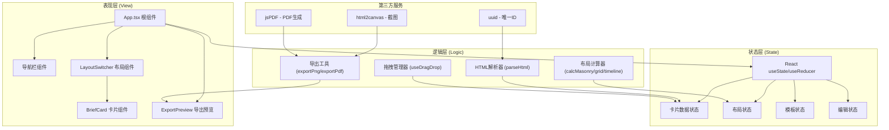

## 1. 架构设计

纯前端React应用，采用组件化架构，所有功能在浏览器端完成，无需后端服务。内容解析通过浏览器原生DOM API实现，导出功能使用第三方库。



## 2. 技术说明

- **前端框架**：React@18 + TypeScript@5
- **构建工具**：Vite@5 (HMR热更新、按需编译、生产优化)
- **样式方案**：原生CSS3 + CSS Modules (避免样式冲突、支持CSS变量)
- **导出库**：html2canvas@1.4.1、jspdf@2.5.1
- **工具库**：uuid@9.0
- **图标方案**：内联SVG图标（轻量、可定制颜色）

## 3. 项目结构与文件定义

```
auto23/
├── index.html                    # 入口HTML
├── package.json                  # 依赖与脚本
├── vite.config.js                # Vite配置
├── tsconfig.json                 # TS严格模式配置
└── src/
    ├── main.tsx                  # React入口
    ├── App.tsx                   # 根组件：状态管理、输入解析、视图切换、导出
    ├── BriefCard.tsx             # 简报卡片：渲染+编辑+删除+拖拽
    ├── LayoutSwitcher.tsx        # 布局切换：三种布局计算与渲染
    ├── types/
    │   └── index.ts              # 全局类型定义
    ├── utils/
    │   ├── htmlParser.ts         # HTML内容解析提取
    │   ├── layoutCalculator.ts   # 三种布局算法
    │   └── exporter.ts           # PNG/PDF导出工具
    ├── hooks/
    │   ├── useDragDrop.ts        # 拖拽排序Hook
    │   └── useCardAnimation.ts   # 卡片动画Hook
    ├── styles/
    │   ├── variables.css         # CSS变量：颜色、间距、动画
    │   ├── global.css            # 全局样式、毛玻璃、响应式
    │   └── animations.css        # 关键帧动画定义
    └── templates/
        └── defaultCards.ts       # Demo示例卡片数据
```

## 4. 核心数据模型

### 4.1 TypeScript 类型定义

```typescript
// 单个简报卡片
interface BriefCardData {
  id: string;                    // uuid
  title: string;                 // 卡片标题
  summary: string;               // 文字摘要
  source: string;                // 引用来源URL
  sourceName?: string;           // 来源显示名称
  image?: string;                // 配图URL
  type: 'paragraph' | 'heading' | 'list' | 'quote' | 'image';
  order: number;                 // 排序序号
  createdAt: number;             // 创建时间戳
  isEditing: boolean;            // 编辑状态标记
}

// 模板类型
type TemplateType = 'business' | 'creative' | 'darktech';

// 布局类型
type LayoutType = 'masonry' | 'grid' | 'timeline';

// 应用状态
interface AppState {
  cards: BriefCardData[];
  currentTemplate: TemplateType;
  currentLayout: LayoutType;
  isLoading: boolean;
  isExportPreview: boolean;
  inputValue: string;            // URL或HTML输入
  errorMessage: string | null;
}

// 卡片位置（用于瀑布流绝对定位）
interface CardPosition {
  id: string;
  top: number;
  left: number;
  width: number;
}
```

## 5. 核心模块设计

### 5.1 HTML内容解析器 (utils/htmlParser.ts)

```
输入: URL字符串 或 HTML文本字符串
输出: BriefCardData[] 数组
流程:
  1. 判断输入类型：以http开头→视为URL，否则→视为HTML文本
  2. URL处理：创建隐藏iframe→加载页面→提取document.documentElement.outerHTML
  3. HTML处理：创建DOMParser→parseFromString得到Document对象
  4. 提取策略:
     - 遍历 <h1>-<h3> → 生成heading型卡片
     - 遍历包含足够文字的 <p> → 生成paragraph型卡片
     - 遍历 <ul>/<ol> → 合并列表项生成list型卡片
     - 遍历 <blockquote> → 生成quote型卡片
     - 遍历  且带alt → 生成image型卡片
  5. 去重与过滤：过短内容(<20字)、重复标题、导航链接等
  6. 按原始出现顺序分配order值，生成uuid
```

### 5.2 布局计算器 (utils/layoutCalculator.ts)

**瀑布流布局 (Masonry)**
```
算法:
  1. 获取容器宽度，计算列数（桌面3/平板2/移动1）
  2. 列宽 = (容器宽 - (列数-1)*16px间距) / 列数
  3. 维护列高度数组 columnHeights[列数] = [0,0,...]
  4. 遍历每张卡片:
     - 找到最短列索引 minCol = argmin(columnHeights)
     - position.top = columnHeights[minCol]
     - position.left = minCol * (列宽 + 16px)
     - 更新 columnHeights[minCol] += 卡片高度 + 16px
  5. 返回位置映射 Map<id, CardPosition>
```

**网格布局 (Grid)**
```
算法:
  1. 使用CSS Grid原生实现: grid-template-columns: repeat(N, 1fr)
  2. 列数N根据响应式断点: 3/2/1
  3. gap: 16px
  4. 卡片自动填充，无需手动计算位置
```

**时间线布局 (Timeline)**
```
算法:
  1. 容器设置 padding-left: 60px
  2. 左侧伪元素 ::before 绘制2px垂直线（位置left: 24px）
  3. 每张卡片 position: relative，左侧留出空间
  4. 卡片 ::before 伪元素绘制圆点节点（left: -44px, top: 20px）
  5. 垂直方向卡片间距 24px
```

### 5.3 拖拽排序Hook (hooks/useDragDrop.ts)

```
核心实现: HTML5 Drag and Drop API
  - 卡片设置 draggable=true
  - dragstart: 记录拖拽源卡片id，设置半透明幽灵图像，标记拖拽态样式
  - dragover: preventDefault，根据鼠标Y坐标计算插入位置，显示占位符
  - drop: 计算目标位置，更新cards数组order值，触发重排
  - dragend: 清除拖拽状态，移除占位符
动画优化:
  - 占位符高度动画 (0.2s ease-out)
  - 周围卡片位移使用 transform transition (0.3s cubic-bezier)
```

### 5.4 导出工具 (utils/exporter.ts)

**PNG导出流程:**
```
1. 克隆简报容器DOM节点
2. 为克隆节点添加水印层（右下角半透明文字）
3. 临时移除动画过渡样式，确保静态渲染
4. html2canvas(克隆节点, {
     scale: window.devicePixelRatio * 2,  // 高清
     useCORS: true,
     backgroundColor: '#ffffff',
     logging: false
   })
5. canvas.toDataURL('image/png') → 创建<a>下载
```

**PDF导出流程:**
```
1. 同PNG步骤1-4生成Canvas
2. 计算PDF页面尺寸 (A4: 210mm × 297mm)
3. new jsPDF({ unit: 'mm', format: 'a4' })
4. 将Canvas按比例缩放至A4宽度
5. 如内容超长，分页处理（计算每页可容纳像素高度）
6. pdf.addImage(canvas, 'PNG', x, y, w, h)
7. pdf.save('briefing-export.pdf')
```

## 6. 性能优化策略

### 6.1 渲染性能

- **虚拟列表**：卡片数量>50时启用react-window虚拟化（按需渲染）
- **避免内联函数**：事件处理函数使用useCallback缓存
- **memo优化**：BriefCard组件使用React.memo，仅props变化时重渲染
- **批量更新**：拖拽排序中使用unstable_batchedUpdates合并状态更新

### 6.2 动画性能

- **仅动画transform和opacity**：不触发layout/paint
- **will-change提示**：拖拽中的卡片设置 will-change: transform
- **GPU加速**：transform: translateZ(0) 提升为合成层
- **requestAnimationFrame**：拖拽位置计算使用rAF节流

### 6.3 首屏优化

- **代码分割**：导出模块( html2canvas/jspdf ) 动态import，仅导出时加载
- **关键CSS**：全局样式和变量CSS内联到index.html
- **预加载**：预加载字体、关键SVG图标

## 7. 组件接口定义

### BriefCard Props
```typescript
interface BriefCardProps {
  card: BriefCardData;
  template: TemplateType;
  layout: LayoutType;
  index: number;
  onUpdate: (id: string, updates: Partial<BriefCardData>) => void;
  onDelete: (id: string) => void;
  onDragStart: (id: string) => void;
  onDragOver: (e: React.DragEvent, targetId: string) => void;
  onDrop: (e: React.DragEvent, targetId: string) => void;
  isDragging: boolean;
  isDragOver: boolean;
}
```

### LayoutSwitcher Props
```typescript
interface LayoutSwitcherProps {
  cards: BriefCardData[];
  layout: LayoutType;
  template: TemplateType;
  onCardUpdate: (id: string, updates: Partial<BriefCardData>) => void;
  onCardDelete: (id: string) => void;
  onReorder: (fromIndex: number, toIndex: number) => void;
}
```
