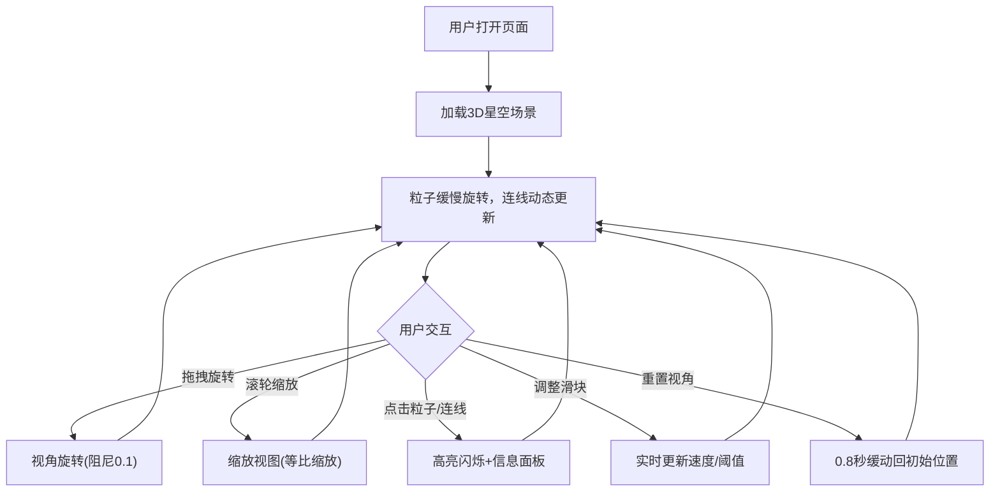

## 1. 产品概述

动态粒子星座连线图是一个基于 Three.js 的 3D 交互式星空可视化项目，在三维空间中生成约 300 颗随机分布的星辰粒子，粒子之间根据距离自动生成发光连线，形成星座图谱视觉效果。用户可拖拽旋转视角、滚轮缩放，并点击粒子或连线查看详细信息。

- 目标用户：天文爱好者、数据可视化开发者、科幻主题爱好者
- 核心价值：沉浸式星空交互体验，兼具科学数据展示与艺术美感

## 2. 核心功能

### 2.1 功能模块

1. **主场景页**：3D 粒子星空、轨道控制、交互点击、控制栏

### 2.2 页面详情

| 页面名称 | 模块名称 | 功能描述 |
|----------|----------|----------|
| 主场景页 | 粒子系统 | 300颗粒子随机分布在三维空间，每颗有随机大小(1-4px)、亮度(0.5-1.0)、冷色调颜色(蓝紫到青白)，沿自身轨道缓慢旋转，距离<阈值时生成半透明发光连线，连线颜色/粗细根据两端粒子平均亮度渐变 |
| 主场景页 | 轨道控制 | 左键拖拽旋转视角、滚轮缩放(等比缩放粒子大小和线宽)、平滑阻尼(缓动系数0.1)、俯仰角限制(-80°到80°) |
| 主场景页 | 点击交互 | 点击粒子或连线高亮闪烁(0.3秒放大1.5倍再恢复)，右下角滑入毛玻璃信息面板显示坐标/亮度/连接数，面板0.4秒cubic-bezier淡入上滑，关闭反向动画 |
| 主场景页 | 控制栏 | 底部半透明控制栏：粒子运动速度滑块(0-2)、连线距离阈值滑块(30-80)、重置视角按钮(0.8秒缓动回初始位置)，滑块数值实时变化带弹性回弹 |

## 3. 核心流程

用户打开页面 → 看到3D星空场景 → 粒子缓慢旋转、连线动态变化 → 拖拽旋转视角、滚轮缩放 → 点击粒子/连线 → 信息面板弹出 → 调整控制栏参数 → 重置视角

## 4. 用户界面设计

### 4.1 设计风格

- 主色调：深空深蓝渐变背景(#0a0e27 → #1a1a3e)
- 粒子颜色：冷色调蓝紫到青白渐变
- 连线颜色：根据两端粒子平均亮度渐变，高亮度更亮更粗
- 控制栏：半透明深色底(rgba(0,0,0,0.6))，圆角，等宽字体(monospace)
- 信息面板：毛玻璃效果(背景模糊8px)，半透明
- 字体：等宽字体 font-family: monospace
- 所有UI悬浮时有亮度提升微效

### 4.2 页面设计概览

| 页面名称 | 模块名称 | UI 元素 |
|----------|----------|---------|
| 主场景页 | 3D画布 | 全屏WebGL渲染容器，深蓝渐变背景，发光粒子+半透明连线 |
| 主场景页 | 控制栏 | 底部固定栏，两个自定义滑块+重置按钮，半透明深色圆角面板 |
| 主场景页 | 信息面板 | 右下角滑入卡片，毛玻璃效果，显示坐标/亮度/连接数，关闭按钮 |

### 4.3 响应式适配

- 桌面优先设计，保证 1440x900 到 1920x1080 分辨率下控制栏和信息面板布局不变形
- 控制栏宽度自适应，信息面板固定宽度

### 4.4 3D场景指引

- 环境/氛围：深空星云氛围，深蓝渐变背景
- 光照：无需额外光照，粒子自发光(PointsMaterial + LineBasicMaterial with vertexColors)
- 相机：透视相机，初始位置适当距离以容纳300颗粒子
- 焦点：粒子群整体为中心，可旋转缩放探索
- 交互：OrbitControls风格的轨道控制(自定义实现)，点击拾取(Raycaster)
- 后处理：粒子发光效果通过AdditiveBlending实现
- 性能预算：300粒子+动态连线，目标55FPS以上
