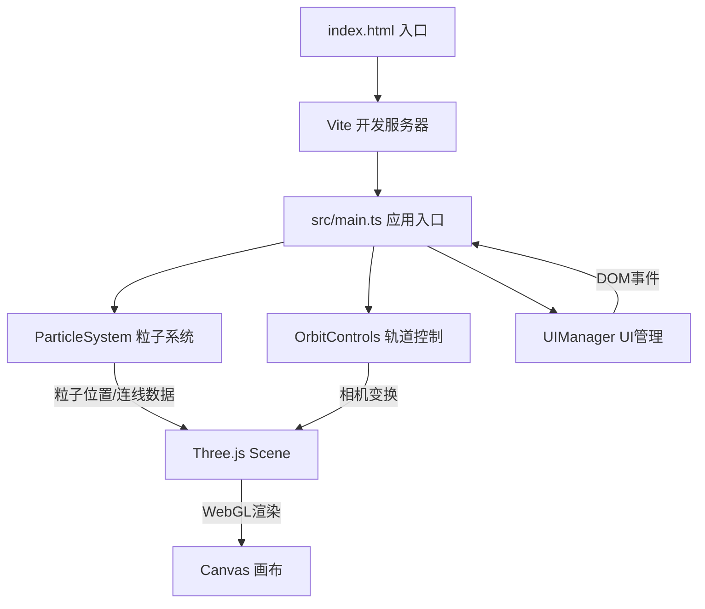

## 1. 架构设计



## 2. 技术说明

- 前端框架：TypeScript + Three.js (原生，非React封装)
- 构建工具：Vite
- 3D渲染：Three.js (PointsMaterial + LineSegments + BufferGeometry)
- 交互控制：自定义轨道控制器(旋转/缩放/阻尼)
- 点击拾取：Three.js Raycaster
- 初始化工具：Vite + TypeScript 模板
- 后端：无

## 3. 文件结构

| 文件 | 职责 |
|------|------|
| package.json | 依赖管理：three, @types/three, vite, typescript；启动脚本 npm run dev |
| index.html | 入口页面，全屏渲染容器 + UI元素(控制栏/信息面板) |
| vite.config.js | Vite构建配置 |
| tsconfig.json | TypeScript严格模式配置 |
| src/main.ts | 应用入口：创建场景/相机/渲染器，初始化粒子系统和UI事件，动画循环 |
| src/particleSystem.ts | 粒子系统核心：生成粒子坐标/大小/亮度/颜色，维护位置更新和连线生成逻辑 |
| src/orbitControls.ts | 自定义轨道控制：旋转/缩放/阻尼/视角边界 |
| src/uiManager.ts | UI管理：控制栏滑块事件/信息面板显示/动画效果 |

## 4. 核心数据结构

### 4.1 粒子数据

```typescript
interface ParticleData {
  x: number; y: number; z: number;
  size: number;        // 1-4
  brightness: number;  // 0.5-1.0
  color: { r: number; g: number; b: number };
  orbitRadius: number;
  orbitSpeed: number;
  orbitPhase: number;
  connectionCount: number;
}
```

### 4.2 连线数据

```typescript
interface LineData {
  particleA: number;
  particleB: number;
  opacity: number;    // 0-1 淡入淡出
  brightness: number; // 两端粒子平均亮度
}
```

### 4.3 控制状态

```typescript
interface ControlState {
  speed: number;         // 0-2
  distanceThreshold: number; // 30-80
}
```

## 5. 性能策略

- 粒子使用 BufferGeometry + Points 渲染，单次 draw call
- 连线使用 LineSegments + BufferGeometry，动态更新 position/color/opacity 属性
- 使用 requestAnimationFrame 驱动动画循环
- 连线更新采用增量策略：仅更新距离变化超过阈值的连线对
- 粒子位置更新在 GPU 友好的 Float32Array 中操作
- Raycaster 仅在点击事件触发时执行，不每帧检测
- 视口外粒子跳过连线计算（视锥体裁剪）
