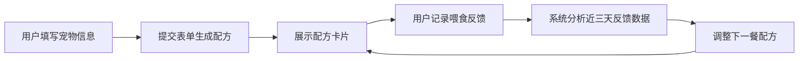

## 1. 产品概述

个性化每日宠物饲料配方系统，为宠物主人提供基于宠物品种、年龄、体重和活动量的智能营养配餐服务，并根据每日进食反馈动态调整配方，帮助宠物获得更科学均衡的饮食。

- 目标用户：饲养猫狗等宠物的家庭用户，关注宠物健康营养的养宠人士
- 核心价值：将专业宠物营养学转化为简单易用的日常工具，降低科学喂养门槛

## 2. 核心功能

### 2.1 用户角色

| 角色 | 注册方式 | 核心权限 |
|------|----------|----------|
| 普通用户 | 无需注册，直接使用 | 填写宠物信息、生成配方、记录和修改反馈 |

### 2.2 功能模块

1. **宠物信息表单模块**：品种下拉选择、年龄滑块、体重输入、活动量单选
2. **配方展示模块**：圆角卡片展示、环形进度条、加载动画、变化趋势徽章
3. **反馈记录模块**：时间轴列表、Emoji反馈图标、修改弹窗、底部滑入动画

### 2.3 页面详情

| 页面名称 | 模块名称 | 功能描述 |
|----------|----------|----------|
| 主页面 | 宠物信息表单 | 用户录入宠物基础信息（品种、年龄、体重、活动量），点击提交生成配方 |
| 主页面 | 配方卡片展示 | 展示主粮、肉类、蔬菜、补剂四类食材的名称、克数和百分比，带环形进度条动画 |
| 主页面 | 反馈记录列表 | 时间轴形式展示历史反馈，支持点击修改，每条记录含时间戳和Emoji图标 |

## 3. 核心流程

用户填写宠物信息表单 → 提交后调用API生成初始配方 → 展示配方卡片（含加载动画和进度条动画）→ 用户喂食后记录反馈（吃光/剩余/呕吐）→ 系统基于近三天反馈动态调整下一餐配方 → 更新配方卡片（淡出淡入过渡 + 趋势徽章）

## 4. 用户界面设计

### 4.1 设计风格

- **主色调**：森林绿（#2D5A27）+ 暖米色（#F5F0E1），采用自然清新的配色方案
- **按钮风格**：圆角12px，悬停时微抬升（translateY(-2px)）并附带柔和阴影
- **字体**：标题使用圆润手写风格字体（如 Pacifico 或 Caveat），正文使用易读的无衬线字体
- **布局风格**：卡片式布局，页面居中展示，左右分栏（左侧表单，右侧配方+反馈）
- **图标风格**：反馈结果搭配Emoji图标（吃光😋、剩50%🍽️、剩25%🥣、没怎么吃😕、呕吐😷）

### 4.2 页面设计概述

| 页面名称 | 模块名称 | UI元素 |
|----------|----------|--------|
| 主页面 | 宠物信息表单 | 森林绿表单边框、圆角输入框、滑块组件、单选按钮组、提交按钮带悬停动效 |
| 主页面 | 配方卡片 | 米白背景、深绿主色调、圆角12px、加载旋转动画、环形进度条（0.8秒填充动画）、右上角趋势徽章 |
| 主页面 | 反馈列表 | 卡片式时间轴布局、每项间距8px、时间戳左对齐、反馈结果+Emoji右对齐、悬停高亮 |
| 主页面 | 修改弹窗 | 底部滑入动画、半透明遮罩背景、弹窗内容淡入动画、圆角表单 |

### 4.3 响应式设计

- 桌面端优先设计（当前阶段），左右双栏布局：左侧40%表单区，右侧60%配方展示区
- 移动端自动切换为单列布局，表单在上，配方卡片居中，反馈列表在下
- 触控设备优化：按钮最小高度44px，反馈列表项触控区域扩大

### 4.4 动画性能要求

- 配方卡片加载旋转动画：CSS动画，GPU加速
- 环形进度条填充动画：0.8秒缓动（ease-out）
- 配方更新过渡：旧卡片淡出（0.3秒）→ 新卡片淡入（0.3秒）
- 弹窗动画：遮罩淡入（0.2秒）+ 底部滑入（0.3秒 cubic-bezier(0.16, 1, 0.3, 1)）
- API响应时间 ≤ 300ms，动画帧率 ≥ 30FPS
