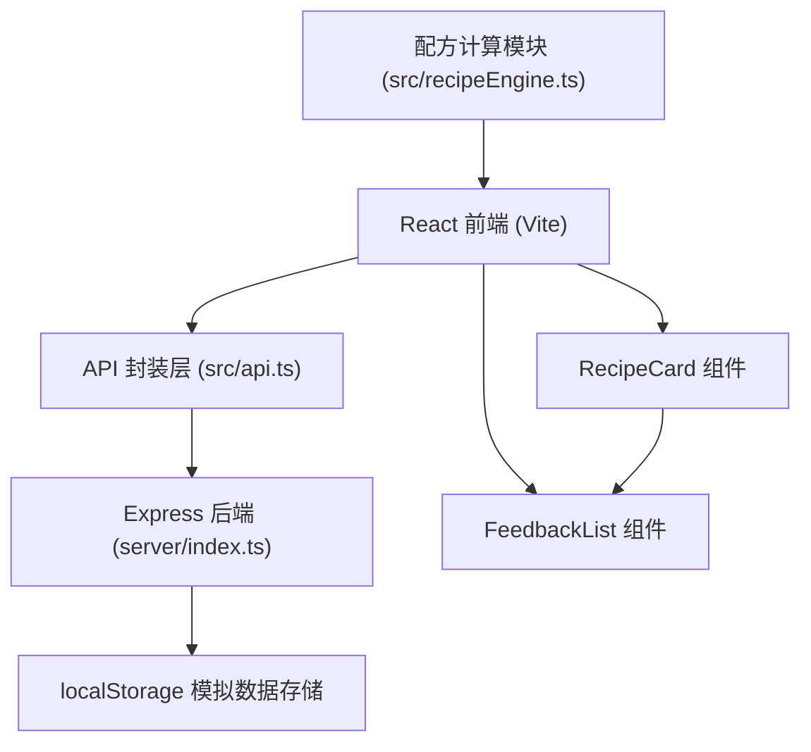
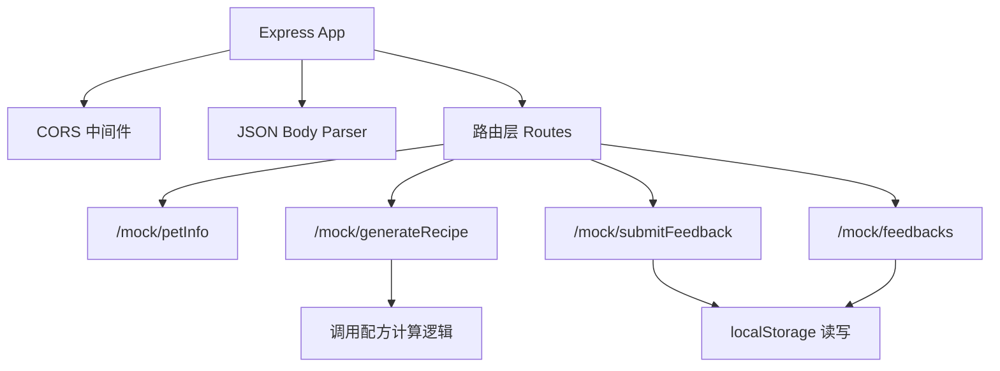
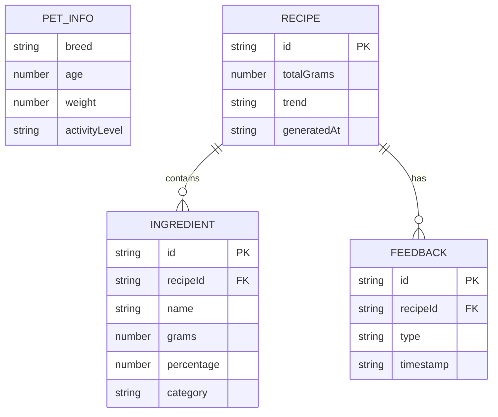

## 1. 架构设计



## 2. 技术说明

- **前端**：React@18 + TypeScript@5 + Vite@5
- **后端**：Express@4 + TypeScript + uuid + cors
- **状态管理**：React useState/useEffect（轻量级场景，无需额外状态管理库）
- **数据持久化**：浏览器 localStorage 模拟后端存储
- **构建工具**：Vite，配置 /api 代理转发至 Express 后端
- **样式方案**：原生 CSS（使用 CSS 变量维护设计令牌）+ CSS Modules

## 3. 路由定义

| 路由 | 用途 |
|------|------|
| / | 主页面（宠物信息表单 + 配方展示 + 反馈列表） |

后端 API 路由：

| 路由 | 方法 | 用途 |
|------|------|------|
| /mock/petInfo | GET | 获取宠物品种等选项数据 |
| /mock/generateRecipe | POST | 根据宠物信息生成配方 |
| /mock/submitFeedback | POST | 提交喂食反馈 |
| /mock/feedbacks | GET | 获取反馈历史记录 |

## 4. API 定义

```typescript
// 宠物信息
interface PetInfo {
  breed: string;
  age: number;
  weight: number;
  activityLevel: 'low' | 'medium' | 'high';
}

// 食材项
interface Ingredient {
  name: string;
  grams: number;
  percentage: number;
  category: 'staple' | 'meat' | 'vegetable' | 'supplement';
}

// 配方数据
interface Recipe {
  id: string;
  totalGrams: number;
  ingredients: Ingredient[];
  trend: 'up' | 'down' | 'stable';
  trendPercentage?: number;
  generatedAt: string;
}

// 反馈类型
type FeedbackType = 'all_eaten' | 'half_left' | 'quarter_left' | 'hardly_eaten' | 'vomited';

// 反馈记录
interface FeedbackRecord {
  id: string;
  recipeId: string;
  type: FeedbackType;
  timestamp: string;
}
```

## 5. 服务端架构图



## 6. 数据模型

### 6.1 数据模型定义



### 6.2 localStorage 存储结构

```typescript
// localStorage keys
{
  'pet_feedbacks': FeedbackRecord[];   // 所有反馈记录
  'pet_info': PetInfo | null;          // 当前宠物信息
  'current_recipe': Recipe | null;     // 当前配方
}
```

## 7. 项目文件结构

```
auto29/
├── package.json
├── index.html
├── vite.config.js
├── tsconfig.json
├── src/
│   ├── api.ts
│   ├── recipeEngine.ts
│   ├── App.tsx
│   ├── main.tsx
│   ├── styles/
│   │   └── globals.css
│   └── components/
│       ├── RecipeCard.tsx
│       └── FeedbackList.tsx
└── server/
    └── index.ts
```
