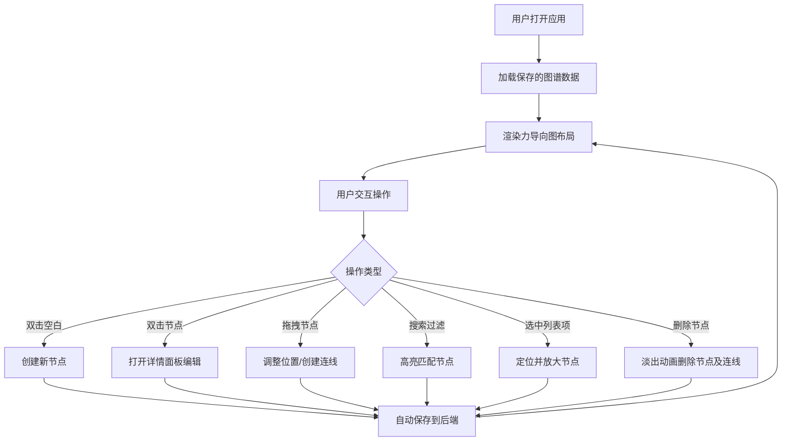

## 1. 产品概述

个人知识图谱应用，帮助用户将零散信息以可视化方式关联管理，解决信息碎片化、难以建立知识关联的问题。

- 目标用户：知识工作者、学生、研究者
- 核心价值：通过图形化方式直观展示知识节点间的关联关系，支持Markdown详情编辑，实现知识的结构化管理
- 市场定位：轻量化个人知识管理工具，专注于知识关联可视化

## 2. 核心功能

### 2.1 用户角色
| 角色 | 注册方式 | 核心权限 |
|------|----------|----------|
| 普通用户 | 无需注册，本地使用 | 创建、编辑、删除节点和连线，搜索过滤，保存图谱 |

### 2.2 功能模块
1. **知识图谱画布**：力导向图布局，节点拖拽，连线创建，缩放平移
2. **节点管理**：四种节点类型（概念、文章、问题、人物），双击编辑，删除动画
3. **连线管理**：四种关联类型（包含、引用、矛盾、灵感来源），随节点删除
4. **搜索过滤**：关键词高亮，类型筛选，平滑过渡动画
5. **详情面板**：Markdown编辑器，毛玻璃效果侧边滑入
6. **节点列表**：层级折叠，选中定位，自动聚焦放大

### 2.3 页面详情
| 页面名称 | 模块名称 | 功能描述 |
|---------|----------|----------|
| 主页面 | 图谱画布 | Canvas渲染力导向图，支持节点拖拽、连线创建、缩放平移、双击添加 |
| 主页面 | 左侧边栏 | 节点层级列表，支持折叠展开，选中后画布定位聚焦 |
| 主页面 | 右侧详情面板 | 节点标题和Markdown详情编辑，从右侧滑入 |
| 主页面 | 顶部工具栏 | 添加节点按钮、搜索框、主题切换、重置布局 |

## 3. 核心流程

## 4. 用户界面设计

### 4.1 设计风格
- **主色调**：深色主题，背景#1a1a2e，节点面板渐变#16213e到#0f3460
- **文字颜色**：#e7e7e7浅色文字
- **节点配色**：概念蓝色、文章绿色、问题橙色、人物紫色
- **节点形状**：概念圆形、文章方形、问题菱形、人物六边形
- **按钮风格**：半透明毛玻璃效果，圆角8px，悬停发光
- **字体**：现代无衬线字体，标题16px粗体，正文14px常规
- **图标**：Lucide图标库，与节点类型对应
- **动画**：节点删除淡出0.3s，面板滑入0.3s，定位缓动0.5s，搜索脉冲闪烁

### 4.2 页面设计概述
| 页面名称 | 模块名称 | UI元素 |
|---------|----------|--------|
| 主页面 | 图谱画布 | 全屏Canvas，力导向节点，曲线连线，拖拽高亮发光 |
| 主页面 | 左侧边栏 | 固定宽度280px，可折叠列表，选中项蓝色高亮 |
| 主页面 | 右侧详情面板 | 宽度25%，毛玻璃背景，从右侧滑入，Markdown编辑区域 |
| 主页面 | 顶部工具栏 | 悬浮在右上角，添加按钮、搜索框、下拉菜单 |
| 主页面 | 重置按钮 | 右上角，一键回到初始布局 |

### 4.3 响应性
- 桌面端优先设计，画布自适应窗口大小
- 侧边栏可折叠以在小屏幕上获得更多画布空间
- 详情面板在窄屏下可切换为底部弹出模式

### 4.4 交互细节
- 长按节点/连线：发光高亮效果
- 搜索匹配：脉冲动画闪烁，不匹配节点透明度0.2
- 筛选切换：节点平滑淡入淡出0.3秒
- 定位动画：0.5秒缓动聚焦到选中节点
- 删除动画：节点及关联连线淡出消失
