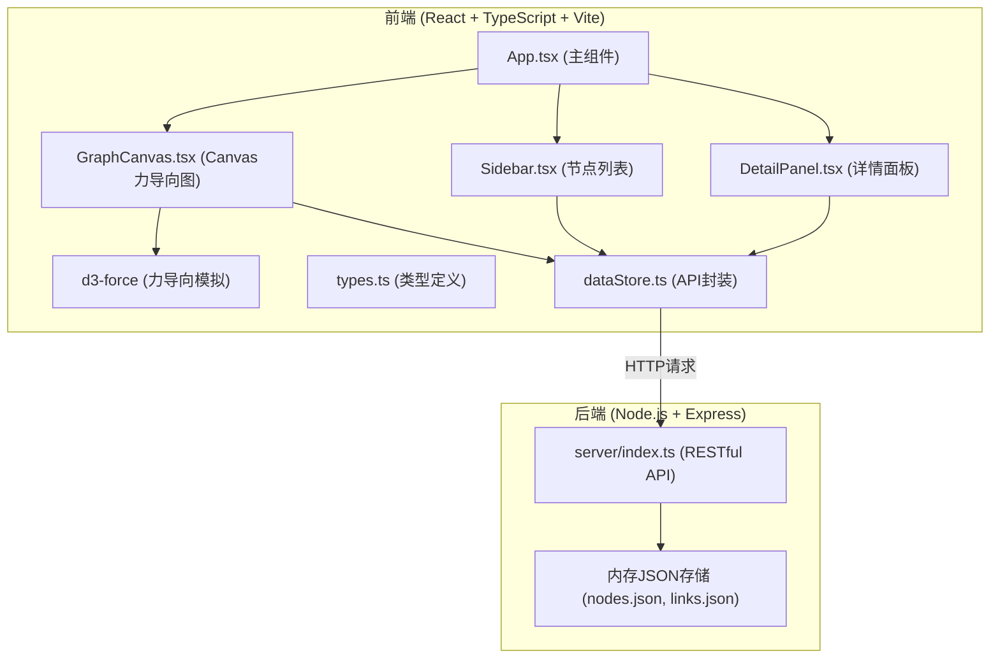
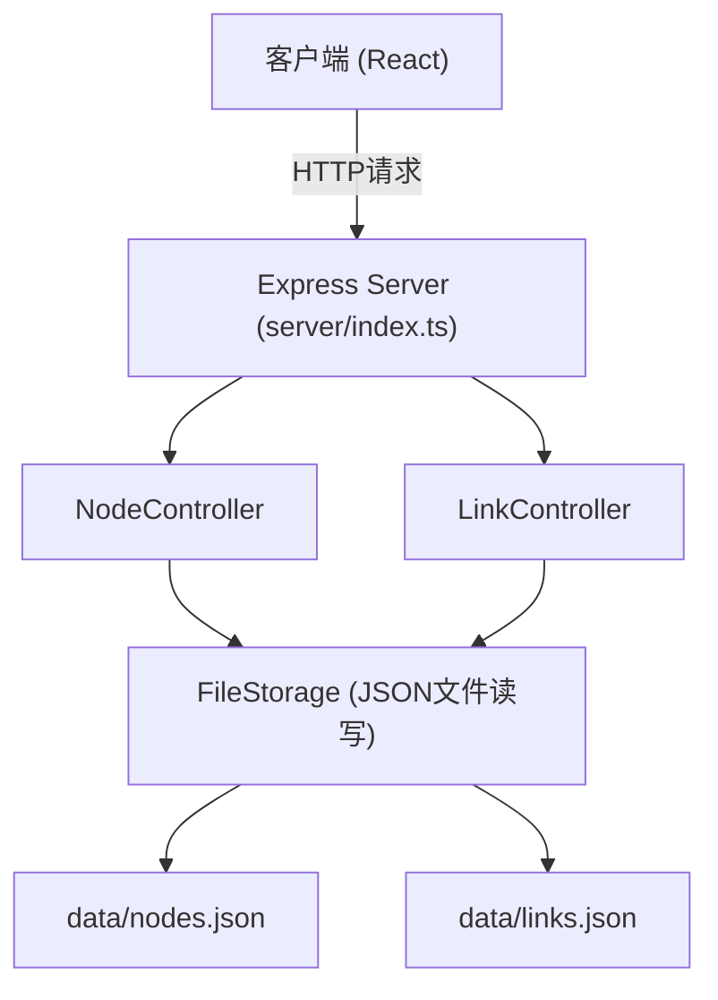
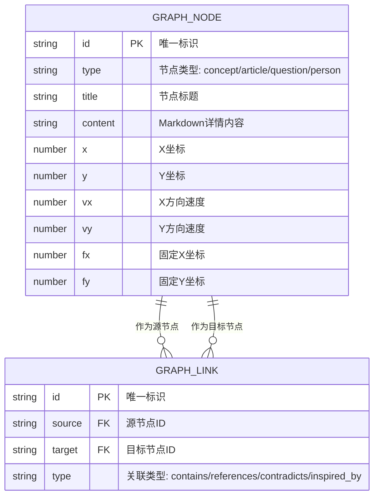

## 1. 架构设计



## 2. 技术描述

- **前端框架**：React@18 + TypeScript@5 + Vite@5
- **力导向模拟**：d3-force@3
- **状态管理**：React useState/useEffect（轻量级场景）
- **后端框架**：Express@4
- **唯一ID生成**：uuid@9
- **图标库**：lucide-react
- **Markdown渲染**：react-markdown
- **构建工具**：Vite，代理API请求到后端端口3001
- **开发服务器**：Vite dev server (前端端口5173) + Express (后端端口3001)

## 3. 路由定义

| 路由 | 用途 |
|------|------|
| / | 主应用页面，包含图谱画布、侧边栏、详情面板、工具栏 |

## 4. API 定义

### 4.1 类型定义

```typescript
// 节点类型
type NodeType = 'concept' | 'article' | 'question' | 'person';

// 关联类型
type LinkType = 'contains' | 'references' | 'contradicts' | 'inspired_by';

// 节点接口
interface GraphNode {
  id: string;
  type: NodeType;
  title: string;
  content: string; // Markdown格式
  x?: number;
  y?: number;
  vx?: number;
  vy?: number;
  fx?: number | null;
  fy?: number | null;
}

// 连线接口
interface GraphLink {
  id: string;
  source: string;
  target: string;
  type: LinkType;
}
```

### 4.2 API 端点

| 方法 | 路径 | 描述 | 请求体 | 响应 |
|------|------|------|--------|------|
| GET | /api/nodes | 获取所有节点 | - | GraphNode[] |
| POST | /api/nodes | 创建新节点 | { type, title, content, x?, y? } | GraphNode |
| PUT | /api/nodes/:id | 更新节点 | { type?, title?, content?, x?, y? } | GraphNode |
| DELETE | /api/nodes/:id | 删除节点及关联连线 | - | { success: true } |
| GET | /api/links | 获取所有连线 | - | GraphLink[] |
| POST | /api/links | 创建新连线 | { source, target, type } | GraphLink |
| PUT | /api/links/:id | 更新连线 | { type? } | GraphLink |
| DELETE | /api/links/:id | 删除连线 | - | { success: true } |
| GET | /api/graph | 获取完整图谱（节点+连线） | - | { nodes: GraphNode[], links: GraphLink[] } |

## 5. 服务器架构图



## 6. 数据模型

### 6.1 数据模型定义



### 6.2 初始数据示例

```json
// data/nodes.json
[
  {
    "id": "node-1",
    "type": "concept",
    "title": "知识图谱",
    "content": "# 知识图谱\n\n知识图谱是一种**结构化的语义知识库**，用于以符号形式描述物理世界中的概念及其相互关系。\n\n## 核心要素\n- 实体（节点）\n- 关系（边）\n- 属性",
    "x": 400,
    "y": 300
  },
  {
    "id": "node-2",
    "type": "article",
    "title": "知识图谱构建方法",
    "content": "# 知识图谱构建方法\n\n本文介绍了知识图谱的**构建流程**和关键技术。",
    "x": 600,
    "y": 200
  },
  {
    "id": "node-3",
    "type": "question",
    "title": "如何实现实体链接？",
    "content": "# 问题\n\n在知识图谱构建中，**实体链接**是关键步骤，如何高效准确地实现？",
    "x": 200,
    "y": 200
  },
  {
    "id": "node-4",
    "type": "person",
    "title": "张三",
    "content": "# 张三\n\n知识图谱领域研究者，专注于**自然语言处理**和知识抽取。",
    "x": 500,
    "y": 450
  }
]

// data/links.json
[
  {
    "id": "link-1",
    "source": "node-1",
    "target": "node-2",
    "type": "references"
  },
  {
    "id": "link-2",
    "source": "node-2",
    "target": "node-3",
    "type": "contains"
  },
  {
    "id": "link-3",
    "source": "node-4",
    "target": "node-2",
    "type": "inspired_by"
  }
]
```
