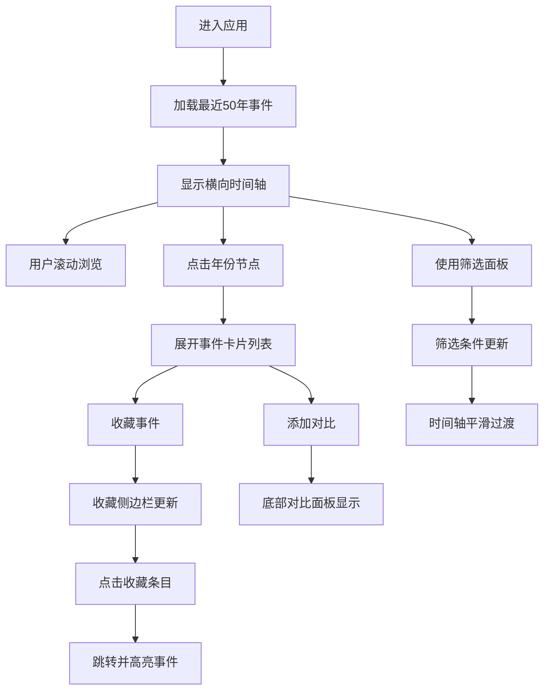

## 1. 产品概述

时间轴大事记展示应用是一款用于按年份浏览历史事件的交互式工具。用户可以通过横向滚动的时间线浏览不同年代的历史事件，支持按年代范围、事件类别和关键词进行筛选，并可对感兴趣的事件进行收藏和对比。

- **目标用户**：历史爱好者、学生、研究人员
- **核心价值**：提供直观、沉浸式的历史事件浏览体验，支持多维度筛选和事件对比功能

## 2. 核心功能

### 2.1 功能模块

1. **时间轴主体**：横向滚动时间线，年份节点展示，事件卡片展开/收起
2. **事件卡片**：展示事件详情，支持收藏和对比操作
3. **筛选面板**：年代范围筛选、事件类别多选、关键词搜索
4. **收藏侧边栏**：展示已收藏事件，支持快速跳转和高亮
5. **对比面板**：底部吸底式对比表格，最多对比三个事件

### 2.2 页面详情

| 页面名称 | 模块名称 | 功能描述 |
|-----------|-------------|---------------------|
| 主页面 | 时间轴主体 | 横向滚动时间线，点击年份圆点展开事件卡片列表，支持鼠标滚轮水平滚动，边缘导航箭头平滑滚动 |
| 主页面 | 事件卡片 | 圆角白色卡片，显示标题、日期、描述、缩略图网格，悬停上浮效果，收藏和对比按钮 |
| 主页面 | 筛选面板 | 左侧固定毛玻璃面板，年代范围滑块、类别多选、关键词搜索 |
| 主页面 | 收藏侧边栏 | 右侧固定侧边栏，时间倒序展示收藏条目，点击跳转并高亮闪烁 |
| 主页面 | 对比面板 | 底部吸底式面板，表格形式并排对比事件，表头固定，行交替着色 |

## 3. 核心流程

用户进入应用后，首先看到最近50年的时间轴。用户可以：
1. 横向滚动时间轴浏览不同年份
2. 点击年份圆点展开该年份的事件卡片
3. 使用左侧筛选面板调整年代范围、选择类别或搜索关键词
4. 点击事件卡片上的收藏按钮，将事件加入右侧收藏栏
5. 点击对比按钮选择最多3个事件，在底部面板中进行对比
6. 点击收藏栏中的条目快速跳转到对应事件

## 4. 用户界面设计

### 4.1 设计风格

- **主题色调**：深色主题背景（#1a1a2e），时间轴线渐变（深蓝#16213e 到 紫色#0f3460）
- **卡片样式**：白色圆角卡片（8px），悬停上浮4px并加深阴影
- **面板效果**：毛玻璃效果（blur 8px），半透明背景
- **动效风格**：平滑过渡动画，淡入淡出，轻微上滑/上浮效果
- **字体**：现代无衬线字体，清晰的层级关系

### 4.2 页面设计概述

| 页面名称 | 模块名称 | UI 元素 |
|-----------|-------------|-------------|
| 主页面 | 时间轴主体 | 横向渐变时间线，半透明年份圆点，脉动呼吸动画，卡片淡入上滑动画 |
| 主页面 | 事件卡片 | 白色圆角卡片，2x2 颜色块缩略图网格，金色星星收藏动画，虚线边框对比标记 |
| 主页面 | 筛选面板 | 毛玻璃背景，范围滑块，多选标签，搜索输入框 |
| 主页面 | 收藏侧边栏 | 深色侧边栏，时间倒序列表，悬停高亮 |
| 主页面 | 对比面板 | 底部滑入，固定表头，交替行色，对比表格 |

### 4.3 响应式

- 桌面端优先设计，左侧筛选面板+中间时间轴+右侧收藏栏的三栏布局
- 中等屏幕下收藏栏可收起为图标按钮
- 移动端采用竖向时间轴布局，筛选面板改为顶部下拉

### 4.4 动效细节

- 年份节点展开：不透明度提升 + 脉动呼吸动画（2秒周期）
- 卡片出现：淡入 + 轻微上滑（0.3s ease-out）
- 筛选切换：不匹配卡片缩小淡出，匹配卡片放大淡入
- 对比面板：从下方滑入（0.3s ease-out）
- 收藏高亮：闪烁两次（金色边框高亮）
- 滚动：惯性阻尼感

## 5. 性能要求

- 渲染200个事件时滚动和动画保持 60fps
- 筛选响应时间不超过 100ms
- 初始加载最近50年事件，按需渲染
