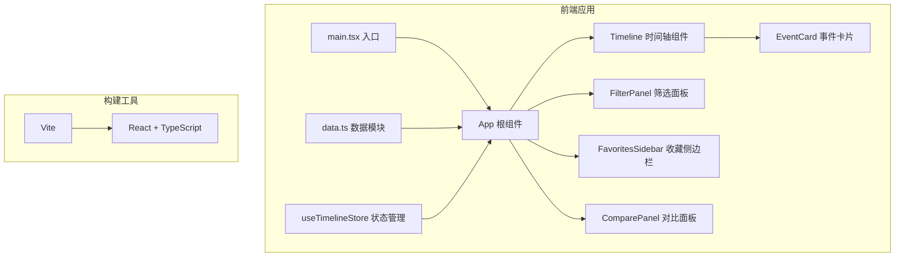

## 1. 架构设计



## 2. 技术描述

- **前端框架**：React 18 + TypeScript
- **构建工具**：Vite 5
- **状态管理**：Zustand（轻量级状态管理）
- **样式方案**：原生 CSS + CSS Modules（或 styled-components，根据复杂度选择）
- **动画**：CSS transitions/animations + React 状态控制
- **数据**：本地 Mock 数据（200条历史事件）

## 3. 项目结构

```
src/
├── main.tsx          # 入口文件
├── App.tsx           # 根组件
├── data.ts           # 模拟数据模块
├── store.ts          # Zustand 状态管理
├── components/
│   ├── Timeline.tsx       # 时间轴主体组件
│   ├── EventCard.tsx      # 事件卡片组件
│   ├── FilterPanel.tsx    # 筛选面板组件
│   ├── FavoritesSidebar.tsx  # 收藏侧边栏
│   └── ComparePanel.tsx   # 对比面板组件
├── hooks/
│   ├── useHorizontalScroll.ts  # 横向滚动 Hook
│   └── useSmoothScroll.ts      # 平滑滚动 Hook
├── types/
│   └── index.ts          # 类型定义
└── styles/
    └── globals.css       # 全局样式
```

## 4. 数据模型

### 4.1 事件数据结构

```typescript
interface HistoryEvent {
  id: string;
  year: number;
  category: 'science' | 'culture' | 'politics' | 'sports' | 'nature';
  title: string;
  description: string;
  colors: string[]; // 4种主题色，用于缩略图网格
}
```

### 4.2 应用状态

```typescript
interface TimelineState {
  // 筛选状态
  yearRange: [number, number];
  categories: string[];
  searchKeyword: string;
  
  // 交互状态
  expandedYears: number[];
  favorites: string[];
  compareList: string[];
  highlightedEventId: string | null;
  
  // Actions
  setYearRange: (range: [number, number]) => void;
  toggleCategory: (cat: string) => void;
  setSearchKeyword: (kw: string) => void;
  toggleYear: (year: number) => void;
  toggleFavorite: (eventId: string) => void;
  toggleCompare: (eventId: string) => void;
  setHighlightedEvent: (eventId: string | null) => void;
}
```

## 5. 性能优化策略

1. **虚拟滚动**：对于200个事件，使用时间轴分段渲染，仅渲染可视区域附近的年份
2. **记忆化组件**：使用 React.memo 包装事件卡片，避免不必要的重渲染
3. **CSS 硬件加速**：动画使用 transform 和 opacity，触发 GPU 加速
4. **防抖搜索**：关键词搜索使用 debounce，减少筛选计算频率
5. **批量更新**：状态更新使用批量处理，减少渲染次数
6. **will-change 提示**：对动画元素添加 will-change 属性

## 6. 关键实现方案

### 6.1 横向时间轴

- 使用 flex 布局横向排列年份节点
- 自定义 Hook 处理鼠标滚轮横向滚动（带惯性）
- IntersectionObserver 检测边缘，显示导航箭头

### 6.2 筛选动画

- 使用 CSS transition 配合 data 属性实现卡片的淡入淡出和缩放
- 筛选变化时先标记不匹配项，延迟后移除 DOM

### 6.3 收藏高亮

- 跳转时设置高亮状态，触发闪烁动画
- 使用 CSS animation 实现两次闪烁效果

### 6.4 对比面板

- 最多支持3个事件对比
- 底部固定定位，滑入动画
- 表格表头 position: sticky 实现固定表头
