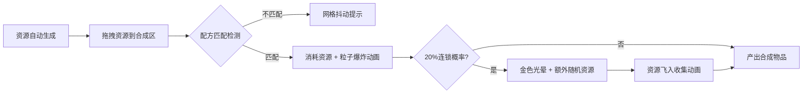

## 1. 产品概述

资源转化与连锁合成模拟器是一款休闲放置类网页应用，玩家收集木材、矿石、魔力晶体三种基础资源，通过合成配方解锁高级道具，并体验连锁反应带来的惊喜感。

- 核心玩法：资源自动生成 + 拖拽合成 + 连锁反应
- 目标用户：喜欢放置类、合成类休闲游戏的玩家
- 产品价值：提供轻松有趣的合成体验，通过连锁机制增加游戏随机性和成就感

## 2. 核心功能

### 2.1 用户角色
| 角色 | 注册方式 | 核心权限 |
|------|----------|----------|
| 玩家 | 无需注册，直接游玩 | 体验全部合成玩法 |

### 2.2 功能模块
1. **资源面板**：展示三类基础资源的数量、生成速率，支持拖拽资源到合成区
2. **合成网格**：中央合成区域，接收拖拽资源，匹配配方触发合成
3. **配方系统**：5种以上合成配方，支持多级合成（基础→中级→高级）
4. **连锁反应**：20%概率触发连锁，额外产生1-3个随机资源
5. **合成路径树**：长按资源查看详细合成路径，树状展开动画

### 2.3 页面详情
| 页面名称 | 模块名称 | 功能描述 |
|----------|----------|----------|
| 主页面 | 资源面板 | 显示木材/矿石/魔力晶体数量与生成速率，像素风图标，发光速率数字 |
| 主页面 | 合成网格 | 中央70%宽度区域，拖拽放入资源，匹配配方触发合成动画 |
| 主页面 | 合成路径弹窗 | 长按资源卡片弹出，树状连线展示合成路径，节点可点击放大 |
| 主页面 | 特效层 | 合成粒子爆炸、连锁金色光晕、资源飞入收集动画 |

## 3. 核心流程

### 3.1 资源生成与合成流程
资源每5秒按速率自动生成 → 玩家拖拽资源到合成网格 → 系统检测配方匹配 → 匹配成功播放粒子爆炸动画 → 20%概率触发连锁反应 → 连锁产生资源飞入资源面板

### 3.2 合成路径查看流程
长按资源卡片 → 弹出悬浮窗 → 树状连线动画展开 → 点击节点放大查看详情 → 点击空白关闭

## 4. 用户界面设计

### 4.1 设计风格
- **整体风格**：暗黑奇幻风格
- **主色调**：深紫色(#2d1b4e) → 深蓝色(#0a1628) 径向渐变背景
- **资源配色**：木材=棕黄色(#d4a857)、矿石=银灰色(#b8c0cc)、魔力晶体=品红色(#e91e8c)
- **卡片风格**：1px亮色描边 + 半透明暗色背景 + 圆角设计
- **字体**：像素风/游戏风格字体，生成速率数字带发光效果
- **动效**：合成粒子爆炸、连锁金色光晕、资源飞行动画、树状展开动画

### 4.2 页面设计概述
| 页面名称 | 模块名称 | UI元素 |
|----------|----------|--------|
| 主页面 | 资源面板 | 左侧/顶部排列，卡片式布局，像素图标，发光速率数字 |
| 主页面 | 合成网格 | 中央区域，网格单元悬停高亮，拖入时放大发光 |
| 主页面 | 特效层 | Canvas渲染粒子爆炸、连锁光晕、飞行资源 |
| 主页面 | 合成路径弹窗 | 悬浮卡片，树状连线，节点可点击放大 |

### 4.3 响应式设计
- **设计策略**：桌面端优先，移动端自适应
- **桌面端**：合成网格5列，资源面板横向排列
- **移动端**：合成网格3列，资源面板堆叠排列，文字大小自适应
- **性能要求**：动画帧率≥30fps，合成计算响应<100ms，连锁更新<50ms界面刷新

### 4.4 动画设计指引
- **资源生成**：数字跳动动画 + 轻微缩放
- **拖拽交互**：资源卡片跟随鼠标，拖入网格时网格单元高亮发光（0.2s过渡）
- **合成成功**：网格震动闪烁 + 中心粒子爆炸（颜色随配方变化）
- **连锁反应**：0.3s金色光晕从中心扩散 + 屏幕边缘金光向中心汇聚 + 资源飞入收集
- **合成路径树**：从根部展开的树状连线动画，节点逐个出现
