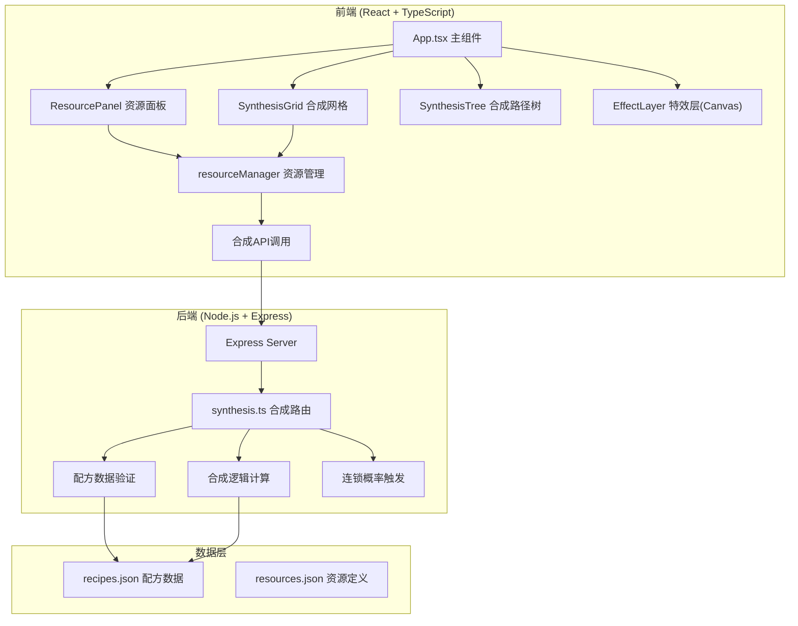

## 1. 架构设计



## 2. 技术描述

- **前端框架**：React 18 + TypeScript
- **构建工具**：Vite 5
- **UI渲染**：HTML5 Canvas（粒子特效、资源图标）+ React DOM（面板、交互）
- **状态管理**：React useState + useReducer（本地状态）+ 事件订阅模式
- **拖拽实现**：原生HTML5 Drag and Drop API
- **后端框架**：Express 4
- **唯一ID生成**：uuid
- **API代理**：Vite dev server proxy

## 3. 文件结构与调用关系

```
项目根目录/
├── package.json              # 项目依赖配置
├── vite.config.js            # Vite构建配置 + API代理
├── tsconfig.json             # TypeScript严格模式配置
├── index.html                # 入口HTML
├── src/
│   ├── main.tsx              # React入口，初始化App
│   ├── App.tsx               # 主组件，整合所有模块
│   ├── types/
│   │   └── index.ts          # 类型定义
│   ├── components/
│   │   ├── ResourcePanel.tsx # 资源面板组件
│   │   ├── SynthesisGrid.tsx # 合成网格组件
│   │   ├── SynthesisTree.tsx # 合成路径树组件
│   │   └── EffectCanvas.tsx  # Canvas特效组件
│   └── utils/
│       └── resourceManager.ts # 资源管理逻辑（纯数据处理）
├── server/
│   ├── index.js              # Express服务器入口
│   ├── routes/
│   │   └── synthesis.ts      # 合成API路由
│   └── data/
│       ├── recipes.json      # 配方数据
│       └── resources.json    # 资源定义数据
```

**调用关系与数据流向：**
1. `App.tsx` → 初始化 `resourceManager` → 订阅资源变化事件 → 传递给子组件
2. `ResourcePanel` → 接收资源数据 → 渲染资源卡片 → 拖拽事件 → `SynthesisGrid`
3. `SynthesisGrid` → 接收拖拽资源 → 调用 `resourceManager.checkRecipe()` → 匹配成功调用后端API
4. `resourceManager` → 计算生成速率、配方匹配、连锁概率 → 触发事件通知UI更新
5. 后端 `synthesis.ts` → 接收合成请求 → 验证配方 → 计算结果 → 返回合成详情

## 4. API 定义

### 4.1 合成接口
**POST /api/synthesis**

请求体：
```typescript
interface SynthesisRequest {
  resources: { resourceId: string; count: number }[];
}
```

响应体：
```typescript
interface SynthesisResponse {
  success: boolean;
  result?: {
    itemId: string;
    itemName: string;
    count: number;
  };
  chainReaction?: {
    triggered: boolean;
    bonusResources: {
      resourceId: string;
      resourceName: string;
      count: number;
    }[];
  };
  consumed: { resourceId: string; count: number }[];
  message?: string;
}
```

### 4.2 配方查询接口
**GET /api/recipes**

响应体：
```typescript
interface Recipe {
  id: string;
  name: string;
  inputs: { resourceId: string; count: number }[];
  output: { itemId: string; count: number };
  chainChance: number;
  color: string;
}

type RecipesResponse = Recipe[];
```

### 4.3 资源定义接口
**GET /api/resources**

响应体：
```typescript
interface ResourceDefinition {
  id: string;
  name: string;
  color: string;
  baseRate: number;
  type: 'basic' | 'crafted';
  icon: string;
}

type ResourcesResponse = ResourceDefinition[];
```

## 5. 核心数据模型

### 5.1 资源状态
```typescript
interface ResourceState {
  [resourceId: string]: {
    count: number;
    rate: number;
    rateMultiplier: number;
  };
}
```

### 5.2 配方数据
```typescript
interface RecipeData {
  id: string;
  name: string;
  inputs: Array<{ resourceId: string; count: number }>;
  output: { itemId: string; count: number };
  chainChance: number;
  particleColor: string;
}
```

### 5.3 合成网格状态
```typescript
interface GridSlot {
  id: string;
  resourceId: string | null;
  count: number;
}

interface GridState {
  slots: GridSlot[];
  isShaking: boolean;
  isGlowing: boolean;
}
```

## 6. 性能优化策略

1. **Canvas批量渲染**：粒子特效使用离屏Canvas预渲染，减少draw调用
2. **requestAnimationFrame**：所有动画使用RAF调度，保证帧率稳定
3. **状态批处理**：资源更新使用requestAnimationFrame批量处理，减少重渲染
4. **React.memo**：对资源卡片、网格单元等频繁渲染组件进行memo优化
5. **节流/防抖**：拖拽事件使用节流，防止频繁触发状态更新
6. **后端缓存**：配方数据内存缓存，避免重复文件读取
