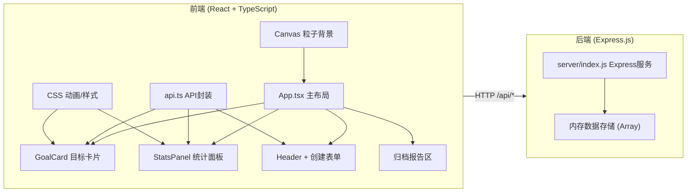
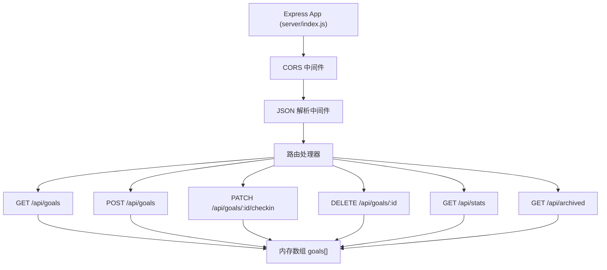
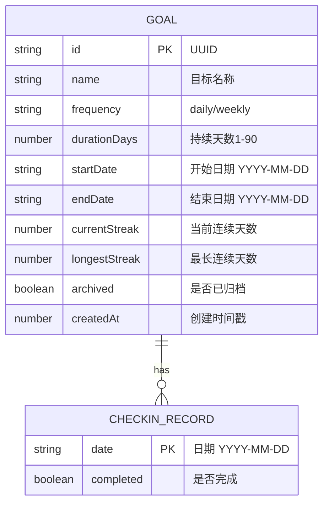

## 1. 架构设计



## 2. 技术描述

- **前端框架**：React@18 + TypeScript@5
- **构建工具**：Vite@5（HMR热更新，快速构建）
- **后端框架**：Express@4（RESTful API，内存存储模拟数据）
- **图表库**：Chart.js + react-chartjs-2（折线图、饼图渲染）
- **日期处理**：date-fns（日期计算、格式化）
- **ID生成**：uuid（唯一目标ID）
- **状态管理**：React useState + useEffect（无需额外状态库）
- **样式方案**：原生CSS + CSS变量（无需Tailwind，用户指定了精确的样式参数）
- **图标库**：lucide-react（火焰、勾选、删除等图标）

## 3. 路由定义

| 路由 | 用途 |
|------|------|
| / | 主页面，包含所有功能模块（单页应用，无前端路由） |

## 4. API 定义

### TypeScript 类型定义

```typescript
// 目标频率类型
type Frequency = 'daily' | 'weekly';

// 打卡记录
interface CheckinRecord {
  date: string;  // YYYY-MM-DD
  completed: boolean;
}

// 目标数据模型
interface Goal {
  id: string;
  name: string;
  frequency: Frequency;
  durationDays: number;
  startDate: string;  // YYYY-MM-DD
  endDate: string;    // YYYY-MM-DD
  checkins: CheckinRecord[];
  currentStreak: number;
  longestStreak: number;
  archived: boolean;
  createdAt: number;  // timestamp
}

// 统计数据
interface StatsData {
  trend7Days: { date: string; count: number; rate: number }[];
  trend30Days: { date: string; count: number; rate: number }[];
  goalCompletion: { goalId: string; goalName: string; completed: number; total: number; rate: number }[];
}

// 归档报告
interface ArchivedReport {
  goalId: string;
  goalName: string;
  totalDays: number;
  completedDays: number;
  longestStreak: number;
  averageRate: number;
  timeline: CheckinRecord[];
}
```

### RESTful API 端点

| 方法 | 端点 | 描述 | 请求体 | 响应 |
|------|------|------|--------|------|
| GET | /api/goals | 获取所有目标列表 | - | `Goal[]` |
| POST | /api/goals | 创建新目标 | `{ name, frequency, durationDays }` | `Goal` |
| PATCH | /api/goals/:id/checkin | 目标打卡 | `{ date: string }` | `Goal` |
| DELETE | /api/goals/:id | 删除目标 | - | `{ success: boolean }` |
| GET | /api/stats | 获取统计数据 | - | `StatsData` |
| GET | /api/archived | 获取归档报告列表 | - | `ArchivedReport[]` |

## 5. 服务器架构图



## 6. 数据模型

### 6.1 数据模型定义



### 6.2 内存数据结构（初始模拟数据）

```javascript
// server/index.js 中的初始数据
const initialGoals = [
  {
    id: 'uuid-1',
    name: '每天阅读30分钟',
    frequency: 'daily',
    durationDays: 30,
    startDate: '2026-05-14',
    endDate: '2026-06-12',
    checkins: [
      { date: '2026-05-14', completed: true },
      { date: '2026-05-15', completed: true },
      // ... 更多打卡记录
    ],
    currentStreak: 12,
    longestStreak: 18,
    archived: false,
    createdAt: 1715644800000,
  },
  // ... 更多初始目标
];
```
