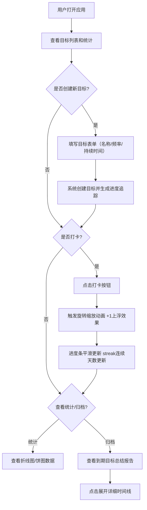

## 1. 产品概述

个人小目标习惯追踪应用，解决手动记录和回顾目标进度时缺乏直观数据可视化和激励反馈的问题。帮助用户建立和维持良好的日常习惯，通过可视化数据和激励动画提升用户坚持动力。

- 目标用户：希望培养良好习惯、追踪每日目标完成进度的个人用户
- 产品价值：通过直观的可视化界面、激励反馈动画和数据统计分析，帮助用户坚持完成目标，培养好习惯

## 2. 核心功能

### 2.1 用户角色

| 角色 | 注册方式 | 核心权限 |
|------|----------|----------|
| 普通用户 | 无需注册，本地数据存储 | 创建目标、打卡、查看统计、查看归档报告 |

### 2.2 功能模块

1. **主页面**：Header（应用标题、主题切换）、目标创建表单、目标卡片列表、统计面板、归档报告区
2. **目标卡片模块**：目标信息展示、进度条、打卡按钮、连续完成天数
3. **统计面板模块**：7天/30天打卡趋势折线图、各目标完成比例饼图
4. **归档报告模块**：到期目标总结卡片、详细时间线展开

### 2.3 页面详情

| 页面名称 | 模块名称 | 功能描述 |
|----------|----------|----------|
| 主页面 | Header | 显示应用标题"目标追踪器"、主题切换按钮（明亮/深邃） |
| 主页面 | 目标创建表单 | 输入目标名称、选择频率（每日/每周）、设置持续时间（1-90天）、创建按钮 |
| 主页面 | 目标卡片列表 | 展示所有进行中的目标卡片，卡片加载时从底部向上依次滑入（stagger动画，间隔0.1秒） |
| 目标卡片 | 进度条 | 从0%到100%的平滑填充动画，实时显示完成百分比 |
| 目标卡片 | 打卡按钮 | 点击打卡（旋转缩放动画，变灰变绿），震动反馈（弹出"+1"文字并上浮消失） |
| 目标卡片 | 连续天数 | 火焰图标 + 数字表示streak连续完成天数 |
| 统计面板 | 折线图 | 展示过去7天/30天的打卡趋势，横轴日期，纵轴打卡次数或完成率 |
| 统计面板 | 饼图 | 展示各目标完成比例，完成部分绿色渐变，未完成浅灰 |
| 归档报告 | 总结卡片 | 淡入动画，显示总完成天数、最长连续天数、平均完成率 |
| 归档报告 | 时间线 | 点击卡片展开，显示每一天的打卡状态图标 |

## 3. 核心流程

用户创建目标 → 系统生成日历视图和进度追踪 → 用户每日点击打卡（触发动画和streak更新）→ 实时查看统计面板 → 目标到期自动归档生成总结报告

## 4. 用户界面设计

### 4.1 设计风格

- **主色调**：深邃蓝紫渐变色（#2C3E50 到 #3498DB）
- **卡片风格**：毛玻璃质感（backdrop-filter: blur），圆角16px，柔和阴影 box-shadow: 0 8px 32px rgba(0,0,0,0.1)
- **按钮交互**：hover时放大1.1倍 + 发光边框（box-shadow glow）
- **字体**：现代无衬线字体，标题加粗，正文清晰可读
- **图标风格**：使用lucide-react图标库，火焰图标表示streak，勾选图标表示完成
- **动态背景**：Canvas粒子效果，粒子缓慢漂浮，半透明
- **动画效果**：
  - 卡片加载：从底部向上滑入，stagger间隔0.1秒
  - 打卡按钮：旋转缩放动画，颜色灰→绿
  - 进度条：0%→100%平滑填充
  - 打卡反馈："+1"文字上浮消失动画
  - 归档卡片：淡入动画
  - 按钮hover：scale(1.1) + 发光边框

### 4.2 页面设计概述

| 页面名称 | 模块名称 | UI元素 |
|----------|----------|--------|
| 主页面 | 动态背景 | Canvas粒子动画，蓝紫色调，半透明粒子缓慢漂浮 |
| 主页面 | Header | 毛玻璃背景，左侧应用标题（渐变色文字），右侧主题切换按钮 |
| 主页面 | 创建表单 | 毛玻璃卡片，圆角16px，输入框+下拉选择+创建按钮 |
| 主页面 | 目标网格 | CSS Grid布局，桌面3列，平板2列，移动1列，响应式栅格 |
| 目标卡片 | 卡片主体 | 毛玻璃效果，圆角16px，柔和阴影，hover时微上浮 |
| 目标卡片 | 头部 | 目标名称（加粗），频率标签，剩余天数徽章 |
| 目标卡片 | 进度条 | 圆角轨道，渐变填充色，平滑过渡动画，百分比文字 |
| 目标卡片 | 打卡区 | 左侧streak火焰+数字，右侧大圆形打卡按钮（带发光效果） |
| 统计面板 | 面板容器 | 毛玻璃大卡片，标题使用渐变色文字 |
| 统计面板 | 图表切换 | 7天/30天切换标签，选中态高亮发光 |
| 统计面板 | 折线图 | Chart.js渲染，蓝紫渐变线条，数据点发光效果 |
| 统计面板 | 饼图 | 绿色渐变+浅灰色块，中间显示总完成率 |
| 归档报告 | 报告卡片 | 淡入动画，毛玻璃卡片，总结数据大数字展示 |
| 归档报告 | 时间线 | 展开/收起动画，日期+状态图标水平排列 |

### 4.3 响应式设计

- **桌面端（≥1024px）**：目标卡片3列布局，统计面板并排展示
- **平板端（768px-1023px）**：目标卡片2列布局，统计面板堆叠
- **移动端（<768px）**：目标卡片1列布局，字体适配缩小，图表自适应宽度，触摸交互优化（增大点击区域）

### 4.4 性能要求

- 页面初始加载时间 FCP < 2秒
- 动画帧率稳定 ≥ 30fps
- Canvas粒子数量控制在合理范围（50-80个）
- 图表数据更新时使用局部渲染而非全量重绘
