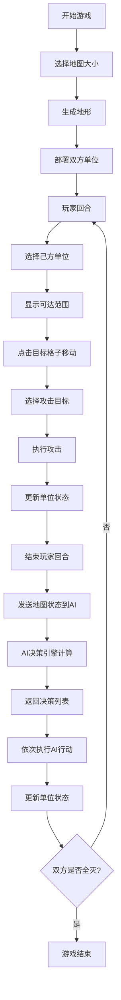

## 1. 产品概述

战棋AI决策模拟应用是一款策略战棋游戏，玩家可以在网格地图上部署单位，通过回合制战斗与AI对战。游戏核心是展示AI决策系统如何根据战场地形和玩家单位位置，动态规划移动路径和攻击目标。

- **核心价值**：直观展示AI决策过程，提供交互式战棋游戏体验
- **目标用户**：策略游戏爱好者、AI学习者、游戏开发者

## 2. 核心功能

### 2.1 用户角色

| 角色 | 注册方式 | 核心权限 |
|------|----------|----------|
| 玩家 | 直接进入 | 部署单位、移动攻击、结束回合、查看AI决策 |

### 2.2 功能模块

1. **地图生成模块**：支持8x8和10x10地图，随机生成草地/山地/水域地形
2. **单位部署模块**：玩家和AI各4个单位，不同类型有不同属性
3. **路径规划模块**：A*算法计算可达范围，高亮显示可移动格子
4. **战斗系统模块**：回合制战斗，攻击选择，伤害计算，单位阵亡
5. **AI决策模块**：后端AI引擎评估威胁、计算最优路径、返回决策指令
6. **动画特效模块**：移动动画、攻击特效、伤害数字、死亡动画
7. **历史记录模块**：记录最近5次AI决策，支持回放

### 2.3 页面详情

| 页面名称 | 模块名称 | 功能描述 |
|----------|----------|----------|
| 主游戏界面 | 地图网格 | 渲染地形和单位，支持点击交互 |
| 主游戏界面 | 单位面板 | 显示选中单位信息，攻击按钮 |
| 主游戏界面 | 状态面板 | 显示双方单位状态，历史决策记录 |
| 主游戏界面 | 战斗动画 | 移动、攻击、伤害、死亡特效 |

## 3. 核心流程

玩家选择地图大小 → 生成地形和部署单位 → 玩家回合（选择单位→移动→攻击）→ 结束回合 → AI决策 → AI执行（移动+攻击）→ 循环直到一方全灭

## 4. 用户界面设计

### 4.1 设计风格

- **主色调**：深灰蓝底色 (#2c3e50)，玩家蓝 (#3498db)，AI红 (#e74c3c)
- **辅助色**：草地浅绿、山地棕灰、水域淡蓝、金色选中边框
- **字体**：现代无衬线字体，清晰易读
- **布局**：左侧游戏地图，右侧状态面板，响应式设计
- **动效**：呼吸灯动画、脉冲高亮、平滑移动、粒子爆发特效

### 4.2 页面设计概览

| 页面名称 | 模块名称 | UI元素 |
|----------|----------|--------|
| 主游戏界面 | 地图网格 | 矩形网格、地形颜色、单位圆形图标、选中金色边框、可达范围蓝色脉冲 |
| 主游戏界面 | 单位面板 | 单位名称、生命值条、攻击力、移动力、攻击按钮 |
| 主游戏界面 | 状态面板 | 深色半透明背景、单位列表、阵亡标记、历史记录 |
| 主游戏界面 | 特效层 | 攻击粒子、伤害数字、移动路径虚线 |

### 4.3 响应式

- **桌面端**（>768px）：左侧地图 + 右侧状态面板并排布局
- **移动端**（≤768px）：地图全屏，状态面板折叠为底部可滚动横条
- 触摸优化：单位点击区域增大，手势支持

### 4.4 性能要求

- 前端路径计算 ≤50ms，不阻塞主线程
- 后端AI决策 ≤300ms（10x10地图，8单位）
- 动画帧率 ≥30fps，使用 requestAnimationFrame
