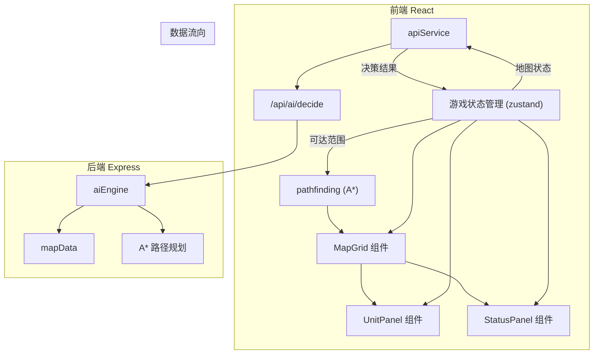
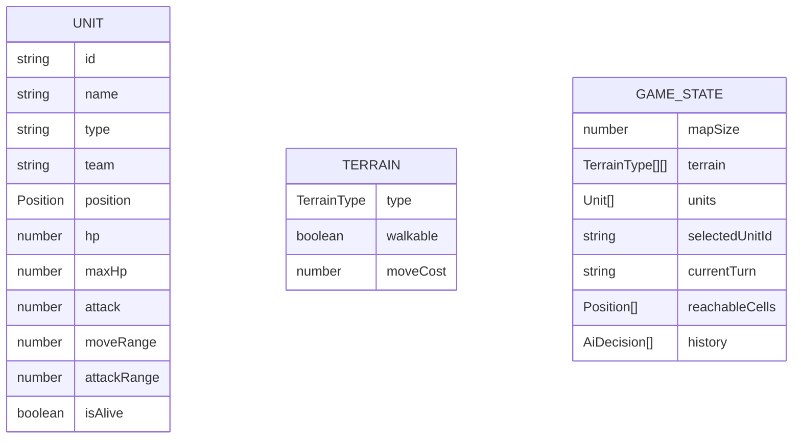

## 1. 架构设计



## 2. 技术描述

- **前端**：React 18 + TypeScript + Vite + zustand 状态管理
- **构建工具**：Vite 5
- **后端**：Express 4 + TypeScript + CORS
- **状态管理**：zustand（前端游戏状态）
- **通信方式**：REST API（/api/ai/decide）
- **动画**：CSS动画 + requestAnimationFrame
- **图标**：lucide-react

## 3. 目录结构

```
.
├── src/
│   ├── components/
│   │   ├── MapGrid.tsx       # 地图网格渲染
│   │   ├── UnitPanel.tsx     # 单位信息面板
│   │   ├── StatusPanel.tsx   # 状态面板
│   │   └── EffectsLayer.tsx  # 特效层
│   ├── services/
│   │   └── apiService.ts     # HTTP请求封装
│   ├── logic/
│   │   └── pathfinding.ts    # A*路径规划
│   ├── store/
│   │   └── gameStore.ts      # 游戏状态管理
│   ├── types/
│   │   └── game.ts           # 类型定义
│   ├── utils/
│   │   └── animation.ts      # 动画工具
│   ├── App.tsx
│   ├── main.tsx
│   └── index.css
├── server/
│   ├── aiEngine.ts           # AI决策引擎
│   ├── mapData.ts            # 地图数据管理
│   └── index.ts              # Express入口
├── shared/
│   └── types.ts              # 共享类型
├── index.html
├── vite.config.ts
├── tsconfig.json
├── package.json
└── tailwind.config.js
```

## 4. API 定义

### 4.1 POST /api/ai/decide

**请求体：**
```typescript
interface AiDecideRequest {
  mapSize: number;
  terrain: TerrainType[][];
  units: Unit[];
  currentTurn: 'player' | 'ai';
}
```

**响应体：**
```typescript
interface AiDecideResponse {
  decisions: AiDecision[];
  timestamp: number;
}

interface AiDecision {
  unitId: string;
  targetPosition: Position;
  path: Position[];
  attackTarget: string | null;
  priority: number;
}
```

## 5. 核心数据模型



## 6. 核心算法

### 6.1 A* 路径规划
- 启发函数：曼哈顿距离
- 移动代价：草地1、山地2、水域不可通行
- 支持可达范围计算（BFS改良版）

### 6.2 AI 决策流程
1. 评估每个敌方单位威胁值（距离、生命值、攻击力）
2. 计算每个AI单位到各目标的最短路径
3. 选择最优目标并计算最佳移动位置
4. 按优先级排序决策列表

## 7. 性能优化

- 前端：Web Worker 计算路径（可选，当前直接计算）
- 后端：缓存路径计算结果，避免重复计算
- 动画：使用 CSS transform 替代 top/left，启用 GPU 加速
