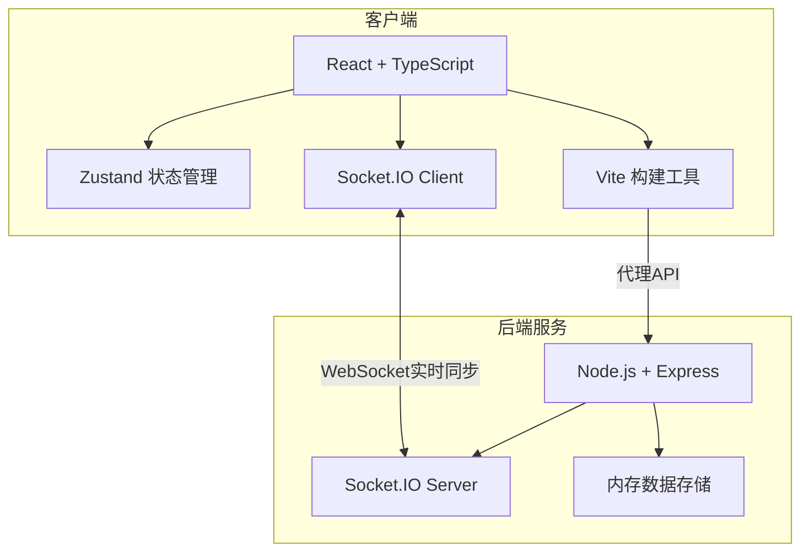
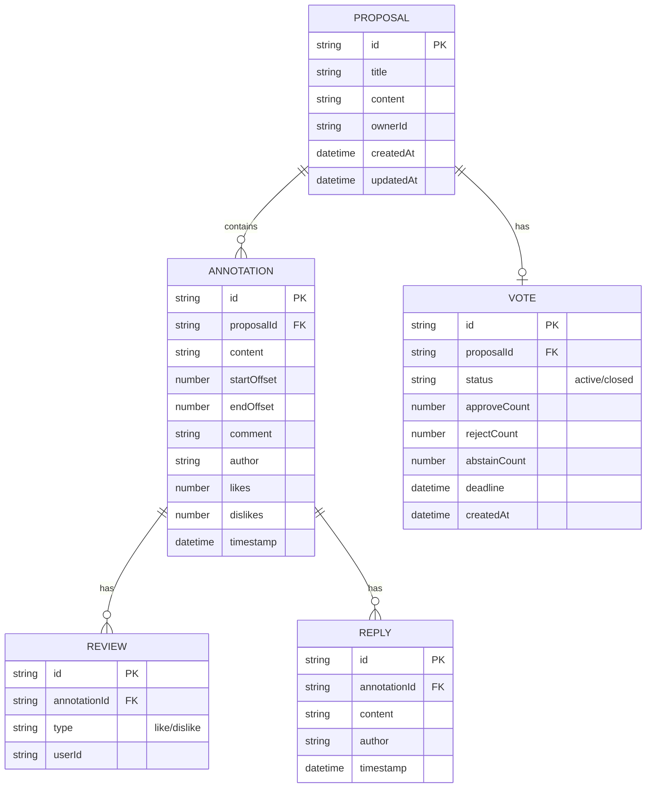

## 1. 架构设计



## 2. 技术栈说明

- **前端框架**：React@18 + TypeScript@5
- **构建工具**：Vite@5
- **状态管理**：Zustand
- **实时通信**：Socket.IO Client + Socket.IO Server
- **后端框架**：Express@4
- **Markdown渲染**：react-markdown + rehype-highlight
- **样式方案**：原生 CSS（按用户要求）
- **图标库**：lucide-react

## 3. 文件结构

```
.
├── package.json
├── index.html
├── vite.config.js
├── tsconfig.json
├── src/
│   ├── main.tsx              # 入口组件
│   ├── App.tsx               # 主布局
│   ├── ProposalEditor.tsx    # 提案编辑器
│   ├── ReviewPanel.tsx       # 评审面板
│   ├── VoteWidget.tsx        # 投票组件
│   ├── TopBar.tsx            # 顶部导航栏
│   ├── store.ts              # Zustand状态管理
│   ├── types.ts              # 类型定义
│   ├── socket.ts             # Socket.IO客户端
│   └── styles.css            # 全局样式
├── server/
│   ├── index.js              # Express + Socket.IO服务器
│   └── mockData.js           # 模拟数据
└── .trae/documents/
    ├── PRD.md
    └── ARCHITECTURE.md
```

## 4. API 定义（WebSocket事件）

### 4.1 客户端 → 服务器

| 事件名 | 参数 | 说明 |
|--------|------|------|
| `annotation:create` | `{id, content, startOffset, endOffset, comment, author, timestamp}` | 创建标注 |
| `annotation:delete` | `{id}` | 删除标注 |
| `review:like` | `{annotationId, type}` | 点赞/反驳 |
| `review:reply` | `{annotationId, content, author, timestamp}` | 回复评论 |
| `vote:create` | `{deadline, duration}` | 发起投票 |
| `vote:cast` | `{type: 'approve'/'reject'/'abstain', voter}` | 投票 |

### 4.2 服务器 → 客户端

| 事件名 | 参数 | 说明 |
|--------|------|------|
| `annotations:init` | `Annotation[]` | 初始化标注列表 |
| `annotation:created` | `Annotation` | 广播新增标注 |
| `annotation:deleted` | `{id}` | 广播删除标注 |
| `annotation:conflict` | `{message, winner}` | 并发冲突通知 |
| `review:updated` | `Annotation` | 评审更新 |
| `vote:created` | `Vote` | 投票创建 |
| `vote:updated` | `Vote` | 投票统计更新 |
| `users:online` | `User[]` | 在线用户列表 |

## 5. 数据模型



## 6. 类型定义（TypeScript）

```typescript
interface User {
  id: string;
  name: string;
  avatar: string;
}

interface Reply {
  id: string;
  annotationId: string;
  content: string;
  author: string;
  timestamp: number;
}

interface Annotation {
  id: string;
  content: string;
  startOffset: number;
  endOffset: number;
  comment: string;
  author: string;
  likes: number;
  dislikes: number;
  replies: Reply[];
  timestamp: number;
  conflictHint?: string;
}

interface Vote {
  id: string;
  status: 'idle' | 'active' | 'closed';
  approveCount: number;
  rejectCount: number;
  abstainCount: number;
  deadline: number | null;
  createdAt: number;
  userVoted: Record<string, 'approve' | 'reject' | 'abstain'>;
}

interface Proposal {
  id: string;
  title: string;
  content: string;
  annotations: Annotation[];
  vote: Vote;
  onlineUsers: User[];
}
```
