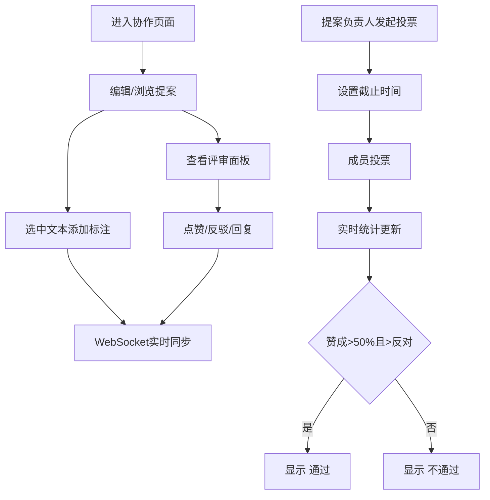

## 1. 产品概述

在线项目提案协作评审系统，旨在为团队提供实时协作评审提案文档的平台。通过标注、讨论和投票功能，帮助团队高效完成提案决策。

- 解决问题：传统邮件/会议评审效率低，意见分散难追踪，决策过程不透明
- 目标用户：产品团队、技术评审委员会、项目管理团队
- 产品价值：提升评审效率 60%，意见可追溯，决策数据化

## 2. 核心功能

### 2.1 用户角色

| 角色 | 核心权限 |
|------|----------|
| 普通成员 | 编辑提案、添加标注、评论回复、参与投票 |
| 提案负责人 | 发起投票、设置截止时间、最终决策权 |

### 2.2 功能模块

1. **提案编辑器**：Markdown实时编辑/预览切换、文本标注添加删除、标注气泡悬浮展示
2. **评审面板**：标注列表展示、点赞/反驳、评论回复、时间倒序排列
3. **投票决策**：发起投票、截止时间设置、圆环进度条展示、通过/不通过判定

### 2.3 页面详情

| 页面名称 | 模块名称 | 功能描述 |
|----------|----------|----------|
| 主协作页面 | 顶部导航栏 | 提案标题、投票入口、在线用户数显示 |
| 主协作页面 | 左侧编辑器 | Markdown编辑、实时预览、标注高亮、气泡评论 |
| 主协作页面 | 右侧评审面板 | 意见列表、点赞/反驳、回复输入、虚拟滚动 |
| 主协作页面 | 投票组件 | 投票按钮、圆环统计、通过判定、截止倒计时 |

## 3. 核心流程

用户进入协作页面 → 编辑或查看提案内容 → 选择文本添加标注/查看已有标注 → 在评审面板点赞/回复/讨论 → 提案负责人发起投票 → 成员投票 → 实时统计并判定结果

## 4. 用户界面设计

### 4.1 设计风格

- **主色调**：深蓝 #1e3a5f，浅灰背景 #f0f2f5
- **强调色**：标注高亮 #ffeeba（淡黄），赞成绿色，反对红色，弃权灰色
- **按钮样式**：圆角8px，悬停渐变背景，按压缩放反馈
- **卡片样式**：圆角12px，柔和阴影，极简设计
- **字体**：编辑器使用 Fira Code 等宽字体，行高1.8
- **图标风格**：使用 lucide-react 线性图标

### 4.2 页面设计概览

| 页面区域 | 模块名称 | UI元素 |
|----------|----------|--------|
| 顶部栏 | 导航栏 | 标题居左、投票按钮居右、圆形用户头像堆叠 |
| 左侧60% | 编辑器 | 行号显示、编辑/预览切换、选中标注高亮、悬浮气泡卡片 |
| 右侧35% | 评审面板 | 首字母圆形头像、时间戳、点赞反驳按钮、回复输入框 |
| 投票弹窗 | 投票组件 | 三色圆环进度条、通过/不通过闪烁标签、截止时间选择 |

### 4.3 响应式设计

- 桌面端（>768px）：左右分栏布局（60%/35%），1px分隔线
- 移动端（<768px）：上下堆叠布局，面板可折叠展开
- 所有交互过渡动画 0.2-0.4秒
- 列表超过30条启用虚拟滚动

### 4.4 动画规范

- 标注气泡：0.2s淡入 + 轻微上移
- 列表展开：0.3s展开动画
- 投票按钮：按压缩放反馈
- 圆环进度：平滑过渡
- 通过/不通过标签：轻微闪烁动画吸引注意
