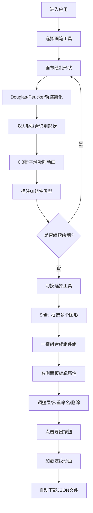

## 1. 产品概述

Sketch2UI是一款实时手绘草图转UI组件树的Web应用，旨在解决设计师与开发者之间因手稿与代码脱节而导致的反复沟通和修改问题。设计师通过手绘草图快速表达设计意图，系统自动识别并转换为可编辑的结构化UI组件，最终以JSON格式导出供开发者使用。

- **核心价值**：桥接设计手稿与代码实现，将设计迭代效率提升300%
- **目标用户**：UI/UX设计师、前端开发者、产品经理

## 2. 核心功能

### 2.1 用户角色
本产品为单角色工具型应用，无需用户注册和权限区分。

### 2.2 功能模块
1. **手绘画布模块**：支持鼠标/触控笔自由绘制、形状实时识别、矢量规整化、平滑吸附动画
2. **组件管理模块**：图形选择、框选分组、层级管理、组件命名、拖拽排序、删除动画
3. **属性面板模块**：选中图形属性展示、坐标尺寸实时编辑、分组信息维护
4. **工具栏模块**：工具切换（画笔/选择/删除/清空）、状态反馈
5. **状态栏模块**：当前工具显示、图形数量统计
6. **JSON导出模块**：一键导出组件树JSON、加载波纹动画、自动下载

### 2.3 页面详情
| 页面名称 | 模块名称 | 功能描述 |
|-----------|-------------|---------------------|
| 主工作区 | 顶部状态栏 | 显示当前激活工具名称、画布图形总数、导出按钮 |
| 主工作区 | 左侧工具栏 | 画笔、选择框、删除、清空画布四个圆角图标按钮 |
| 主工作区 | 中央画布区 | Canvas 2D绘制画布，带网格背景，支持自由绘制和形状识别 |
| 主工作区 | 右侧属性面板 | 选中图形的类型、位置、尺寸输入框，分组管理区域 |

## 3. 核心流程

### 3.1 主用户流程
用户进入应用后，默认使用画笔工具在画布上绘制。当用户完成一笔绘制（鼠标/触控抬起），系统立即执行形状识别算法，将手绘笔迹转换为规整的矢量图形并标注UI组件类型。用户可切换到选择工具，通过Shift+拖拽框选多个图形进行分组，在右侧面板编辑图形属性或重命名分组。完成设计后，点击导出按钮获取JSON格式的组件树文件。

## 4. 用户界面设计

### 4.1 设计风格
- **色彩系统**：冷色调深色主题
  - 画布背景：`#1e1e2e`（深靛蓝灰）
  - 工具栏背景：`#2a2a3e`（稍浅靛蓝灰）
  - 选中边框：`#4fc3f7`（亮青蓝色发光）
  - 网格线：`#333333`（浅灰色，间距20px）
  - 悬停高亮：浅蓝色平移动画
- **按钮风格**：圆角48px×48px图标按钮，带hover背景色过渡动画（0.2s ease-in-out）
- **字体**：主字体使用现代无衬线字体，标题14px加粗，正文12px常规
- **布局风格**：三栏式固定布局，顶部状态栏贯穿全宽
- **图标风格**：简洁线性SVG图标，线条宽度2px，与冷色调主题一致

### 4.2 页面设计概述
| 页面名称 | 模块名称 | UI元素 |
|-----------|-------------|-------------|
| 主工作区 | 顶部状态栏 | 全宽48px高度、左侧工具名称标签、中间图形计数、右侧导出按钮（带波纹动画） |
| 主工作区 | 左侧工具栏 | 固定宽度80px、垂直排列四个工具按钮、激活态发光边框、hover平移动效 |
| 主工作区 | 中央画布区 | 占页面宽度70%、Canvas元素覆盖CSS网格背景图案、图形下方文字标签 |
| 主工作区 | 右侧属性面板 | 固定宽度300px、滚动区域、表单输入框组（x/y/width/height）、分组列表拖拽排序 |

### 4.3 响应式设计
- **桌面端优先**：主要针对桌面Chrome浏览器优化（8GB RAM设备40FPS+）
- **触屏适配**：所有交互元素最小尺寸48px×48px，触控目标间距不小于8px
- **画布自适应**：Canvas元素根据容器宽度动态调整，保持绘制区域比例

### 4.4 动效规范
- **形状吸附**：从手绘原始点集到规整图形的插值动画，持续0.3秒，缓动函数ease-out-cubic
- **选中高亮**：边框蓝色发光脉冲动画（box-shadow: 0 0 8px #4fc3f7）
- **删除动画**：图形以中心点为缩放原点，0.25秒内缩放到0并淡出
- **工具切换**：按钮背景色0.2s ease-in-out过渡，激活图标微平移2px
- **导出波纹**：从按钮中心向外扩散的半透明圆形，2秒内半径从0扩展到200px，透明度从0.8降到0
