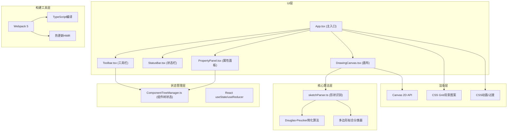

## 1. 架构设计

本应用为纯前端React单页应用，采用分层架构设计，将绘制识别、组件管理、UI渲染三个核心关注点分离。



## 2. 技术描述

- **前端框架**：React 18 + TypeScript 5（严格模式，target ES2020）
- **构建工具**：Webpack 5 + webpack-dev-server（热更新）
- **编译加载器**：ts-loader（TypeScript）、css-loader + style-loader（样式）
- **HTML模板**：html-webpack-plugin（自动生成入口HTML）
- **渲染技术**：Canvas 2D API（矢量绘制）+ DOM/CSS（UI控件与动效）
- **状态管理**：React Hooks（useState/useRef/useCallback）+ 独立Manager类
- **后端/数据库**：无（纯前端应用，导出文件直接下载）

## 3. 项目文件结构

```
auto37/
├── package.json              # 项目依赖与启动脚本
├── index.html                # Webpack入口HTML模板
├── webpack.config.js         # Webpack 5构建配置
├── tsconfig.json             # TypeScript严格模式配置
└── src/
    ├── index.tsx             # React应用入口
    ├── App.tsx               # 主应用组件（布局容器）
    ├── App.css               # 全局样式与CSS变量
    ├── recognition/
    │   └── sketchParser.ts   # 笔画识别核心算法
    ├── drawing/
    │   └── DrawingCanvas.tsx # Canvas画布绘制组件
    ├── componentTree/
    │   └── ComponentTreeManager.ts  # 组件树数据管理
    └── ui/
        ├── Toolbar.tsx       # 左侧工具栏组件
        ├── StatusBar.tsx     # 顶部状态栏组件
        └── PropertyPanel.tsx # 右侧属性面板组件
```

## 4. 核心类型定义

```typescript
// 形状类型枚举
enum ShapeType {
  RECTANGLE = 'rectangle',
  CIRCLE = 'circle',
  TRIANGLE = 'triangle',
  LINE = 'line',
  UNKNOWN = 'unknown'
}

// UI组件类型预测
enum UIComponentType {
  BUTTON = 'Button',
  CARD = 'Card',
  IMAGE = 'Image',
  INPUT = 'Input',
  CONTAINER = 'Container',
  UNKNOWN = 'Unknown'
}

// 画布坐标点
interface Point {
  x: number;
  y: number;
}

// 归一化形状顶点数据
interface ShapeData {
  id: string;
  type: ShapeType;
  predictedComponent: UIComponentType;
  vertices: Point[];        // 形状顶点（矩形4个，三角形3个，圆形为[圆心,半径点]）
  bounds: {                 // 外接矩形
    x: number;
    y: number;
    width: number;
    height: number;
  };
  zIndex: number;
  parentId: string | null;  // 分组ID
  groupName?: string;
}

// 组件树节点（导出格式）
interface ComponentTreeNode {
  id: string;
  type: string;
  x: number;
  y: number;
  width: number;
  height: number;
  zIndex: number;
  parentId: string | null;
  groupName?: string;
  children?: ComponentTreeNode[];
}

// 工具类型
enum ToolType {
  BRUSH = 'brush',
  SELECT = 'select',
  DELETE = 'delete',
  CLEAR = 'clear'
}
```

## 5. 核心算法说明

### 5.1 Douglas-Peucker轨迹简化算法
用于将手绘密集坐标点简化为少量关键点，降低后续识别计算量：
- 输入：原始笔画点集 `Point[]`，简化阈值 ε（默认2px）
- 输出：简化后点集，保留笔画形状特征
- 时间复杂度：O(n log n)

### 5.2 多边形拟合形状识别
基于简化后的点集进行几何特征提取：
1. **矩形判定**（识别率≥95%）：
   - 检查首尾闭合度（端点距离 < 对角线5%）
   - 简化后点数量为3-5个（矩形四角可能合并）
   - 相邻边夹角接近90°（±15°容差）
   - 对边长度比 > 0.7

2. **圆形判定**：
   - 闭合度良好
   - 所有点到外接矩形中心的距离方差 < 半径的8%
   - 宽高比在 0.85 ~ 1.15 之间

3. **三角形判定**：
   - 简化后点数量为3-4个
   - 三内角和接近180°（±10°容差）

4. **UI组件预测**（启发式规则）：
   - 矩形 & 宽高比 2:1 ~ 5:1 → Button
   - 矩形 & 宽高比 1:1 ~ 2:1 & 面积 > 2000px² → Card
   - 矩形 & 宽高比 3:4 ~ 4:3 → Image
   - 矩形 & 窄条 & 高度 < 40px → Input
   - 其他矩形 → Container

### 5.3 平滑吸附动画
使用线性插值（lerp）在0.3秒内从原始手绘点过渡到规整图形顶点：
```
每帧: currentPoint = rawPoint + (targetPoint - rawPoint) * easeOutCubic(elapsed/300ms)
```

## 6. 性能优化策略

### 6.1 Canvas渲染优化（目标40FPS+）
- 使用 `requestAnimationFrame` 驱动渲染循环
- 脏矩形重绘：仅重绘变化区域（形状动画期间、选中状态变化时）
- 离屏Canvas缓存已完成的静态形状
- 绘制路径预计算，避免每帧重复识别计算

### 6.2 内存优化（导出<50MB）
- 形状顶点数据按需保留，原始笔画识别后立即释放
- Canvas使用 `willReadFrequently: false` 优化GPU内存
- 导出JSON前进行扁平化压缩，去除冗余字段
- 200节点以内JSON体积约50-100KB，序列化耗时<0.1s

### 6.3 React渲染优化
- `PropertyPanel` 使用 `React.memo` 包裹，避免无关重渲染
- 形状列表使用稳定的 `key`（shape.id）
- 高频事件（mousemove）使用 `useRef` 直接操作Canvas，不触发React更新
- `useCallback` 缓存事件处理函数引用

## 7. 构建配置要点

### webpack.config.js 关键配置
- entry: `./src/index.tsx`
- output: `dist/bundle.js`，开启clean模式
- resolve.extensions: ['.ts', '.tsx', '.js']
- module.rules:
  - `/\.tsx?$/` → ts-loader，排除node_modules
  - `/\.css$/` → style-loader + css-loader
- plugins: `HtmlWebpackPlugin`（基于index.html模板）
- devServer: port 3000，hot: true，open: true
- mode: development，devtool: 'eval-source-map'

### tsconfig.json 关键配置
- strict: true（严格模式）
- target: ES2020
- module: ESNext
- jsx: react-jsx
- moduleResolution: node
- esModuleInterop: true
- skipLibCheck: true
