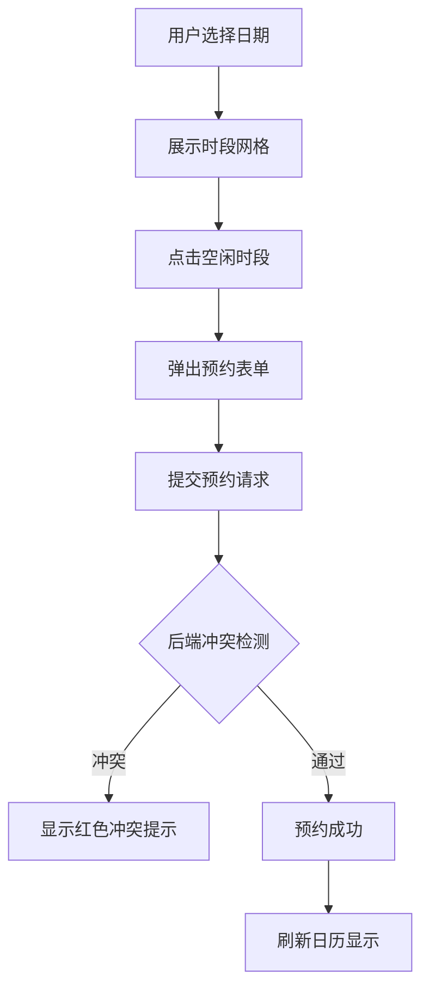
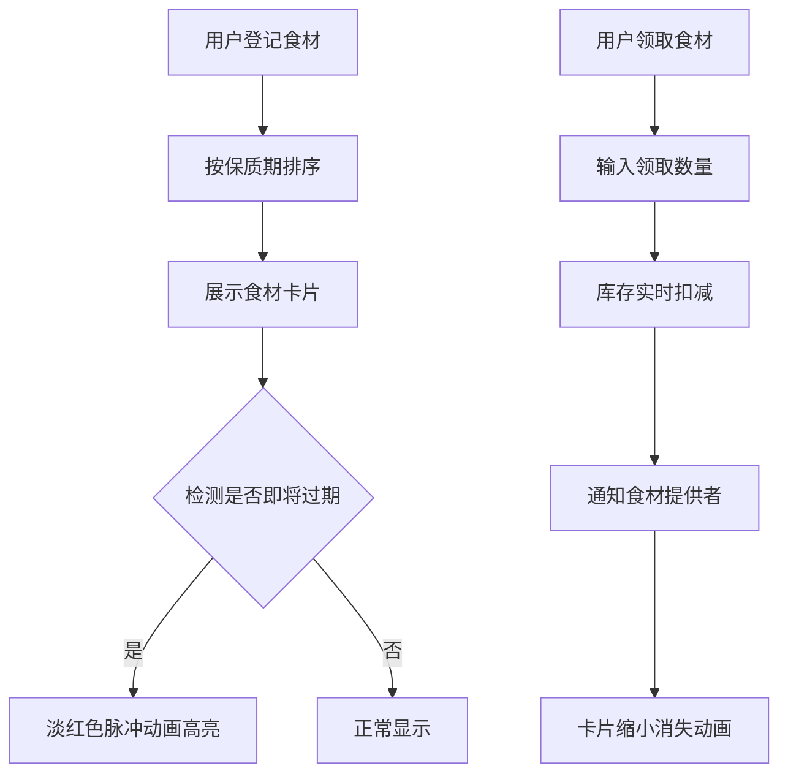

## 1. 产品概述
社区共享厨房资源预约与食材共享平台，解决邻里间共用厨具和食材时的预约冲突和食材过期浪费问题。
- 主要目的：优化社区厨房资源利用，减少食材浪费，促进邻里互助
- 目标用户：社区居民、共享厨房使用者
- 产品价值：通过智能预约和食材共享机制，提升资源利用率，降低生活成本

## 2. 核心功能

### 2.1 用户角色
| 角色 | 注册方式 | 核心权限 |
|------|----------|----------|
| 社区居民 | 默认用户 | 预约厨房时段、登记/领取食材、查看通知 |

### 2.2 功能模块
1. **厨房预约页面**：日历网格展示、时段预约、冲突检测、预约取消
2. **食材共享页面**：食材卡片列表、食材登记、食材领取、过期提醒
3. **通知系统**：过期食材提醒、领取通知、预约冲突提醒

### 2.3 页面详情
| 页面名称 | 模块名称 | 功能描述 |
|---------|----------|----------|
| 厨房预约页 | 日历网格 | 以半小时为单位展示可预约时段，绿色空闲、红色约满、黄色部分占用 |
| 厨房预约页 | 预约表单 | 点击空闲时段弹出表单，填写时长和用途，提交后检测冲突 |
| 厨房预约页 | 预约记录 | 展示用户预约列表，支持取消操作（从右向左划出动画） |
| 食材共享页 | 食材卡片瀑布流 | 按保质期排序展示共享食材，即将过期高亮显示 |
| 食材共享页 | 食材登记表单 | 登记多余食材（名称、数量、保质期、存放位置） |
| 食材共享页 | 食材领取操作 | 输入领取数量后扣减库存，通知提供者 |
| 导航栏 | 通知角标 | 显示当日过期食材数量（红色数字角标） |

## 3. 核心流程

### 3.1 厨房预约流程
用户选择日期 → 系统展示当日时段网格 → 用户点击空闲时段 → 弹出预约表单 → 用户填写时长和用途 → 后端检测设备冲突 → 冲突则显示红色提示 → 通过则预约成功 → 刷新日历

### 3.2 食材共享流程
用户登记食材 → 系统按保质期排序 → 展示食材卡片列表 → 用户选择食材领取 → 输入领取数量 → 库存实时扣减 → 发送通知给提供者 → 卡片缩小消失动画

## 4. 用户界面设计

### 4.1 设计风格
- **主色调**：浅橙色 #FFF3E0（背景）、深棕色 #5D4037（文字主色）
- **辅助色**：绿色 #66BB6A（可用/成功）、红色 #E53935（冲突/过期）
- **按钮样式**：圆角 8px，点击时 scale(0.95) 缩放 + 涟漪效果 0.6s
- **字体**：标题使用温暖的衬线字体，正文使用清晰的无衬线字体
- **布局风格**：卡片式布局，暖色调营造温馨社区氛围
- **图标风格**：使用 lucide-react 线性图标，与整体暖色调统一

### 4.2 页面设计概述
| 页面名称 | 模块名称 | UI 元素 |
|---------|----------|---------|
| 厨房预约页 | 日历网格 | 30分钟时段格子、悬停放大阴影过渡0.2s、颜色状态指示 |
| 厨房预约页 | 预约表单 | 从折叠到展开的平滑高度动画、红色冲突提示框 |
| 厨房预约页 | 预约记录卡片 | 取消按钮从右向左划出动画释放时段 |
| 食材共享页 | 食材卡片 | 瀑布流布局、16px间距、保质进度条（绿→黄→红渐变） |
| 食材共享页 | 过期食材 | 淡红色背景脉冲动画（2秒间隔闪烁） |
| 导航栏 | 角标通知 | 红色数字角标显示过期食材数量 |
| 全局 | 页面切换 | 淡入淡出过渡（opacity 0→1，0.3s） |

### 4.3 响应式设计
- **大屏（≥1200px）**：食材卡片 3 列布局
- **中屏（≥768px 且 <1200px）**：食材卡片 2 列布局
- **小屏（<768px）**：食材卡片 1 列布局
- 触摸优化：按钮最小尺寸 44×44px，增加点击区域

### 4.4 性能约束
- 预约时段网格渲染时间 ≤ 200ms（30天 × 48时段）
- 食材列表首次加载时间 ≤ 1s（100条以内）
- 后端 API 响应时间 ≤ 500ms
