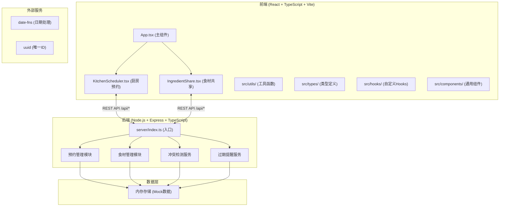
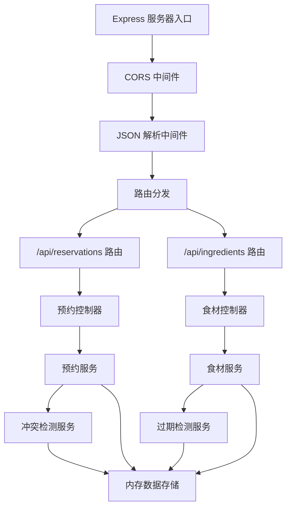
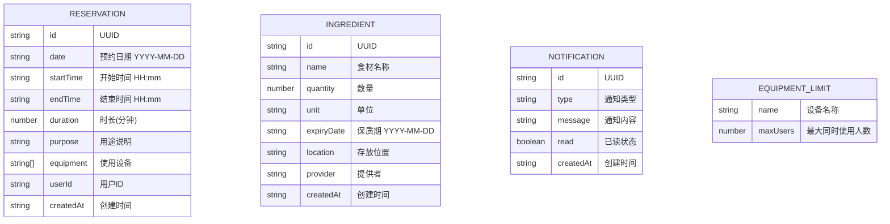

## 1. 架构设计



## 2. 技术描述
- **前端**：React@18 + TypeScript + Vite + TailwindCSS + Zustand
- **后端**：Express@4 + TypeScript
- **数据库**：内存存储（Mock数据，便于演示）
- **核心依赖**：uuid, date-fns, lucide-react
- **初始化工具**：vite-init，使用 react-express-ts 模板

## 3. 路由定义
| 路由 | 用途 |
|------|------|
| / | 重定向到 /kitchen |
| /kitchen | 厨房预约页面 |
| /ingredients | 食材共享页面 |

## 4. API 定义

### 4.1 预约相关 API

#### 获取预约列表
```typescript
GET /api/reservations?date=YYYY-MM-DD
Response: {
  success: boolean;
  data: Reservation[];
}
```

#### 创建预约
```typescript
POST /api/reservations
Request: {
  date: string;
  startTime: string;
  duration: number; // 分钟
  purpose: string;
  equipment: string[];
}
Response: {
  success: boolean;
  data?: Reservation;
  conflicts?: ConflictItem[];
  message?: string;
}
```

#### 取消预约
```typescript
DELETE /api/reservations/:id
Response: {
  success: boolean;
  message: string;
}
```

### 4.2 食材相关 API

#### 获取食材列表
```typescript
GET /api/ingredients
Response: {
  success: boolean;
  data: Ingredient[];
}
```

#### 登记食材
```typescript
POST /api/ingredients
Request: {
  name: string;
  quantity: number;
  unit: string;
  expiryDate: string;
  location: string;
  provider: string;
}
Response: {
  success: boolean;
  data: Ingredient;
}
```

#### 领取食材
```typescript
PUT /api/ingredients/:id/claim
Request: {
  quantity: number;
  claimant: string;
}
Response: {
  success: boolean;
  data?: Ingredient;
  message?: string;
}
```

#### 获取过期食材
```typescript
GET /api/ingredients/expired
Response: {
  success: boolean;
  data: Ingredient[];
  count: number;
}
```

### 4.3 类型定义

```typescript
interface Reservation {
  id: string;
  date: string;
  startTime: string;
  endTime: string;
  duration: number;
  purpose: string;
  equipment: string[];
  userId: string;
  createdAt: string;
}

interface ConflictItem {
  equipment: string;
  maxUsers: number;
  currentUsers: number;
  timeRange: string;
}

interface Ingredient {
  id: string;
  name: string;
  quantity: number;
  unit: string;
  expiryDate: string;
  location: string;
  provider: string;
  createdAt: string;
}

interface Notification {
  id: string;
  type: 'expiry' | 'claim' | 'reservation';
  message: string;
  read: boolean;
  createdAt: string;
}

interface EquipmentLimit {
  name: string;
  maxUsers: number;
}
```

## 5. 服务器架构图



## 6. 数据模型

### 6.1 数据模型定义



### 6.2 初始化数据
```typescript
// 设备限制配置
const equipmentLimits: EquipmentLimit[] = [
  { name: '烤箱', maxUsers: 2 },
  { name: '灶台', maxUsers: 3 },
  { name: '微波炉', maxUsers: 1 },
  { name: '电饭煲', maxUsers: 2 },
  { name: '料理机', maxUsers: 1 },
];

// Mock 预约数据
const mockReservations: Reservation[] = [
  {
    id: '1',
    date: '2026-06-12',
    startTime: '09:00',
    endTime: '10:30',
    duration: 90,
    purpose: '烘焙蛋糕',
    equipment: ['烤箱'],
    userId: 'user1',
    createdAt: '2026-06-10T10:00:00Z',
  },
];

// Mock 食材数据
const mockIngredients: Ingredient[] = [
  {
    id: '1',
    name: '鸡蛋',
    quantity: 10,
    unit: '个',
    expiryDate: '2026-06-13',
    location: '冰箱A层',
    provider: '张阿姨',
    createdAt: '2026-06-10T08:00:00Z',
  },
  {
    id: '2',
    name: '西红柿',
    quantity: 5,
    unit: '斤',
    expiryDate: '2026-06-18',
    location: '厨房置物架',
    provider: '李叔叔',
    createdAt: '2026-06-11T09:00:00Z',
  },
];
```

## 7. 文件结构与调用关系

```
project-root/
├── package.json          # 根依赖配置
├── index.html            # 入口 HTML
├── vite.config.js        # Vite 配置（代理 /api）
├── tsconfig.json         # TypeScript 配置
├── src/
│   ├── App.tsx           # 主组件 → 加载数据，分发到子组件
│   ├── main.tsx          # React 入口
│   ├── index.css         # 全局样式
│   ├── types/
│   │   └── index.ts      # 类型定义 → 被所有组件引用
│   ├── utils/
│   │   ├── dateUtils.ts  # 日期工具函数
│   │   └── api.ts        # API 请求封装 → 组件调用后端
│   ├── hooks/
│   │   ├── useReservations.ts  # 预约数据 Hook
│   │   └── useIngredients.ts   # 食材数据 Hook
│   ├── components/
│   │   ├── Navbar.tsx          # 导航栏组件
│   │   ├── NotificationBar.tsx # 通知栏组件
│   │   ├── TimeSlotGrid.tsx    # 时段网格组件
│   │   ├── ReservationForm.tsx # 预约表单组件
│   │   ├── IngredientCard.tsx  # 食材卡片组件
│   │   └── IngredientForm.tsx  # 食材登记表单
│   ├── pages/
│   │   ├── KitchenScheduler.tsx  # 厨房预约页面
│   │   └── IngredientShare.tsx   # 食材共享页面
│   └── store/
│       └── useAppStore.ts     # Zustand 状态管理
└── server/
    ├── index.ts             # 后端入口 → 启动 Express 服务
    ├── types.ts             # 后端类型定义
    ├── data/
    │   └── mockData.ts      # Mock 数据
    ├── services/
    │   ├── reservationService.ts  # 预约业务逻辑
    │   ├── ingredientService.ts   # 食材业务逻辑
    │   ├── conflictService.ts     # 冲突检测服务
    │   └── expiryService.ts       # 过期检测服务
    ├── controllers/
    │   ├── reservationController.ts  # 预约 API 处理
    │   └── ingredientController.ts   # 食材 API 处理
    └── routes/
        ├── reservations.ts  # 预约路由
        └── ingredients.ts   # 食材路由
```

### 数据流说明
1. **预约流程**：
   - KitchenScheduler.tsx → useReservations.ts → api.ts → server/routes/reservations.ts → reservationController.ts → reservationService.ts → conflictService.ts → mockData.ts

2. **食材流程**：
   - IngredientShare.tsx → useIngredients.ts → api.ts → server/routes/ingredients.ts → ingredientController.ts → ingredientService.ts → expiryService.ts → mockData.ts

3. **状态更新**：
   - 后端返回数据 → api.ts → hooks → Zustand store → 组件重新渲染

## 8. 性能优化策略

1. **时段网格渲染优化**：
   - 使用 CSS Grid 批量渲染，避免重排
   - 仅渲染当前可见日期范围
   - 使用 React.memo 包裹 TimeSlotGrid 组件

2. **食材列表优化**：
   - 分页加载（默认显示前50条）
   - 虚拟滚动（可选）
   - 图片懒加载（如有图片）

3. **后端优化**：
   - 内存数据使用 Map 存储，O(1) 查找
   - 冲突检测使用时间区间交集算法
   - 过期检测使用缓存，每小时更新一次
