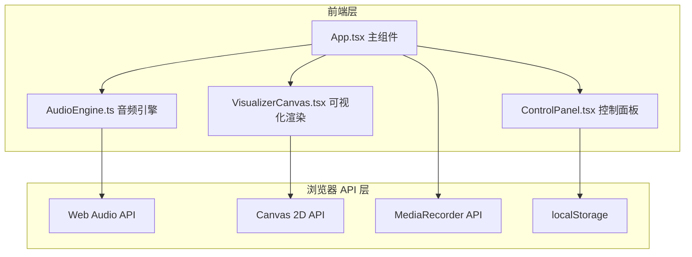

## 1. 架构设计



## 2. 技术说明

- 前端：React@18 + TypeScript + Vite（纯前端项目，无后端）
- 初始化工具：vite-init（react-ts 模板）
- 音频处理：Web Audio API（AudioContext, AnalyserNode, GainNode）
- 可视化渲染：Canvas 2D API + requestAnimationFrame
- 录制：MediaRecorder API（捕获 Canvas 流 + 音频流）
- 状态管理：React Hooks（useState/useRef/useEffect/useCallback）
- 参数持久化：localStorage
- 样式：CSS（全局样式 + CSS 变量）

## 3. 路由定义

| 路由 | 用途 |
|------|------|
| / | 主页面，包含可视化区域和控制面板 |

## 4. 数据模型

### 4.1 核心数据结构

```typescript
interface VisualizerParams {
  barCount: number;
  particleSize: number;
  backgroundHue: number;
  backgroundSaturation: number;
  backgroundLightness: number;
  sensitivity: number;
}

type VisualizerMode = 'bars' | 'waveform' | 'circular' | 'particles';

interface PlaybackState {
  isPlaying: boolean;
  currentTime: number;
  duration: number;
  volume: number;
  buffered: number;
}

interface RecordingState {
  isRecording: boolean;
  startTime: number | null;
}
```

### 4.2 参数持久化

VisualizerParams 通过 JSON 序列化存储到 localStorage 的 `visualizer-params` 键中，页面加载时自动读取并恢复。

## 5. 文件结构

```
├── package.json
├── vite.config.js
├── tsconfig.json
├── index.html
└── src/
    ├── audio/
    │   └── AudioEngine.ts
    ├── visualizer/
    │   └── VisualizerCanvas.tsx
    ├── controls/
    │   └── ControlPanel.tsx
    ├── App.tsx
    ├── main.tsx
    └── styles.css
```

## 6. 模块职责

### 6.1 AudioEngine.ts
- 使用 Web Audio API 创建 AudioContext、AnalyserNode、GainNode
- 接收 Blob 文件并解码为 AudioBuffer
- 提供 `getFrequencyData()` 和 `getTimeDomainData()` 方法
- 提供播放/暂停/seek/音量控制
- 通过回调函数向 React 组件发射频谱数据和播放状态

### 6.2 VisualizerCanvas.tsx
- 接收频谱数据和播放进度
- 使用 requestAnimationFrame 在 Canvas 上绘制四种可视化模式
- 维护当前模式状态和过渡动画
- 支持参数调节回调
- 频谱柱状图：柱子颜色随频率渐变（低频暖色→高频冷色）
- 波形曲线图：带发光阴影的平滑曲线
- 圆形环绕频谱图：环形排列的频谱柱
- 粒子频谱瀑布流：粒子从底部向上流动

### 6.3 ControlPanel.tsx
- 文件选择器（MP3/WAV/OGG）
- 播放/暂停按钮
- 进度条（显示缓冲区域）
- 音量滑块
- 模式切换按钮组
- 自定义参数滑块（柱子数量、粒子大小、背景色HSL、敏感度）
- 录制按钮（红点闪烁动画）
- 所有交互通过 props 回调传递

### 6.4 App.tsx
- 组合 AudioEngine、VisualizerCanvas 和 ControlPanel
- 管理全局状态（音频文件、播放状态、可视化参数、录制状态）
- 处理录制逻辑（MediaRecorder 捕获 Canvas 流 + 音频流）
- 提供响应式布局
- 参数持久化到 localStorage
