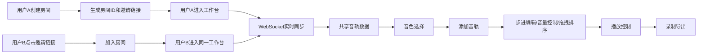

## 1. 产品概述
在线音乐协作工作坊应用，让音乐爱好者能在浏览器中一起创作简单的电子音乐片段。通过 WebSocket 实现多用户实时协作编辑，支持步进音序器模式的多音轨电子音乐制作。
- 目标用户：电子音乐爱好者、音乐制作人、音乐教育场景师生
- 产品价值：降低协作门槛，实现零配置的浏览器端多人实时音乐创作

## 2. 核心功能

### 2.1 用户角色
| 角色 | 注册方式 | 核心权限 |
|------|---------|---------|
| 协作用户 | 无需注册，通过房间链接加入 | 加入房间、编辑音轨、同步播放 |
| 房间创建者 | 创建房间自动生成 | 生成邀请链接、管理房间成员 |

### 2.2 功能模块
1. **协作房间系统**：创建房间、生成邀请链接、房间成员同步
2. **音轨编辑器**：波形预览、音量控制、静音/独奏、删除音轨、拖拽排序
3. **音色选择面板**：6种预设音色、示例播放、快速添加音轨
4. **步进音序器**：16步开关网格、速度调节、当前步高亮
5. **播放控制**：播放/暂停、停止、录制

### 2.3 页面详情
| 页面名称 | 模块名称 | 功能描述 |
|---------|---------|---------|
| 主工作台 | 房间管理区 | 创建房间、显示房间ID、复制邀请链接、显示在线成员 |
| 主工作台 | 播放控制栏 | 播放/暂停按钮、停止按钮、录制按钮、BPM速度调节、顶部进度条 |
| 主工作台 | 音色选择面板 | 6种音色卡片展示、播放示例、添加到音轨列表 |
| 主工作台 | 音轨列表区 | 多音轨卡片展示、拖拽排序、步进音序器网格 |
| 音轨卡片 | 波形预览区 | Canvas 绘制基本波形图 |
| 音轨卡片 | 控制面板 | 音量滑块(0-100带数值)、静音按钮、独奏按钮、删除按钮(带确认弹窗) |
| 音轨卡片 | 步进音序器 | 16步开关按钮网格、当前步绿色发光高亮 |

## 3. 核心流程
用户创建房间 → 生成唯一邀请链接 → 其他用户通过链接加入 → 所有客户端共享音轨状态 → 选择音色添加音轨 → 编辑步进音序器 → 调节音量/静音/独奏 → 拖拽排序音轨 → 播放/录制音乐片段。所有编辑操作通过 WebSocket 实时广播同步。

## 4. 用户界面设计
### 4.1 设计风格
- 主色调：背景 #1a1a2e，卡片 #16213e，高亮 #0f3460，点缀 #e94560
- 深色酷炫电子音乐风格，毛玻璃半透明效果，边框发光
- 圆角矩形卡片，步进按钮0.2秒缩放动画，播放按钮旋转动画，拖拽弹簧动画
- 字体：使用具有未来感的现代字体，标题醒目，数据清晰

### 4.2 页面设计概述
| 页面名称 | 模块名称 | UI元素 |
|---------|---------|--------|
| 主工作台 | 房间管理区 | 房间ID标签、复制链接按钮、在线成员头像列表 |
| 主工作台 | 播放控制栏 | 播放/暂停(旋转动画)、停止、录制按钮，BPM滑块，顶部流动进度条 |
| 主工作台 | 音色选择面板 | 6张音色卡片，含名称、类型标签、播放按钮 |
| 主工作台 | 音轨列表区 | 垂直排列音轨卡片，支持拖拽排序，拖拽时有阴影透明效果 |
| 音轨卡片 | 波形区 | Canvas绘制渐变波形，背景暗色渐变 |
| 音轨卡片 | 控制面板 | 音色名称标签、音量滑块+数值、静音(带图标高亮)、独奏(带图标高亮)、删除按钮 |
| 音轨卡片 | 步进音序器 | 16个方形按钮网格，开启时填充主色，关闭时浅灰，当前步绿色发光 |

### 4.3 响应式设计
- 桌面端：音轨卡片横向展开，步进按钮大尺寸，音色面板水平排列
- 平板端：音轨卡片间距缩小，音色面板两列排列
- 手机端：所有区域垂直堆叠，音轨卡片紧凑显示，步进按钮缩小

### 4.4 动效设计
- 播放按钮旋转动画（播放时持续慢速旋转）
- 步进按钮切换时0.2s缩放动画
- 音轨拖拽时弹簧动画和阴影效果
- 顶部进度条从左向右流动渐变
- 当前步绿色发光脉冲效果
- 音色卡片悬停时上浮+发光效果
