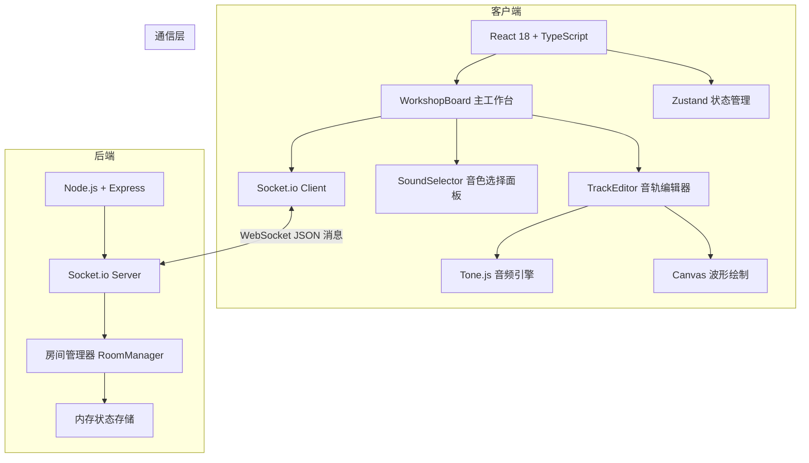
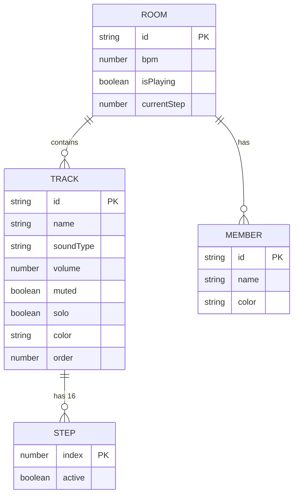
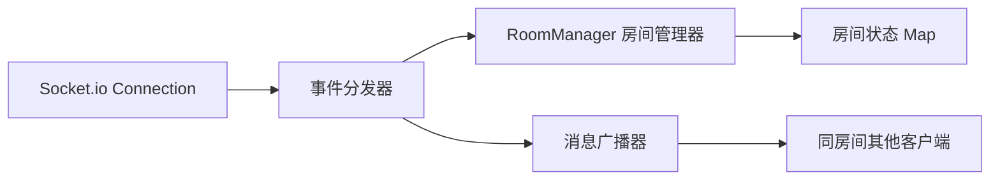

## 1. 架构设计



## 2. 技术描述
- **前端**：React@18 + TypeScript + Vite@5
- **音频引擎**：Tone.js 用于合成器、采样器、音序器调度
- **状态管理**：Zustand 管理本地状态，WebSocket 事件驱动全局同步
- **WebSocket**：socket.io@4 + socket.io-client@4
- **后端**：Express@4 + TypeScript + Socket.io Server
- **唯一ID**：uuid@9
- **UI样式**：原生 CSS + CSS 变量，响应式布局
- **图标**：lucide-react

## 3. 文件结构
```
├── package.json
├── index.html
├── vite.config.js
├── tsconfig.json
├── src/
│   ├── main.tsx              # React 入口
│   ├── App.tsx               # 根组件
│   ├── WorkshopBoard.tsx     # 主工作台组件
│   ├── TrackEditor.tsx       # 单音轨编辑组件
│   ├── SoundSelector.tsx     # 音色选择面板
│   ├── store/
│   │   └── useWorkshopStore.ts  # Zustand 状态
│   ├── types/
│   │   └── index.ts          # 共享类型定义
│   ├── utils/
│   │   └── audio.ts          # Tone.js 封装
│   └── styles/
│       └── index.css         # 全局样式
└── server/
    └── index.ts              # WebSocket 服务器
```

## 4. WebSocket 消息协议
### 消息类型定义
```typescript
interface ServerToClientEvents {
  'room:joined': (payload: { roomId: string; tracks: Track[]; bpm: number; members: Member[] }) => void;
  'track:added': (payload: { track: Track }) => void;
  'track:removed': (payload: { trackId: string }) => void;
  'track:updated': (payload: { trackId: string; updates: Partial<Track> }) => void;
  'tracks:reordered': (payload: { trackIds: string[] }) => void;
  'sequencer:step': (payload: { step: number }) => void;
  'bpm:changed': (payload: { bpm: number }) => void;
  'playback:state': (payload: { isPlaying: boolean; currentStep: number }) => void;
  'member:joined': (payload: { member: Member }) => void;
  'member:left': (payload: { memberId: string }) => void;
}

interface ClientToServerEvents {
  'room:create': () => void;
  'room:join': (payload: { roomId: string }) => void;
  'track:add': (payload: { soundPreset: SoundPreset }) => void;
  'track:remove': (payload: { trackId: string }) => void;
  'track:update': (payload: { trackId: string; updates: Partial<Track> }) => void;
  'tracks:reorder': (payload: { trackIds: string[] }) => void;
  'bpm:change': (payload: { bpm: number }) => void;
  'playback:play': () => void;
  'playback:pause': () => void;
  'playback:stop': () => void;
  'sequencer:step': (payload: { step: number }) => void;
}
```

## 5. 数据模型
### 5.1 数据模型定义


### 5.2 TypeScript 类型定义
```typescript
type SoundType = '808-drum' | 'synth-bass' | 'e-piano' | 'strings' | 'square-lead' | 'noise-perc';

interface SoundPreset {
  id: SoundType;
  name: string;
  type: 'drum' | 'bass' | 'keys' | 'pad' | 'lead' | 'percussion';
  color: string;
}

interface Track {
  id: string;
  name: string;
  soundPreset: SoundPreset;
  volume: number;
  muted: boolean;
  solo: boolean;
  steps: boolean[];
  color: string;
  order: number;
}

interface Member {
  id: string;
  name: string;
  color: string;
}

interface RoomState {
  id: string;
  bpm: number;
  isPlaying: boolean;
  currentStep: number;
  tracks: Track[];
  members: Member[];
}
```

## 6. 后端架构


### 6.1 服务器职责
1. 管理房间生命周期（创建、销毁）
2. 维护每个房间的状态快照
3. 接收客户端操作并广播给同房间其他客户端
4. 维护在线成员列表
5. 确保房间状态最终一致性

## 7. 性能优化策略
1. **WebSocket**：消息延迟目标 < 200ms，使用增量更新而非全量同步
2. **音频调度**：Tone.js Transport 统一调度，避免 setTimeout 漂移
3. **Canvas 波形**：预渲染波形数据，只在音轨变化时重绘
4. **步进渲染**：使用 CSS class 切换而非 DOM 重建，保持 60fps
5. **批量同步**：连续操作使用节流 50ms 合并发送
