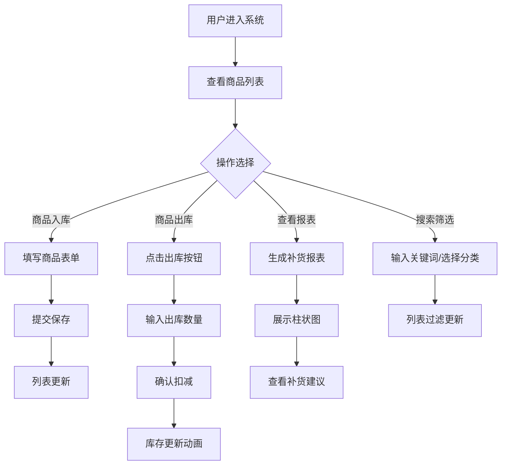

## 1. 产品概述

库存预警与商品追踪系统是一款面向小型零售商的库存管理应用，旨在解决手动盘点库存和追踪商品过期日期效率低下的问题。通过数字化管理商品入库、库存实时更新、过期日期提醒以及补货建议报表，帮助店主提升库存管理效率，减少商品损耗。

- **目标用户**：小型零售商、便利店店主
- **核心价值**：提升库存管理效率，降低过期商品损耗，智能补货建议

## 2. 核心功能

### 2.1 用户角色
| 角色 | 注册方式 | 核心权限 |
|------|----------|----------|
| 店主 | 系统内置 | 商品管理、库存操作、查看报表、系统配置 |

### 2.2 功能模块
1. **商品管理**：商品入库、编辑、删除、分类管理
2. **库存管理**：库存实时扣减、库存数量展示、库存状态预警
3. **过期预警**：过期日期提醒、临近过期高亮、已过期标识
4. **补货报表**：自动生成补货建议、柱状图可视化、补货理由说明
5. **筛选搜索**：按名称搜索、按分类筛选

### 2.3 页面详情
| 页面名称 | 模块名称 | 功能描述 |
|----------|----------|----------|
| 商品库存页 | 商品表格 | 展示商品列表、库存数量、过期日期、预警状态，支持删除和出库操作 |
| 商品库存页 | 商品表单 | 商品入库表单，输入名称、数量、过期日期、分类 |
| 商品库存页 | 搜索筛选 | 按名称搜索、按分类筛选标签 |
| 商品库存页 | 预警提示栏 | 显示即将过期和已过期商品数量 |
| 补货报表页 | 柱状图 | 展示当前库存与建议补货量对比 |
| 补货报表页 | 补货列表 | 列出具体补货数量和理由 |

## 3. 核心流程

### 3.1 商品入库流程
用户填写商品表单 → 提交表单 → 后端验证数据 → 保存商品 → 前端列表更新 → 显示成功提示

### 3.2 库存出库流程
用户点击出库按钮 → 弹出数量输入对话框 → 输入出库数量 → 确认提交 → 后端更新库存 → 前端数字翻转动画 → 更新列表

### 3.3 补货报表生成流程
用户点击生成报表按钮 → 调用报表接口 → 后端计算补货建议 → 返回报表数据 → 前端渲染柱状图和列表

### 3.4 流程图

## 4. 用户界面设计

### 4.1 设计风格
- **主色调**：深蓝 `#1E3A5F`、浅蓝 `#4A90D9`
- **背景色**：米白 `#F8F9FA`
- **预警色**：暖橙 `#FF6B35`、警示红 `#D32F2F`
- **按钮风格**：深蓝到浅蓝渐变，圆角设计，hover 亮度提升并放大 1.02 倍
- **字体**：现代无衬线字体，清晰易读
- **布局风格**：左侧固定导航栏 + 右侧动态内容区，卡片式设计
- **图标风格**：简洁线性图标，与主题色一致

### 4.2 页面设计概述
| 页面名称 | 模块名称 | UI 元素 |
|----------|----------|---------|
| 商品库存页 | 导航栏 | 深蓝背景，系统名称，功能链接，hover 下划线动画 |
| 商品库存页 | 预警提示栏 | 从左滑入动画，显示过期商品统计 |
| 商品库存页 | 分类筛选标签 | 全部/食品/日用品，选中下划线高亮，淡入淡出切换 |
| 商品库存页 | 商品表格 | 深蓝表头白色文字，行交替底色，过期行红色背景闪烁 |
| 商品库存页 | 商品表单 | 卡片式布局，输入框，日期选择器，下拉选择 |
| 商品库存页 | 出库对话框 | 模态框，数量输入，确认/取消按钮 |
| 补货报表页 | 柱状图 | 从下至上渐显动画，悬停高亮显示数值 |
| 补货报表页 | 补货列表 | 卡片列表，商品名称、补货数量、理由 |

### 4.3 响应式设计
- 桌面端优先设计，最小宽度 1024px
- 内容区宽度自适应
- 左侧导航栏固定宽度

### 4.4 动画效果
- 页面加载：从底部滑入淡入效果（0.4秒）
- 数字更新：CSS 3D 翻转效果（0.3秒）
- 行删除：缩小淡出动画
- 按钮交互：点击瞬间缩放 0.95 倍再恢复
- 卡片 hover：阴影深度增加
- 过期预警：脉冲动画警告图标
