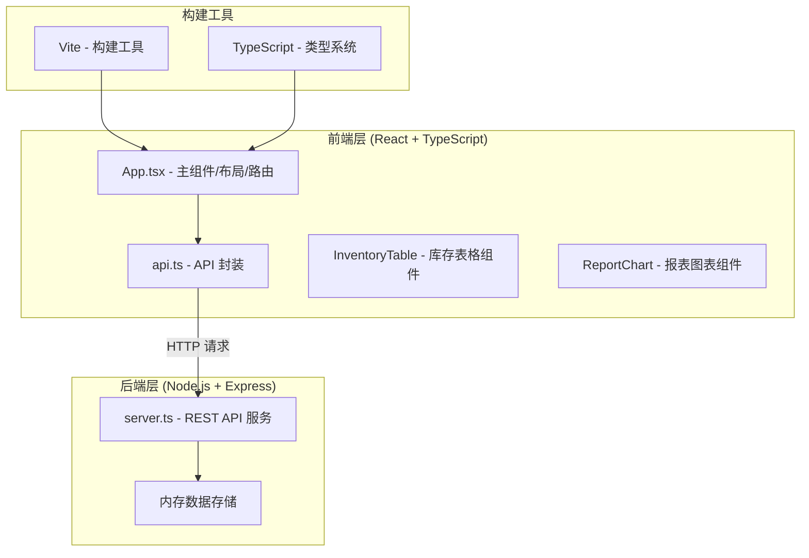
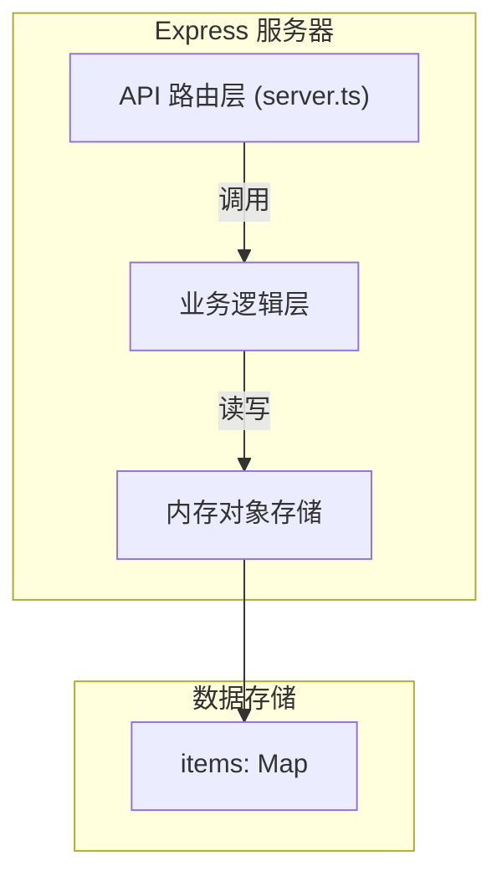
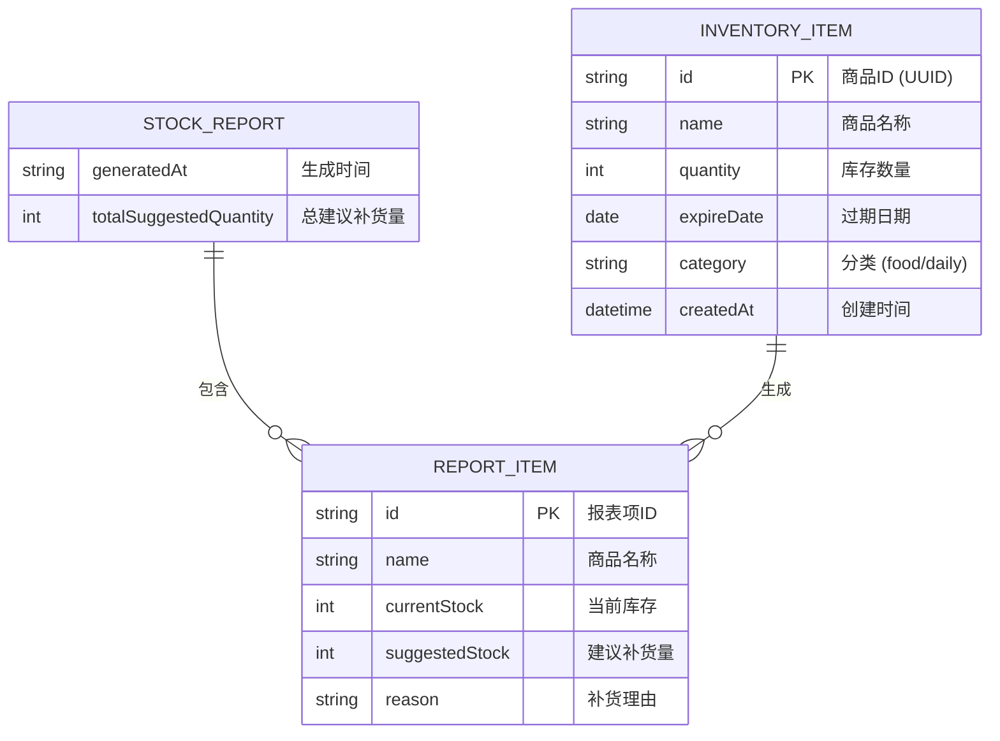

## 1. 架构设计



## 2. 技术描述

### 2.1 前端技术栈
- **框架**：React 18 + TypeScript
- **构建工具**：Vite
- **HTTP 客户端**：原生 Fetch API
- **图表库**：Recharts
- **日期处理**：date-fns
- **样式方案**：CSS Modules / 内联样式 + CSS 动画

### 2.2 后端技术栈
- **运行时**：Node.js
- **Web 框架**：Express
- **唯一 ID 生成**：uuid
- **数据存储**：内存对象（开发阶段）

### 2.3 开发工具
- **包管理器**：npm
- **类型检查**：TypeScript 严格模式
- **开发服务器**：Vite 开发服务器（前端） + Express（后端）

## 3. 路由定义

### 3.1 前端路由
| 路由 | 页面/组件 | 用途 |
|------|-----------|------|
| /inventory | InventoryTable | 商品库存管理页面 |
| /report | ReportChart | 补货报表页面 |

### 3.2 后端 API 路由
| 方法 | 路由 | 用途 |
|------|------|------|
| GET | /api/items | 获取所有商品列表 |
| POST | /api/items | 添加新商品 |
| PUT | /api/items/:id | 更新商品信息（库存扣减等） |
| DELETE | /api/items/:id | 删除商品 |
| GET | /api/report | 获取补货建议报表 |

## 4. API 定义

### 4.1 数据类型定义

```typescript
// 商品分类
type ItemCategory = 'food' | 'daily';

// 商品实体
interface InventoryItem {
  id: string;
  name: string;
  quantity: number;
  expireDate: string; // ISO 日期字符串
  category: ItemCategory;
  createdAt: string;
}

// 补货建议项
interface ReportItem {
  id: string;
  name: string;
  currentStock: number;
  suggestedStock: number;
  reason: string;
}

// 补货报表
interface StockReport {
  items: ReportItem[];
  generatedAt: string;
  totalSuggestedQuantity: number;
}
```

### 4.2 请求/响应 schema

#### GET /api/items
- **请求参数**：无
- **响应**：`InventoryItem[]`

#### POST /api/items
- **请求体**：
```typescript
interface AddItemRequest {
  name: string;
  quantity: number; // 正整数
  expireDate: string; // ISO 日期
  category: ItemCategory;
}
```
- **响应**：`InventoryItem`（新创建的商品）

#### PUT /api/items/:id
- **请求体**：
```typescript
interface UpdateItemRequest {
  name?: string;
  quantity?: number;
  expireDate?: string;
  category?: ItemCategory;
}
```
- **响应**：`InventoryItem`（更新后的商品）

#### DELETE /api/items/:id
- **请求参数**：无
- **响应**：`{ success: boolean }`

#### GET /api/report
- **请求参数**：无
- **响应**：`StockReport`

## 5. 服务器架构图



### 5.1 模块职责
- **API 路由层**：处理 HTTP 请求，参数验证，返回 JSON 响应
- **业务逻辑层**：库存计算、过期判断、补货建议生成逻辑
- **数据存储层**：内存对象存储，提供 CRUD 操作接口

## 6. 数据模型

### 6.1 数据模型定义



### 6.2 业务规则

1. **库存数量**：必须为正整数，出库时不能超过当前库存
2. **过期预警**：
   - 过期日期距今 < 7 天：即将过期预警（浅红色背景 + 橙色警告图标）
   - 过期日期已过：已过期（深红色背景）
3. **补货建议**：
   - 库存低于初始数量的 20%：触发补货建议
   - 过期日期 < 14 天：触发补货建议
   - 建议补货量 = 初始数量 - 当前库存（最低为初始数量的 50%）
4. **分类**：食品（food）、日用品（daily）

## 7. 文件结构与调用关系

```
项目根目录/
├── package.json           # 项目依赖和脚本
├── vite.config.js         # Vite 构建配置（代理配置）
├── tsconfig.json          # TypeScript 配置
├── index.html             # HTML 入口文件
└── src/
    ├── server.ts          # 后端：Express 服务器 + API 路由 + 业务逻辑
    ├── App.tsx            # 前端主组件：布局 + 路由 + 状态管理
    ├── api.ts             # 前端 API 封装：fetch 请求封装
    └── components/
        ├── InventoryTable.tsx  # 库存表格组件
        └── ReportChart.tsx     # 报表图表组件
```

### 调用关系与数据流向

1. **App.tsx → api.ts**：调用 API 函数获取/修改数据
2. **api.ts → server.ts**：发送 HTTP 请求到后端 API
3. **server.ts → 内存数据**：读写内存中的商品数据
4. **server.ts → api.ts**：返回 JSON 响应
5. **api.ts → App.tsx**：返回 Promise 数据
6. **App.tsx → InventoryTable/ReportChart**：通过 props 传递数据给子组件
7. **InventoryTable/ReportChart → App.tsx**：通过回调函数触发操作
