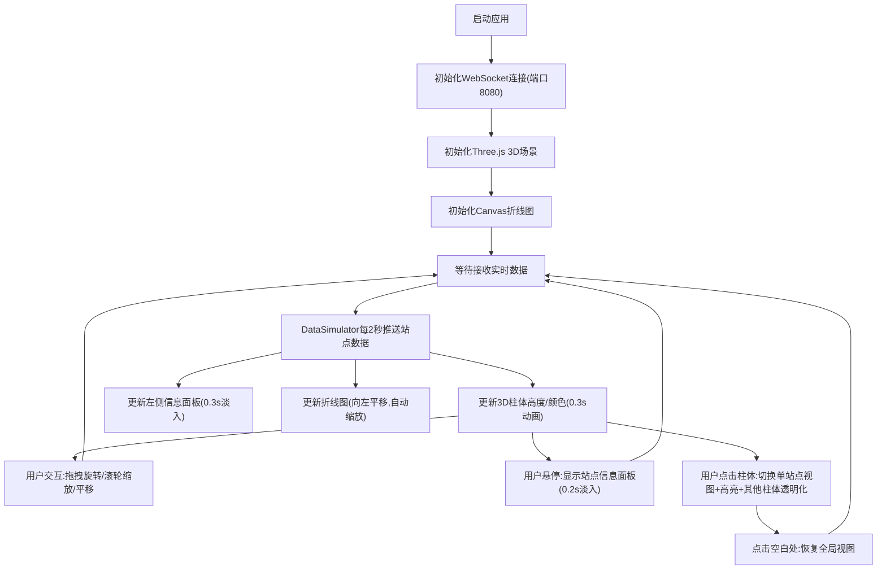

## 1. 产品概述

城市空气质量3D可视化应用，通过实时数据流和三维渲染技术，直观展示城市监测站点的污染物空间分布与扩散趋势，解决传统二维图表缺乏空间感知的问题。

- 目标用户：环境监测人员、城市管理者、科研工作者及关注空气质量的公众
- 核心价值：以沉浸式3D立体地图呈现空气质量数据，提供直观的空间洞察和交互式分析能力

## 2. 核心功能

### 2.1 功能模块

1. **数据模拟与通信模块**：模拟10个城市监测站点的实时数据流，每2秒更新一次，通过WebSocket推送至前端
2. **3D渲染与交互模块**：Three.js实现的城市地形与监测柱体渲染，支持旋转、缩放、平移、悬停信息面板
3. **图表联动模块**：Canvas 2D折线图展示AQI趋势，支持全局/单站点切换，与3D场景联动高亮
4. **实时信息面板**：左侧显示全局平均AQI、活跃站点数和更新时间

### 2.2 页面详情

| 页面名称 | 模块名称 | 功能描述 |
|-----------|-------------|---------------------|
| 主页面 | 3D场景容器 | 全屏Three.js场景，包含地形网格、星空天空盒、10根监测柱体 |
| 主页面 | 左侧信息面板 | 黑色半透明背景，显示全球平均AQI、活跃站点数、最近更新时间 |
| 主页面 | 右侧折线图 | Canvas 2D绘制的24小时AQI趋势图，支持站点切换联动 |
| 主页面 | 悬停信息面板 | 鼠标悬停柱体时弹出，显示站点名、污染物浓度、AQI等级、更新时间 |

## 3. 核心流程

## 4. 用户界面设计

### 4.1 设计风格

- **主色调**：深蓝黑色背景 (#0a0e1a)，营造深邃科技感
- **柱体渐变色**：
  - 优 (0-50)：绿色 #00e400
  - 良 (51-100)：黄色 #ffff00
  - 轻度污染 (101-150)：橙色 #ff7e00
  - 中度污染 (151-200)：红色 #ff0000
  - 重度污染 (201-300)：紫色 #8f3f97
- **辅助色**：半透明白色网格线、白色字体、星空纹理天空盒
- **按钮/面板风格**：圆角设计，半透明背景，玻璃拟态效果
- **字体**：现代无衬线字体，白色为主，数字等宽显示
- **布局风格**：3D场景全屏居中，左侧固定信息面板，右侧固定图表面板

### 4.2 页面设计概述

| 页面名称 | 模块名称 | UI元素 |
|-----------|-------------|-------------|
| 主页面 | 3D场景 | 深蓝黑背景、星空天空盒、半透明白色地形网格、渐变发光柱体、顶部脉动光晕 |
| 主页面 | 左侧面板 | 黑色半透明背景 (rgba(0,0,0,0.7))、圆角8px、白色字体、数据更新0.3s淡入 |
| 主页面 | 右侧图表 | Canvas绘制、白色坐标轴、渐变色折线、数据点标记 |
| 主页面 | 悬停面板 | 白色半透明 (rgba(255,255,255,0.9))、圆角8px、0.2s淡入动画 |

### 4.3 响应式设计

- **桌面端（≥768px）**：3D场景全屏，左侧信息面板固定宽度，右侧图表面板固定宽度
- **移动端（<768px）**：3D场景占满上半屏，图表面板移至下方，采用滑动标签页切换3D/图表视图

### 4.4 3D场景指引

- **环境/HDRI**：深邃星空纹理天空盒，营造宇宙空间感
- **光照设置**：环境光 + 方向光，柱体材质使用自发光增强视觉效果
- **相机设置**：PerspectiveCamera，初始俯视角45度，OrbitControls控制
- **构图**：10根柱体按城市地理分布排列，高度对应AQI值（0-500单位）
- **交互与动画**：
  - 柱体初始0.3秒从地面伸展动画
  - 数值变化0.3秒平滑升降
  - 柱体顶部2秒周期脉动光晕
  - 鼠标悬停弹出信息面板0.2秒淡入
- **性能**：单柱体顶点数≤200，帧率稳定≥45FPS
