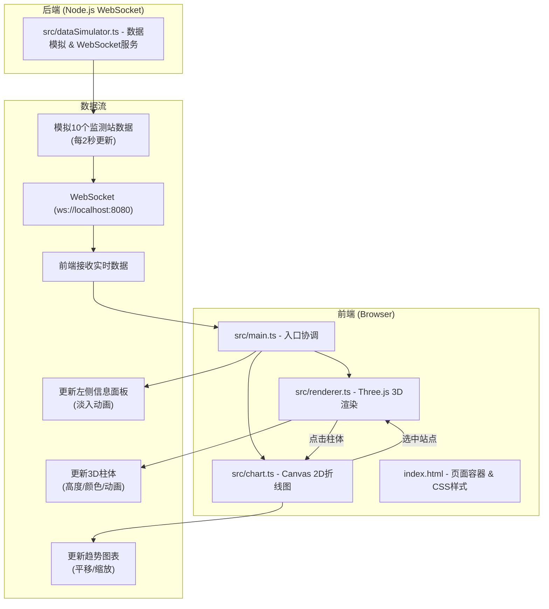

## 1. 架构设计



## 2. 技术栈说明

- **前端框架**：原生 TypeScript (无框架) + Three.js
- **构建工具**：Vite 5.x
- **3D渲染**：Three.js 最新版，使用 CylinderGeometry 构建柱体（低面数≤200顶点）
- **图表绘制**：原生 Canvas 2D API
- **后端通信**：ws (WebSocket库)，端口 8080
- **样式**：原生 CSS，CSS 变量管理主题色
- **开发语言**：TypeScript 严格模式

## 3. 文件结构

```
project-root/
├── package.json           # 依赖: three, @types/three, typescript, vite, ws
├── index.html             # 入口页面，全屏3D容器 + 左侧/右侧面板
├── vite.config.js         # Vite构建配置
├── tsconfig.json          # TypeScript严格模式配置
└── src/
    ├── main.ts            # 入口脚本，协调数据流程
    ├── renderer.ts        # Three.js场景、光照、相机、柱体管理
    ├── dataSimulator.ts   # 数据模拟 + WebSocket服务器(端口8080)
    └── chart.ts           # Canvas 2D折线图绘制与联动
```

## 4. 数据类型定义

```typescript
interface StationData {
  id: string;
  name: string;
  lat: number;
  lng: number;
  aqi: number;
  pm25: number;
  pm10: number;
  o3: number;
  timestamp: number;
}

interface AqiHistoryPoint {
  timestamp: number;
  value: number;
}
```

## 5. API / 通信协议

### WebSocket 消息格式

**服务端 → 客户端**（每2秒推送）：
```json
{
  "type": "stationsUpdate",
  "data": [
    {
      "id": "station_1",
      "name": "朝阳监测站",
      "lat": 39.92,
      "lng": 116.44,
      "aqi": 78,
      "pm25": 45,
      "pm10": 89,
      "o3": 120,
      "timestamp": 1718123456789
    }
  ]
}
```

## 6. 性能指标

| 指标 | 目标值 |
|------|--------|
| 3D场景帧率 | ≥ 45 FPS |
| 单柱体顶点数 | ≤ 200 |
| 柱体动画时长 | 0.3s 平滑过渡 |
| 悬停面板淡入 | 0.2s |
| 数据更新间隔 | 2秒 |
| 历史数据点 | 最近24小时（720个点） |

## 7. 关键实现要点

### 7.1 3D柱体渲染
- 使用 `THREE.CylinderGeometry`，径向分段数=8，高度分段数=1，顶点数约 8×2+2=18（远低于200上限）
- 材质使用 `MeshStandardMaterial`，设置 `emissive` 自发光增强视觉
- 高度映射：AQI 0-300 → 0-500单位高度（线性映射，超出300取500）
- 颜色映射：基于AQI区间线性插值，5个色阶平滑渐变
- 动画：使用 requestAnimationFrame + 线性插值实现0.3秒平滑过渡

### 7.2 折线图渲染
- 使用原生 Canvas 2D `beginPath` + `lineTo` + `stroke` 绘制
- 24小时数据：每2秒一个点，共 3600/2 × 24 = 43200 点，降采样至720点显示
- 平移策略：新数据点从右侧进入，旧数据整体左移
- Y轴自动缩放：根据数据范围动态调整，最小值向下取整到最近50，最大值向上取整到最近50

### 7.3 交互联动
- Raycaster 检测鼠标与柱体相交
- 点击柱体：selectedStation 状态变更 → 该柱体 scale 放大 + 其他柱体 opacity=0.3
- 折线图联动：切换 selectedStation → 图表切换为该站点单独趋势线
- 点击空白（无相交柱体）→ 恢复全局视图

### 7.4 响应式布局
- CSS Media Query: `@media (max-width: 768px)`
- 桌面：左面板固定宽度280px，右面板固定宽度360px，3D场景 flex: 1
- 移动端：上下布局，标签页切换（CSS `transform: translateX` 实现滑动）
