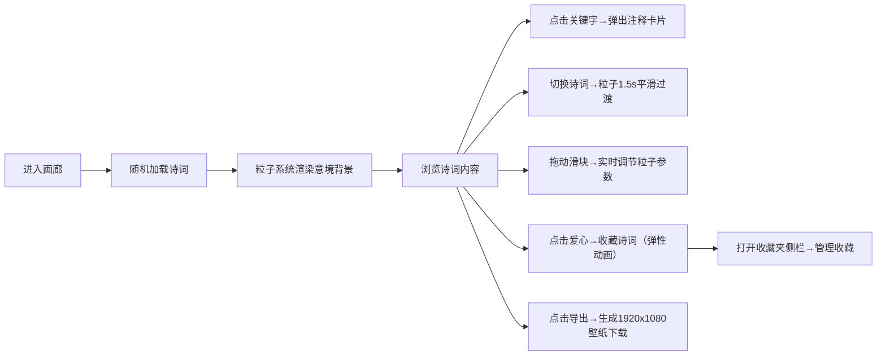

## 1. 产品概述

交互式诗词意像可视化画廊——通过动态粒子画境呈现经典古诗词的沉浸式阅读体验。
- 面向古典文学爱好者、学习者、艺术审美者，提供"诗中有画、画中有诗"的跨感官阅读体验
- 结合AI粒子可视化技术，让抽象文字转化为可感知的动态视觉意象，兼具教育性与艺术价值

## 2. 核心功能

### 2.2 功能模块

1. **诗词展示模块**：40首唐诗宋词分类浏览、竖排毛笔字呈现、关键字注释、同主题关联
2. **背景粒子系统模块**：意境主题动态粒子生成、平滑过渡动画、密度/速度实时调节
3. **收藏与导出模块**：收藏夹管理、一键清空、1920x1080壁纸导出

### 2.3 页面详情

| 页面名称 | 模块名称 | 功能描述 |
|-----------|-------------|---------------------|
| 主画廊 | 诗词分类导航 | 按朝代/主题标签切换，下拉选择40首诗词 |
| 主画廊 | 诗词画布展示 | 思源宋体竖排自适应显示，点击关键字弹出注释卡片 |
| 主画廊 | 背景粒子系统 | 根据主题渲染青绿山水/黄绿田园/红褐边塞粒子画境，1.5秒平滑过渡 |
| 主画廊 | 收藏侧边栏 | 心形按钮收藏，弹性动画侧滑展示，一键清空 |
| 主画廊 | 壁纸导出 | html2canvas生成1920x1080 PNG截图自动下载 |
| 主画廊 | 底部控制条 | 粒子密度滑块(0-1000)、速度滑块(0-5)，磨砂黑底面板 |

## 3. 核心流程

用户进入画廊 → 随机加载一首诗词 → 粒子系统根据意境渲染背景 → 用户点击关键字查看注释 → 切换/浏览诗词（粒子平滑过渡）→ 调整粒子参数（实时反馈）→ 收藏喜欢的诗词 → 导出当前画面为壁纸

## 4. 用户界面设计

### 4.1 设计风格

- **主色调**：暗蓝渐变背景 `#0a0e27 → #1a1f36`，营造静谧深邃的古典意境
- **文字色**：淡金色 `#e8d5b7`，呼应古籍宣纸色泽
- **点缀色**：
  - 收藏按钮：粉色光晕 `#ff6b9d`
  - 导出按钮：青色光晕 `#4fd1c5`
  - 注释卡片边框：月白色半透明白 `rgba(255,255,255,0.5)`
- **字体**：思源宋体（Source Han Serif CN），体现毛笔书法质感
- **按钮风格**：悬停0.2s放大+发光动效，圆角8px
- **布局风格**：全屏沉浸式，诗词居中悬浮于粒子画布之上
- **粒子色调映射**：
  - 山水主题：青绿色系 `#2d6a4f, #40916c, #52b788, #74c69d`
  - 田园主题：黄绿色系 `#606c38, #bc6c25, #dda15e, #fefae0`
  - 边塞主题：红褐色系 `#9d0208, #d00000, #e85d04, #faa307`

### 4.2 页面设计概述

| 页面名称 | 模块名称 | UI元素 |
|-----------|-------------|-------------|
| 主画廊 | 顶部导航栏 | 朝代/主题Tab切换（磨砂背景），诗词下拉选择器，收藏夹入口按钮 |
| 主画廊 | 诗词画布 | 全屏canvas粒子背景+中央竖排诗词文字+右上角爱心收藏按钮 |
| 主画廊 | 注释卡片 | 点击关键字弹出，毛玻璃效果(backdrop-blur:10px)，半透明白边0.5px，解释字词+关联诗词链接 |
| 主画廊 | 底部控制条 | 磨砂黑底`#1e2433`，0.3s淡入动画，密度滑块+速度滑块+导出壁纸按钮 |
| 主画廊 | 收藏侧边栏 | 右侧滑入(0.3s弹性)，收藏诗词列表+清空按钮+关闭按钮 |

### 4.3 响应式设计

- **大屏 (≥1200px)**：诗词文字居中显示，粒子占满全屏，密度默认500
- **平板 (768-1199px)**：诗词文字偏左30%区域，粒子密度自动降低30%（默认350）
- **手机 (<768px)**：诗词文字改为横排，粒子密度降低50%（默认250），底部控件改为可折叠面板（默认收起）

### 4.4 动效规范

- 粒子过渡：1.5秒 ease-in-out 缓动，粒子从旧图案位置漂移到新图案目标位置
- 爱心收藏：点击瞬间 scale(1.3) → 弹回 +1 文字上浮淡出
- 侧边栏：transform: translateX 配合 cubic-bezier(0.34, 1.56, 0.64, 1) 弹性曲线
- 控件悬停：0.2s transition，scale(1.05) + box-shadow 光晕
- 底部控件：进入页面时 translateY(20px) → 0，opacity 0→1，0.3s
