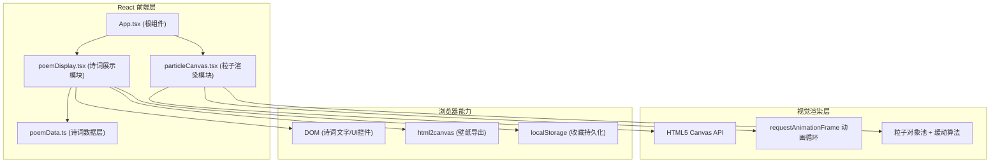

## 1. 架构设计



## 2. 技术描述

- **前端框架**：React 18 + TypeScript（严格模式 strict: true）
- **构建工具**：Vite 5.x
- **数据层**：纯前端Mock数据，40首诗词内嵌于 poemData.ts
- **状态管理**：React Hooks (useState/useEffect/useRef/useCallback)，轻量场景无需zustand
- **视觉渲染**：HTML5 Canvas 2D + requestAnimationFrame 循环，手动实现粒子系统
- **截图导出**：html2canvas（指定scale参数生成1920x1080高清图）
- **样式方案**：纯CSS Modules + CSS变量（主题色/间距/动效参数），不引入tailwind避免用户未指定的额外依赖
- **字体方案**：Google Fonts 在线加载 Source Han Serif CN（思源宋体）

## 3. 文件结构

```
/
├── package.json               # 依赖声明 & 脚本
├── index.html                 # Vite入口HTML，引入思源宋体字体
├── vite.config.js             # Vite构建配置
├── tsconfig.json              # TypeScript严格模式配置
└── src/
    ├── main.tsx               # React入口
    ├── App.tsx                # 根组件，布局与状态聚合
    ├── App.css                # 全局样式与CSS变量
    ├── poem-module/
    │   ├── poemData.ts        # 40首诗词数据、分类接口、关键字映射
    │   └── poemDisplay.tsx    # 诗词展示组件（关键字、注释、收藏、导出UI）
    └── particle-module/
        └── particleCanvas.tsx # Canvas粒子渲染组件（主题映射、过渡动画、参数控制）
```

## 4. 核心接口类型定义

```typescript
// poemData.ts
export type PoemTheme = '山水' | '田园' | '边塞' | '咏物' | '送别' | '思乡';
export type PoemDynasty = '唐' | '宋';

export interface KeywordAnnotation {
  word: string;
  meaning: string;
  relatedPoemIds: string[];
}

export interface Poem {
  id: string;
  title: string;
  author: string;
  dynasty: PoemDynasty;
  theme: PoemTheme;
  content: string[];  // 每行一个元素
  keywords: KeywordAnnotation[];
  particleHint: string; // 粒子意境提示关键词
}

export interface PoemDataModule {
  getAllPoems(): Poem[];
  getRandomPoem(): Poem;
  getPoemById(id: string): Poem | undefined;
  filterByTheme(theme: PoemTheme): Poem[];
  filterByDynasty(dynasty: PoemDynasty): Poem[];
}

// particleCanvas.tsx Props
export interface ParticleCanvasProps {
  theme: PoemTheme;
  particleHint: string;
  density: number;    // 0-1000
  speed: number;      // 0-5
  canvasRef?: React.RefObject<HTMLCanvasElement>; // 暴露给父组件用于截图
}
```

## 5. 粒子系统算法设计

### 5.1 主题粒子生成策略

- **山水类**：基于分形噪声生成山峦轮廓采样点，粒子沿y轴高度映射青绿渐变，远山小而透明，近山大而鲜艳
- **田园类**：生成水平带状田野区域+随机花点粒子，黄绿渐变，微风摆动效果（sin函数偏移）
- **边塞类**：烽火台几何形状+飘散的火星粒子（向上升腾），红褐色渐变，远景沙丘波浪线

### 5.2 过渡动画算法

```
对每个粒子 p：
  记录 p.oldX, p.oldY（切换瞬间位置）
  计算 p.newX, p.newY（新主题目标位置）
  t = 0 ~ 1，持续1500ms，缓动函数 easeInOutCubic(t)
  每帧：p.x = lerp(p.oldX, p.newX, ease(t))
         p.y = lerp(p.oldY, p.newY, ease(t))
  过渡完成后进入常态自由运动模式
```

### 5.3 性能优化

- 粒子对象池：预分配最大1000个粒子对象，密度变化时仅显隐/重置，不创建销毁
- requestAnimationFrame 循环，deltaTime 时间步长归一化，保证不同FPS下运动速度一致
- 离屏图案采样：在离屏canvas上一次性绘制主题形状轮廓图，每帧仅读取像素alpha作为粒子目标位置参考，不重复计算复杂几何
