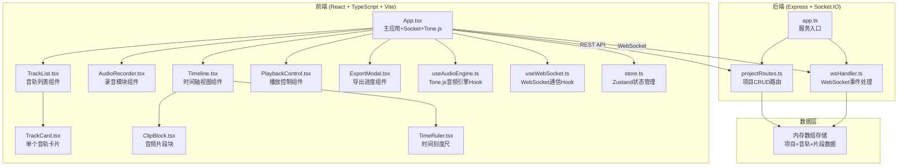
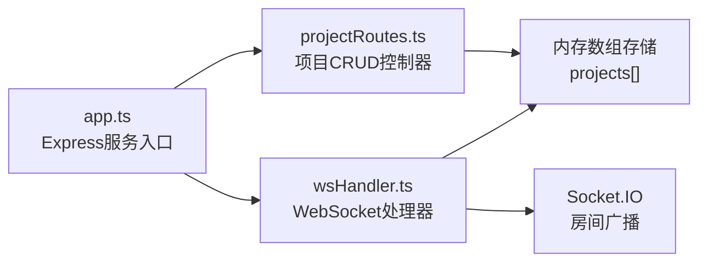
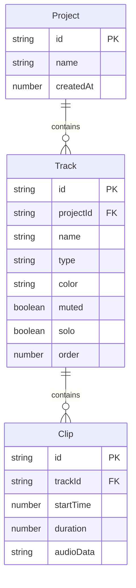

## 1. 架构设计



## 2. 技术说明
- 前端：React@18 + TypeScript + Vite + TailwindCSS + Zustand
- 初始化工具：vite-init (react-express-ts 模板)
- 后端：Express@4 + Socket.IO
- 音频引擎：Tone.js
- 数据库：内存数组存储（简易数据库）
- 通信：REST API + WebSocket (Socket.IO)

## 3. 路由定义
| 路由 | 用途 |
|------|------|
| / | 项目创建页面 |
| /project/:id | 编排工作台页面 |

## 4. API定义

### 4.1 TypeScript类型定义

```typescript
interface Clip {
  id: string;
  trackId: string;
  startTime: number;
  duration: number;
  audioData: string;
}

interface Track {
  id: string;
  projectId: string;
  name: string;
  type: "drums" | "bass" | "guitar" | "vocals";
  color: string;
  muted: boolean;
  solo: boolean;
  order: number;
  clips: Clip[];
}

interface Project {
  id: string;
  name: string;
  tracks: Track[];
  createdAt: number;
}
```

### 4.2 REST API

| 方法 | 路径 | 请求体 | 响应 | 说明 |
|------|------|--------|------|------|
| POST | /api/projects | `{ name: string }` | `{ id: string }` | 创建项目，自动生成四条默认音轨 |
| GET | /api/projects/:id | - | `Project` | 获取项目详情含所有音轨和片段 |
| PUT | /api/projects/:id | `Project` | `{ success: boolean }` | 更新项目数据 |
| DELETE | /api/projects/:id | - | `{ success: boolean }` | 删除项目 |

### 4.3 WebSocket事件

| 事件名 | 方向 | 数据 | 说明 |
|--------|------|------|------|
| join_project | Client→Server | `{ projectId: string }` | 加入项目协作房间 |
| clip_moved | Client→Server | `{ clipId, trackId, newStartTime }` | 片段拖动位置变更 |
| recording_started | Client→Server | `{ trackId }` | 某音轨开始录音 |
| recording_stopped | Client→Server | `{ trackId, clip: Clip }` | 某音轨停止录音，附带新片段数据 |
| project_updated | Server→Client | `Project` | 项目数据更新广播 |

## 5. 服务器架构图



## 6. 数据模型

### 6.1 数据模型定义



### 6.2 数据定义

项目数据存储在内存数组中，服务器重启后数据丢失（简易方案）：

```typescript
const projects: Project[] = [];

const DEFAULT_TRACKS: Omit<Track, "id" | "projectId">[] = [
  { name: "鼓", type: "drums", color: "#e74c3c", muted: true, solo: false, order: 0, clips: [] },
  { name: "贝斯", type: "bass", color: "#3498db", muted: true, solo: false, order: 1, clips: [] },
  { name: "吉他", type: "guitar", color: "#2ecc71", muted: true, solo: false, order: 2, clips: [] },
  { name: "人声", type: "vocals", color: "#9b59b6", muted: true, solo: false, order: 3, clips: [] },
];
```

## 7. 文件结构与调用关系

```
├── package.json
├── index.html
├── vite.config.ts          # 代理 /api 和 /socket.io 到后端 3001
├── tsconfig.json
├── server/
│   └── src/
│       ├── app.ts          # 启动Express+Socket.IO，挂载路由和WebSocket
│       ├── projectRoutes.ts # REST API，调用内存数组存取项目
│       └── wsHandler.ts    # WebSocket事件处理，广播给同房间客户端
├── src/
│   ├── App.tsx             # 主应用：初始化Socket、路由、Tone.js引擎
│   ├── main.tsx            # React入口
│   ├── store.ts            # Zustand全局状态（项目、音轨、播放状态）
│   ├── components/
│   │   ├── TrackList.tsx   # 音轨列表，调用store读写音轨数据
│   │   ├── TrackCard.tsx   # 单个音轨卡片，含操作按钮
│   │   ├── AudioRecorder.tsx # 录音组件，调用Tone.js UserMedia
│   │   ├── Timeline.tsx    # 时间轴视图，渲染片段块和播放头
│   │   ├── ClipBlock.tsx   # 可拖拽片段块，1/16拍网格对齐
│   │   ├── TimeRuler.tsx   # 时间刻度尺
│   │   ├── PlaybackControl.tsx # 播放/暂停/停止控制
│   │   └── ExportModal.tsx # 导出进度对话框，Tone.js OfflineContext
│   └── hooks/
│       ├── useAudioEngine.ts # Tone.js引擎封装（播放、录音、导出）
│       └── useWebSocket.ts   # Socket.IO连接与事件管理
└── shared/
    └── types.ts            # 前后端共享类型定义
```

### 数据流向
1. **项目创建**：前端POST请求 → projectRoutes → 内存数组 → 返回项目ID
2. **录音流程**：AudioRecorder → Tone.js UserMedia采集 → Blob分块 → WebSocket发送 → wsHandler广播 → 其他客户端更新
3. **片段拖拽**：ClipBlock拖拽 → 计算网格对齐位置 → 更新store → WebSocket广播 → wsHandler转发
4. **播放回放**：PlaybackControl → useAudioEngine → Tone.js Transport同步播放 → 播放头位置更新
5. **导出合成**：ExportModal → useAudioEngine → Tone.js OfflineContext混音 → WAV Blob → 自动下载
