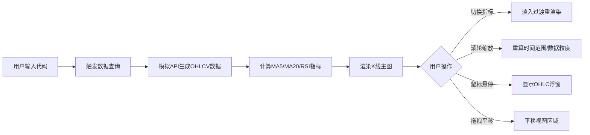

## 1. 产品概述

股票/基金K线图技术分析工具 - 一款轻量级金融数据可视化Web应用，解决投资者手动查看多个数据源、分别计算技术指标效率低下的痛点。

- **核心功能**：根据股票/基金代码自动生成交互式K线图，叠加MA/RSI等技术指标分析
- **目标用户**：个人投资者、金融分析师、交易员
- **产品价值**：一站式快速获取行情可视化与技术分析，提升决策效率

## 2. 核心功能

### 2.1 功能模块

1. **主页面（唯一页面）**：
   - 代码输入模块：股票/基金代码输入框与查询按钮
   - 指标控制模块：MA5、MA20、RSI指标勾选切换
   - K线图表模块：烛台图主视图、成交量、技术指标子图
   - 交互工具：鼠标悬停信息浮窗、滚轮缩放、拖拽平移

### 2.2 页面详情

| 页面名称 | 模块名称 | 功能描述 |
|----------|----------|----------|
| 主页面 | 代码输入 | 支持输入股票代码（如AAPL）或基金代码，回车或点击按钮触发数据加载 |
| 主页面 | 指标勾选列表 | 三个复选框：MA5（5日均线）、MA20（20日均线）、RSI（14日相对强弱指数），支持独立开关 |
| 主页面 | K线主图 | 渲染6个月日级OHLCV烛台图，红绿表示涨跌，X轴日期Y轴价格 |
| 主页面 | MA均线 | 浅蓝色MA5平滑曲线、橙色MA20平滑曲线，可独立开关 |
| 主页面 | RSI子图 | K线图下方独立子图，0-100纵轴，70+红色超买区、30-绿色超卖区 |
| 主页面 | 悬停浮窗 | 鼠标悬停烛台显示该日完整OHLC数据和成交量 |
| 主页面 | 缩放平移 | 滚轮缩放时间范围（1个月~6个月），拖拽平移视图，少于10天自动切换分钟级数据 |

## 3. 核心流程

用户输入股票/基金代码 → 系统调用模拟API生成6个月日级OHLCV数据 → 渲染K线主图与默认指标 → 用户切换指标/缩放平移 → 图表平滑过渡重渲染 → 鼠标悬停查看详情

## 4. 用户界面设计

### 4.1 设计风格

- **主题色系**：暗色主题，背景色 `#1a1a2e`，卡片色 `#16213e`
- **主色点缀**：涨色 `#26a69a`（绿），跌色 `#ef5350`（红），MA5 `#64b5f6`（浅蓝），MA20 `#ffa726`（橙）
- **布局**：左侧窄边栏（输入+指标控制）+ 右侧主体（K线图占70%页面）
- **圆角与阴影**：图表容器圆角 `12px`，轻微阴影效果
- **分隔线**：子图之间使用 `1px` 虚线分隔
- **字体**：系统无衬线字体栈
- **动画**：所有交互均有平滑过渡（0.5s淡入、60fps流畅动画）

### 4.2 页面设计概览

| 页面名称 | 模块名称 | UI元素 |
|----------|----------|--------|
| 主页面 | 侧边栏 | 暗色卡片 `#16213e`，输入框带聚焦发光效果，复选框自定义样式，文字浅色 `#e0e0e0` |
| 主页面 | K线图表容器 | `12px` 圆角，轻微外发光阴影，内边距 `16px` |
| 主页面 | 烛台 | 涨绿跌红填充，柱体宽度自适应 |
| 主页面 | RSI子图 | 背景渐变红色（70+）和绿色（30-）区域标记，70/30参考虚线 |
| 主页面 | 悬停浮窗 | 半透明深色背景，白色文字，十字准线辅助线 |

### 4.3 响应式适配

- **桌面端**：左侧边栏固定宽度（~240px），K线图宽度自适应剩余空间
- **移动端**（<768px）：边栏折叠为顶部下拉菜单，图表区域全宽展示
- **触控优化**：支持双指缩放、长按触发挥停信息
