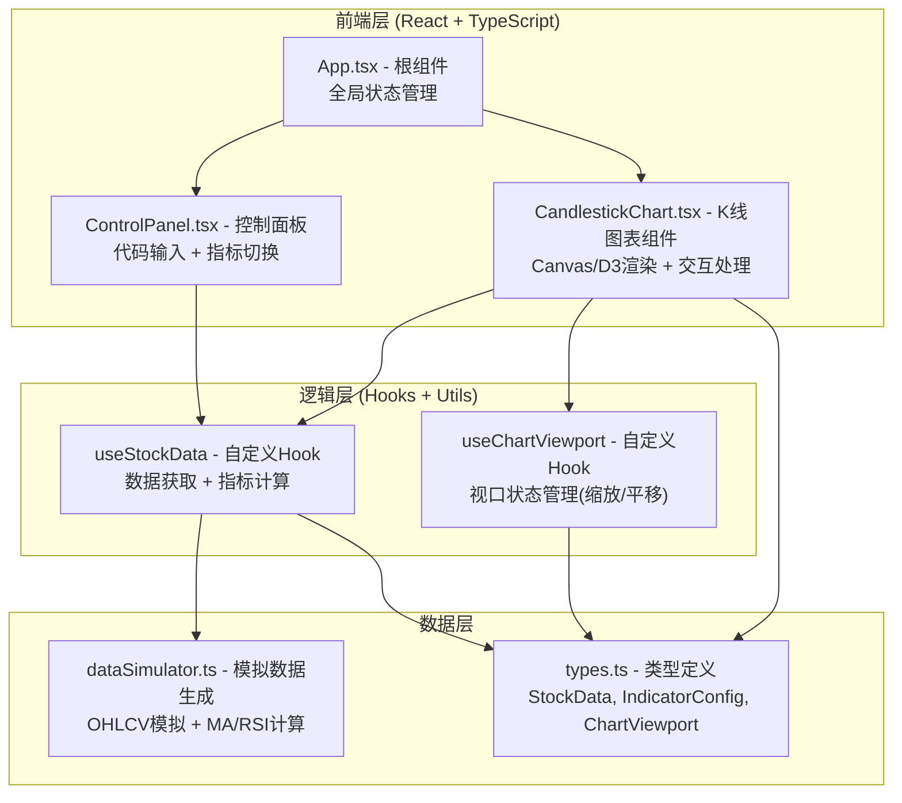

## 1. 架构设计



## 2. 技术说明

- **前端框架**：React 18 + TypeScript 5（严格模式）
- **构建工具**：Vite 5
- **图表渲染**：D3.js v7（用于比例尺、坐标轴、路径生成）+ 原生 Canvas API（高性能烛台与线条绘制）
- **状态管理**：React Hooks (useState, useEffect, useRef, useMemo) + 自定义Hooks
- **样式方案**：原生 CSS + CSS 变量（暗色主题）
- **数据来源**：前端模拟生成（模拟API）

### 依赖包清单

| 包名 | 用途 |
|------|------|
| react, react-dom | 前端框架核心 |
| vite | 构建与开发服务器 |
| typescript, @types/react, @types/react-dom | TypeScript 支持 |
| d3, @types/d3 | 比例尺、坐标轴、曲线插值、数据处理 |
| uuid | 唯一ID生成（烛台元素标识） |

## 3. 路由定义

| 路由 | 用途 |
|------|------|
| / | 主页面（唯一页面），包含控制面板与K线图表 |

## 4. 数据模型

### 4.1 核心类型定义

```typescript
// 单根K线数据
interface StockData {
  date: string;           // ISO 日期字符串 YYYY-MM-DD 或 YYYY-MM-DD HH:mm
  open: number;
  high: number;
  low: number;
  close: number;
  volume: number;
}

// 指标开关配置
interface IndicatorConfig {
  ma5: boolean;   // MA5 均线开关
  ma20: boolean;  // MA20 均线开关
  rsi: boolean;   // RSI 指标开关
}

// 图表视口状态
interface ChartViewport {
  startIndex: number;    // 当前视图起始数据索引
  endIndex: number;      // 当前视图结束数据索引
  totalDays: number;     // 总数据天数
  isMinuteLevel: boolean;// 是否为分钟级数据
}

// 计算后的指标数据
interface CalculatedIndicators {
  ma5: (number | null)[];
  ma20: (number | null)[];
  rsi: (number | null)[];
}

// 悬停信息
interface HoverInfo {
  dataIndex: number;
  screenX: number;
  screenY: number;
  data: StockData;
}
```

### 4.2 数据处理流程

1. `generateMockData(code: string, days: number = 126): StockData[]` - 生成6个月日级数据（约126个交易日）
2. `generateMinuteData(baseData: StockData[], days: number = 10): StockData[]` - 生成分钟级数据（用于放大时）
3. `calculateMA(data: StockData[], period: number): (number | null)[]` - 简单移动平均线计算
4. `calculateRSI(data: StockData[], period: number = 14): (number | null)[]` - 相对强弱指数计算
5. `filterByDateRange(data: StockData[], startIdx: number, endIdx: number): StockData[]` - 按索引范围筛选数据

## 5. 性能优化策略

### 5.1 渲染性能
- 使用 **Canvas 2D API** 直接绘制烛台和线条，避免DOM操作开销
- 使用 **requestAnimationFrame** 驱动动画，确保60fps
- 使用 **useMemo** 缓存指标计算结果和比例尺
- 使用 **useRef** 存储Canvas和D3比例尺引用，避免不必要的重渲染

### 5.2 数据处理
- 指标计算（MA/RSI）仅在原始数据变化时重算，不随视口缩放重复计算
- 分钟级数据按需生成，默认不预计算
- 数据筛选使用切片操作，时间复杂度 O(1)

### 5.3 性能指标目标
- 加载100个交易日数据，首屏渲染 ≤ 150ms
- 缩放/平移响应延迟 ≤ 16ms（单帧内完成）
- 指标切换动画 0.5s 淡入过渡，帧率 ≥ 60fps

## 6. 文件组织结构

```
项目根目录/
├── package.json          # 依赖与脚本配置
├── index.html            # 入口HTML
├── vite.config.js        # Vite构建配置
├── tsconfig.json         # TypeScript严格模式配置
└── src/
    ├── main.tsx          # React入口
    ├── App.tsx           # 根组件（组装所有模块，管理全局状态）
    ├── types.ts          # 类型定义（StockData, IndicatorConfig, ChartViewport等）
    ├── dataSimulator.ts  # 模拟数据生成 + MA/RSI计算 + 日期筛选
    ├── CandlestickChart.tsx  # K线主图表组件（Canvas渲染，交互处理）
    ├── ControlPanel.tsx      # 控制面板（代码输入框 + 指标勾选列表）
    └── index.css             # 全局样式（暗色主题，响应式布局）
```

## 7. 组件职责划分

| 组件/模块 | 职责 |
|-----------|------|
| `App.tsx` | 根组件，管理全局状态（当前代码、指标配置），组装ControlPanel和CandlestickChart |
| `ControlPanel.tsx` | 渲染代码输入框、查询按钮、指标复选框列表，向上派发变更事件 |
| `CandlestickChart.tsx` | 主图表组件：管理Canvas引用、D3比例尺、视口状态（缩放/平移）、悬停状态；负责K线、MA线、RSI子图、坐标轴、浮窗的完整渲染；监听鼠标/滚轮/拖拽事件 |
| `dataSimulator.ts` | 纯函数模块：生成模拟OHLCV数据（日级/分钟级）、计算MA均线、计算RSI、数据筛选 |
| `types.ts` | 集中导出所有类型接口，无运行时代码 |
