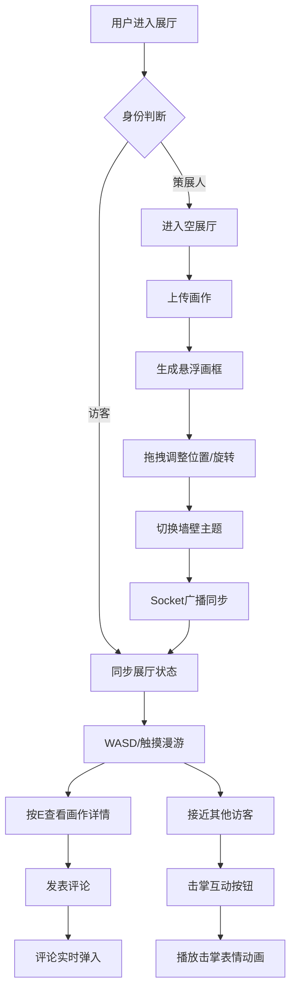

## 1. 产品概述

虚拟艺术展策展平台是一款基于Web的3D虚拟展览应用，允许用户上传数字绘画作品并自由布置在沉浸式3D展厅中，同时支持多人在线参观与社交互动。

- **核心价值**：为数字艺术家提供沉浸式的作品展示空间，打破物理展览的时空限制，实现艺术作品的社交化传播
- **目标用户**：数字艺术家、艺术爱好者、策展人、艺术教育工作者
- **市场价值**：填补Web端轻量化虚拟艺术展览的空白，提供从布展到社交的一站式体验

---

## 2. 核心功能

### 2.1 用户角色

| 角色 | 登录方式 | 核心权限 |
|------|---------|----------|
| 策展人 | 本地用户标识 | 上传画作、调整画框位置/旋转、更改展厅主题 |
| 访客 | 本地用户标识 | 漫游展厅、查看画作详情、发表评论、与其他访客互动 |

### 2.2 功能模块

1. **3D展厅主界面**：沉浸式展厅渲染、漫游控制、画框展示、墙壁主题切换
2. **展品管理模块**：图片上传、画框创建、位置拖拽调整、旋转角度控制
3. **访客社交模块**：在线用户列表、画作评论、浮动名称标签、击掌互动

### 2.3 页面详情

| 页面名称 | 模块名称 | 功能描述 |
|---------|---------|---------|
| 3D展厅主页面 | 场景渲染模块 | 地板/墙壁/灯光/画框的3D渲染，第一人称相机控制，每帧渲染循环 |
| 3D展厅主页面 | 展品管理UI | 侧边栏上传面板，位置/旋转控制面板，主题选择器 |
| 3D展厅主页面 | 画作信息面板 | 按E键弹出，显示标题、作者、创作日期、评论列表、评论输入框 |
| 3D展厅主页面 | 访客互动UI | 在线用户列表，头顶名称标签，接近触发的击掌按钮 |
| 3D展厅主页面 | 响应式导航 | 移动端竖排堆叠布局，触摸手势控制 |

---

## 3. 核心流程

### 3.1 策展人布展流程
策展人进入空展厅 → 点击侧边栏上传按钮 → 选择PNG/JPG图片（≤5MB）→ 系统生成悬浮画框 → 拖拽调整位置/旋转 → 切换墙壁主题颜色 → 邀请链接分享给访客

### 3.2 访客参观流程
访客通过链接进入展厅 → 以第一人称视角漫游（WASD/触摸手势）→ 接近画作按E查看详情 → 发表评论（实时弹入动画）→ 接近其他访客触发击掌互动

---

## 4. 用户界面设计

### 4.1 设计风格

- **主色调**：浅灰 #F5F5F5、白色 #FFFFFF、淡蓝高亮 #4A90D9
- **辅助色**：金色画框 #D4AF37、5种墙壁主题色（暖白 #FDF8F3、深灰 #2C2C2C、米黄 #F5EFE0、墨绿 #2D4A3E、淡蓝 #E8F4FC）
- **按钮风格**：8px圆角、hover时淡蓝色边框高亮、点击微缩效果
- **字体**：主字体 Inter（现代无衬线）、标题字重 600、正文字重 400
- **布局风格**：侧边栏半透明毛玻璃效果（backdrop-filter: blur(12px)）、卡片式浮层、充足留白
- **动效风格**：全局淡入淡出 0.4s、墙壁颜色渐变过渡 0.5s、评论弹入动画（从下往上 + 透明度渐变）

### 4.2 页面设计概览

| 页面名称 | 模块名称 | UI元素与细节 |
|---------|---------|-------------|
| 3D展厅主页面 | 侧边导航栏 | 左侧固定，半透明白底毛玻璃，上传按钮（带+图标）、主题选择色块、控制说明、在线用户列表 |
| 3D展厅主页面 | 画框样式 | 3mm金色边框、画作内容、柔光阴影投射、悬浮上下浮动动画（±5cm，2s周期） |
| 3D展厅主页面 | 画作信息面板 | 右侧弹出卡片，顶部标题+作者，中间创作日期，底部评论列表（带用户头像和时间）+ 输入框 |
| 3D展厅主页面 | 访客名称标签 | 跟随3D位置的2D浮层，半透明黑底白字圆角标签，显示用户昵称 + 头像图标 |
| 3D展厅主页面 | 击掌互动按钮 | 两人之间居中浮现，圆形淡蓝色按钮，带👋图标，hover放大，点击后播放心形+表情粒子动画 |
| 3D展厅主页面 | 移动端控件 | 底部虚拟摇杆（控制移动）、右侧旋转触摸区（控制视角）、UI元素竖排堆叠 |

### 4.3 响应式设计

- **桌面端（≥768px）**：左侧固定侧边栏（280px宽），3D场景全屏，信息面板右侧弹出
- **移动端（<768px）**：顶部折叠导航按钮，侧边栏下拉展开，控制按钮竖排堆叠在底部，信息面板全屏覆盖
- **触摸优化**：双指滑动控制视角旋转，单指虚拟摇杆控制移动，双击快速前进

### 4.4 3D场景指南

- **环境氛围**：现代简约画廊风格，漫射顶光模拟展厅射灯，柔和环境光补充阴影
- **灯光设置**：主平行光（模拟顶灯，带阴影）、环境光（半球光，天地色渐变）、每个画框配一点光源（营造柔光阴影）
- **相机设置**：PerspectiveCamera（FOV 75°）、第一人称控制、身高1.7m、移动速度3m/s、旋转灵敏度0.002
- **构图**：展厅尺寸 12m × 8m × 4m（长×宽×高），四堵墙可挂画，地板木纹纹理，天花板留白
- **交互动画**：画框悬浮动画（sin波动）、拖拽时高亮边框、墙壁颜色CSS3D渐变过渡
- **后处理**：轻微Bloom发光（画框金边）、FXAA抗锯齿、色调映射（ACES）
- **性能预算**：总三角面≤10万，单画框纹理≤2048px，Draw Call≤50，目标帧率≥30FPS

---

## 5. 非功能性需求

| 指标 | 目标值 |
|------|-------|
| 渲染帧率 | ≥30 FPS（中低端设备），≥60 FPS（高端设备） |
| 移动响应时间 | ≤50ms（按键输入到画面更新） |
| 多人同步延迟 | ≤100ms（操作到其他端显示） |
| 图片上传限制 | PNG/JPG格式，单张≤5MB |
| 同时在线人数 | 单展厅最多4人 |
| 内存占用 | ≤500MB |
| 首屏加载时间 | ≤3s（宽带环境） |
