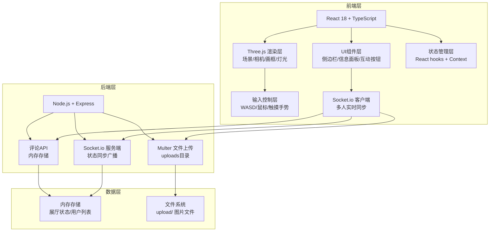
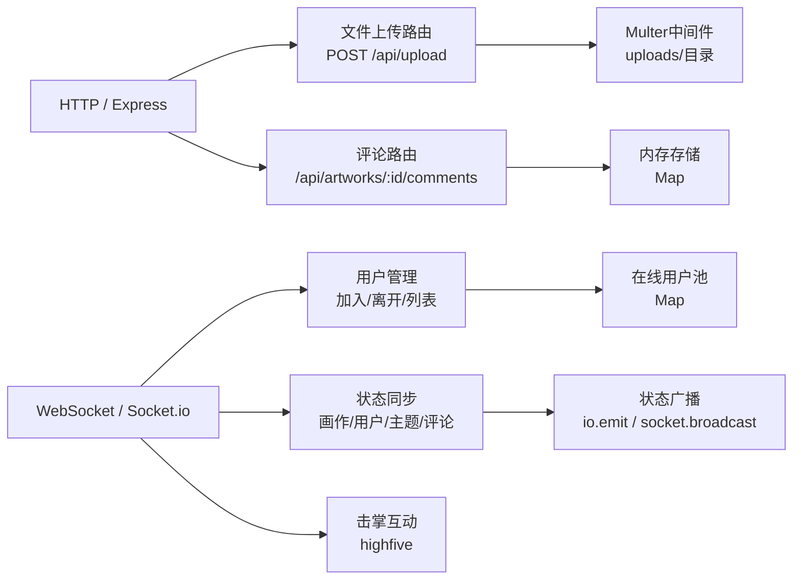

## 1. 架构设计



---

## 2. 技术说明

| 层级 | 技术选型 | 版本 | 用途 |
|-----|---------|------|------|
| 前端框架 | React | ^18.2.0 | UI组件构建 |
| 前端语言 | TypeScript | ^5.3.0 | 类型安全开发 |
| 构建工具 | Vite | ^5.0.0 | 快速开发构建 |
| 3D渲染 | Three.js | ^0.160.0 | WebGL 3D场景渲染 |
| 实时通信 | Socket.io Client | ^4.6.0 | 多人同步通信 |
| 后端框架 | Express | ^4.18.0 | HTTP服务/API路由 |
| 文件上传 | Multer | ^1.4.5 | 图片上传处理 |
| 实时通信服务端 | Socket.io | ^4.6.0 | WebSocket服务端 |
| 跨域支持 | CORS | ^2.8.5 | 跨域请求处理 |
| ID生成 | UUID | ^9.0.0 | 画作/用户唯一标识 |

---

## 3. 项目结构

```
auto52/
├── package.json              # 根配置，concurrently同时启动前后端
├── index.html                # 前端入口HTML
├── vite.config.js            # Vite构建配置
├── tsconfig.json             # TS严格模式配置
├── client/
│   └── src/
│       ├── main.tsx          # React入口，初始化场景+组件挂载
│       ├── styles/           # 全局CSS样式
│       │   └── index.css
│       └── components/
│           ├── ExhibitionHall.tsx    # 3D展厅核心渲染模块
│           ├── ArtworkManager.tsx    # 展品管理+上传+调整UI
│           └── VisitorPanel.tsx      # 访客社交+评论+击掌
├── server/
│   └── index.ts              # Express + Socket.io 后端服务
└── uploads/                  # 上传图片存储目录
```

---

## 4. 前端路由（单页应用）

| 路由 | 页面组件 | 说明 |
|-----|---------|------|
| / | ExhibitionHall + ArtworkManager + VisitorPanel | 主展厅页面，三合一组合 |

---

## 5. API 定义

### 5.1 REST API

#### 上传图片
```typescript
POST /api/upload
Content-Type: multipart/form-data
Request: { file: File (png/jpg, ≤5MB) }
Response: { 
  id: string, 
  url: string,           // 静态访问URL
  width: number, 
  height: number,
  createdAt: number
}
Error: 400 { error: "文件格式/大小不合法" } | 413 { error: "文件超过5MB" }
```

#### 获取画作评论列表
```typescript
GET /api/artworks/:id/comments
Response: Comment[]
Comment = {
  id: string,
  artworkId: string,
  userId: string,
  userName: string,
  content: string,
  createdAt: number
}
```

#### 发表评论
```typescript
POST /api/artworks/:id/comments
Request: { userId: string, userName: string, content: string }
Response: Comment
```

### 5.2 Socket.io 事件

| 事件名 | 方向 | 数据类型 | 说明 |
|-------|------|---------|------|
| `user:join` | Client→Server | `{ userId, userName }` | 用户加入展厅 |
| `user:joined` | Server→All | `User` | 广播新用户加入 |
| `user:leave` | Server→All | `{ userId }` | 广播用户离开 |
| `users:list` | Server→Client | `User[]` | 发送在线用户列表 |
| `user:move` | Client→Server | `{ userId, position: [x,y,z], rotation: [x,y,z] }` | 用户位置旋转更新 |
| `user:moved` | Server→Others | `UserPosition` | 广播其他用户移动 |
| `artwork:add` | Client→Server | `Artwork` | 新增画作（上传后） |
| `artwork:added` | Server→All | `Artwork` | 广播新增画作 |
| `artwork:update` | Client→Server | `{ id, position, rotation }` | 画作位置/旋转变更 |
| `artwork:updated` | Server→All | `ArtworkUpdate` | 广播画作更新 |
| `wall:theme` | Client→Server | `{ theme: string }` | 切换墙壁主题 |
| `wall:themed` | Server→All | `{ theme }` | 广播主题变更 |
| `comment:add` | Client→Server | `Comment` | 发表评论 |
| `comment:added` | Server→All | `Comment` | 广播新评论 |
| `highfive:send` | Client→Server | `{ from, to }` | 发送击掌 |
| `highfive:received` | Server→Client | `{ from, to }` | 转发击掌给目标 |
| `hall:state` | Server→Client | `HallState` | 新用户加入时发送完整状态 |

### 5.3 类型定义

```typescript
// 用户
interface User {
  id: string;
  name: string;
  avatarColor: string;   // 随机头像颜色
  position: [number, number, number];
  rotation: [number, number, number];
}

// 画作
interface Artwork {
  id: string;
  imageUrl: string;
  title: string;         // 文件名（去除后缀）
  author: string;        // 上传者昵称
  createdAt: number;
  position: [number, number, number];
  rotation: [number, number, number];   // Y轴旋转
  scale: [number, number, number];
  width: number;         // 原始图片宽
  height: number;        // 原始图片高
}

// 展厅状态
interface HallState {
  theme: string;          // 墙壁主题标识
  artworks: Artwork[];
  users: User[];
}
```

---

## 6. 后端架构



### 内存数据结构
```typescript
// 服务端全局状态
type ServerState = {
  hallTheme: string;
  artworks: Map<string, Artwork>;
  comments: Map<string, Comment[]>;  // artworkId → comments
  users: Map<string, User>;          // socketId → user
};
```

---

## 7. 关键实现要点

### 7.1 Three.js 性能优化
- 画框模型复用（Geometry/Material 共享，纹理按需加载）
- LOD：远距关闭画框点光源阴影
- 每帧 requestAnimationFrame，deltaTime 控制动画速度
- raycaster 画作拾取，单帧最多1次拾取检测

### 7.2 第一人称控制
- PointerLock API 锁定鼠标（桌面端）
- WASD 键位状态机 + 速度向量，碰撞检测（展厅边界）
- 触摸端虚拟摇杆：左半屏移动，右半屏滑动旋转

### 7.3 画框交互
- raycaster 检测鼠标悬停，高亮边框变色
- mousedown + mousemove 拖拽：投影到 X-Y 平面更新 position
- 旋转滑块直接修改 rotation.y，或拖拽四角旋转手柄

### 7.4 多人同步策略
- 用户移动节流 60ms 发送一次
- 画作位置变更防抖 100ms 后广播
- 新用户连接时立即发送完整 hall:state 快照

### 7.5 启动配置
- 使用 `concurrently` 同时启动 Vite 前端 (3000) 和 Express 后端 (4000)
- Vite 配置代理：`/api` → `http://localhost:4000`，`/socket.io` → 透传
- 后端开启 CORS，`/uploads` 作为静态目录
