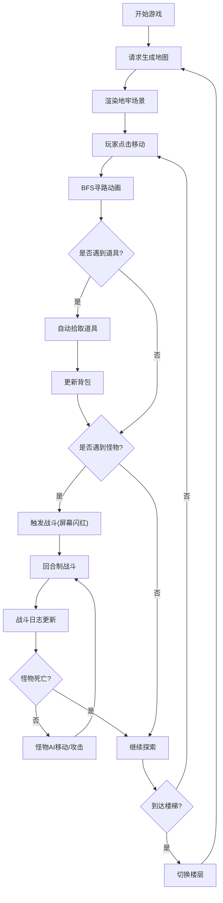

## 1. 产品概述
基于Roguelike机制的地牢探索游戏，玩家控制角色在随机生成的迷宫中探索、收集道具并与怪物战斗。
- 核心玩法：回合制战斗、随机地图生成、道具收集、楼层递进
- 目标用户：喜欢Roguelike、地牢探索类游戏的玩家

## 2. 核心功能

### 2.1 功能模块
1. **地图生成系统**：15x15网格随机地牢，包含墙壁、通道、楼梯、道具
2. **战斗系统**：回合制战斗，怪物AI追逐与攻击，战斗日志
3. **玩家控制系统**：鼠标点击移动，WASD地图滚动，BFS寻路
4. **道具系统**：5种道具随机分布，自动拾取与背包管理
5. **楼层系统**：上下楼梯切换楼层，重置地图，保留道具
6. **HUD界面**：生命值、攻击力、楼层、背包、战斗日志显示

### 2.2 页面详情
| 页面名称 | 模块名称 | 功能描述 |
|-----------|-------------|---------------------|
| 游戏主界面 | Canvas地图渲染 | 绘制地牢网格、玩家、怪物、道具，支持点击移动和悬停高亮 |
| 游戏主界面 | HUD信息面板 | 显示玩家状态、背包、战斗日志，半透明毛玻璃效果 |
| 游戏主界面 | 战斗特效 | 战斗触发闪红、攻击特效、拾取动画 |

## 3. 核心流程
玩家进入游戏 → 请求生成地图 → 渲染地牢 → 玩家点击移动 → 自动寻路移动 → 拾取道具/遭遇怪物 → 回合制战斗 → 战斗结算 → 寻找楼梯 → 切换楼层 → 生成新地图

## 4. 用户界面设计

### 4.1 设计风格
- **主色调**：深棕暗灰暗黑地牢风格，背景#1a1a1a，墙壁#333333，通道#666666
- **强调色**：玩家亮蓝色#00aaff，怪物红色#ff3333，道具金色#ffd700，悬停高亮#ffff99
- **字体**：monospace等宽字体
- **特效**：半透明毛玻璃HUD、玩家光环闪烁、行走尘土粒子、战斗红屏闪烁、道具拾取缩放动画

### 4.2 页面设计概述
| 页面名称 | 模块名称 | UI元素 |
|-----------|-------------|-------------|
| 游戏主界面 | Canvas地图 | 15x15网格、蓝色玩家(带光环)、红色怪物圆点、金色菱形道具、深灰墙壁/浅灰通道 |
| 游戏主界面 | HUD面板 | 顶部：生命值条(绿→红渐变)、攻击力、楼层数；右侧：背包道具列表；底部：战斗日志滚动区 |
| 游戏主界面 | 交互动画 | 鼠标悬停格子淡黄色高亮、移动平滑动画(0.3s/格)、战斗屏幕边缘闪红、拾取道具闪烁缩小 |

### 4.3 响应式
- 桌面优先设计，游戏区域保持16:9宽高比
- 窗口宽度<800px时，HUD自动变为底部横向布局
- WASD控制地图滚动，支持不同屏幕尺寸

## 5. 性能要求
- 动画帧率：60FPS流畅运行
- API响应：地图生成≤100ms，战斗结算≤50ms
- 实时同步：WebSocket推送房间状态
