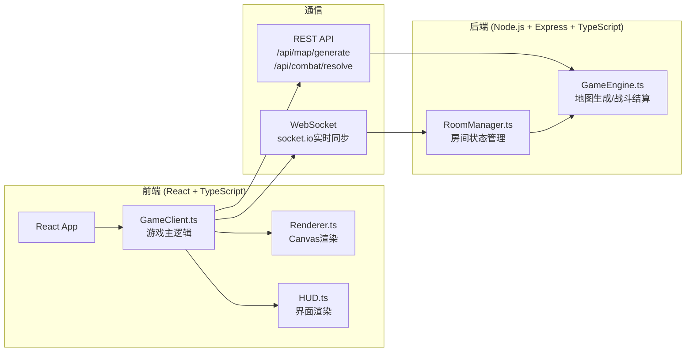
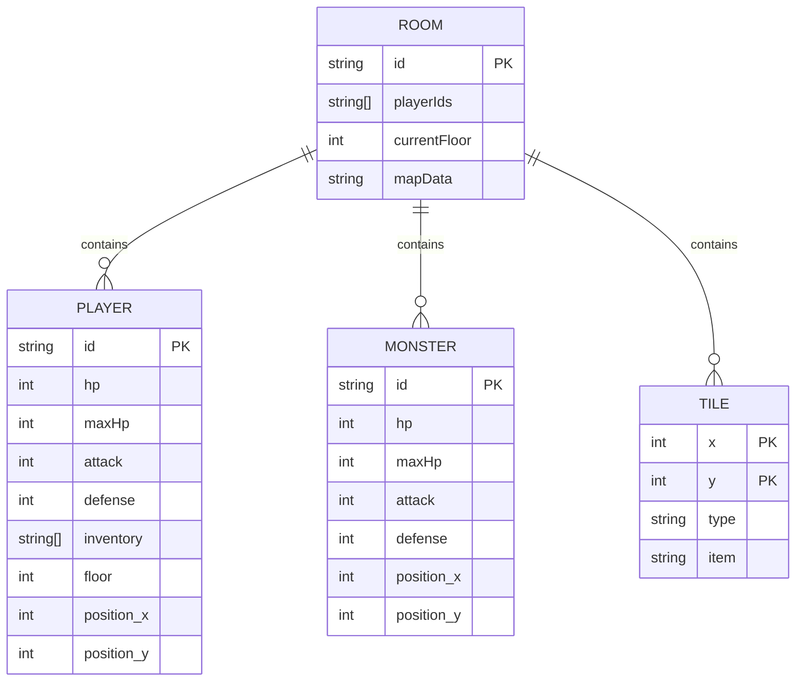

## 1. 架构设计



## 2. 技术描述
- **前端**：React@18 + TypeScript + Vite + socket.io-client
- **后端**：Express@4 + TypeScript + socket.io + uuid
- **渲染**：Canvas 2D API 绘制地牢地图
- **状态管理**：React useState/useEffect + 自定义GameClient类
- **实时通信**：Socket.IO 实现房间状态同步

## 3. API 定义

### 类型定义
```typescript
// 格子类型
type TileType = 'wall' | 'floor' | 'stairs_up' | 'stairs_down';

// 道具类型
type ItemType = 'key' | 'health_potion' | 'shield' | 'fireball' | 'cloak';

// 坐标
interface Position {
  x: number;
  y: number;
}

// 格子
interface Tile {
  type: TileType;
  position: Position;
  item?: ItemType;
}

// 玩家
interface Player {
  id: string;
  position: Position;
  hp: number;
  maxHp: number;
  attack: number;
  defense: number;
  inventory: ItemType[];
  floor: number;
}

// 怪物
interface Monster {
  id: string;
  position: Position;
  hp: number;
  maxHp: number;
  attack: number;
  defense: number;
}

// 地图数据
interface DungeonMap {
  width: number;
  height: number;
  tiles: Tile[][];
  monsters: Monster[];
  playerStart: Position;
}

// 战斗请求
interface CombatRequest {
  playerId: string;
  monsterId: string;
  roomId: string;
}

// 战斗结果
interface CombatResult {
  playerDamage: number;
  monsterDamage: number;
  playerHp: number;
  monsterHp: number;
  monsterDefeated: boolean;
  log: string;
}
```

### API端点
| 方法 | 路径 | 描述 |
|-------|------|------|
| GET | /api/map/generate?floor=:floor | 生成指定楼层的地牢地图 |
| POST | /api/combat/resolve | 结算一回合战斗 |

## 4. 数据模型



## 5. 项目文件结构
```
.
├── package.json
├── index.html
├── vite.config.js
├── tsconfig.json
├── server/
│   ├── GameEngine.ts      # 地图生成、战斗结算
│   └── RoomManager.ts     # 房间管理、WebSocket
├── src/
│   ├── client/
│   │   ├── GameClient.ts  # 前端游戏逻辑
│   │   ├── Renderer.ts    # Canvas渲染
│   │   └── HUD.ts         # 界面渲染
│   ├── App.tsx
│   ├── main.tsx
│   └── index.css
└── .trae/documents/
    ├── PRD.md
    └── TECH_ARCH.md
```
