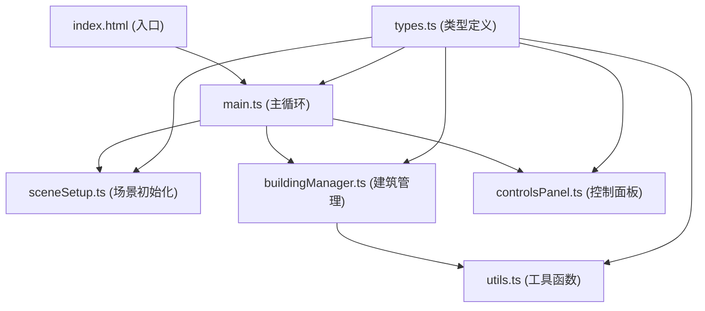

## 1. 架构设计

本项目采用模块化的前端架构，基于TypeScript + Three.js + Vite构建，各模块职责清晰，通过接口和回调进行通信。



## 2. 技术描述

- **前端框架**: 原生TypeScript，不使用UI框架，直接操作DOM
- **3D引擎**: Three.js r150+，使用InstancedMesh优化大量建筑渲染
- **构建工具**: Vite 4.x，支持HMR和快速开发
- **语言**: TypeScript 5.x，严格模式，target ES2020
- **无需后端**：纯前端应用，所有逻辑在浏览器端运行
- **无需数据库**：状态全部保存在内存中

### 核心技术选型理由：
1. **Three.js**：成熟的WebGL封装库，提供完整的3D渲染能力，性能优异
2. **TypeScript**：强类型保证代码质量，便于维护和扩展
3. **Vite**：极速的开发体验，原生ESM支持，构建效率高
4. **InstancedMesh**：专门用于渲染大量重复几何体，5000个建筑的性能保证

## 3. 目录结构

```
auto55/
├── index.html                    # 入口HTML
├── package.json                  # 项目依赖和脚本
├── vite.config.js                # Vite配置
├── tsconfig.json                 # TypeScript配置
└── src/
    ├── types.ts                  # 全局类型定义
    ├── utils.ts                  # 工具函数
    ├── sceneSetup.ts             # 场景、相机、渲染器初始化
    ├── buildingManager.ts        # 建筑生长逻辑管理
    ├── controlsPanel.ts          # 控制面板DOM生成和事件绑定
    └── main.ts                   # 主循环和交互处理
```

## 4. 模块接口定义

### 4.1 类型定义 (types.ts)

```typescript
export interface Building {
  id: number;
  x: number;
  z: number;
  height: number;
  color: THREE.Color;
  mesh: THREE.Mesh | null;
  haloMesh: THREE.Mesh | null;
  growthProgress: number; // 0-1, 生长动画进度
  isGrowing: boolean;
}

export interface CorePoint {
  x: number;
  z: number;
  mesh: THREE.Mesh;
  spreadRadius: number; // 当前扩散半径
}

export interface ControlParams {
  density: number;      // 0.1-1.0
  maxHeight: number;    // 2-20
  growthSpeed: number;  // 1-10
  isPaused: boolean;
}

export interface CameraState {
  theta: number;        // Y轴旋转角度
  phi: number;          // X轴旋转角度
  radius: number;       // 相机距离中心点距离
  target: THREE.Vector3;
}
```

### 4.2 工具函数 (utils.ts)

| 函数名 | 参数 | 返回值 | 功能描述 |
|--------|------|--------|----------|
| `randomRange` | min: number, max: number | number | 生成指定范围内的随机数 |
| `randomInt` | min: number, max: number | number | 生成指定范围内的随机整数 |
| `lerpColor` | color1: THREE.Color, color2: THREE.Color, t: number | THREE.Color | 颜色插值 |
| `getHeightColor` | height: number, maxHeight: number | THREE.Color | 根据高度计算建筑颜色 |
| `easeLinear` | t: number | number | 线性缓动函数 |
| `easeInOutQuad` | t: number | number | 二次缓动函数 |
| `clamp` | value: number, min: number, max: number | number | 数值限制在范围内 |

### 4.3 场景初始化 (sceneSetup.ts)

| 导出对象 | 类型 | 描述 |
|---------|------|------|
| `scene` | THREE.Scene | Three.js场景对象 |
| `camera` | THREE.PerspectiveCamera | 透视相机 |
| `renderer` | THREE.WebGLRenderer | WebGL渲染器 |
| `groundMesh` | THREE.Mesh | 地面网格 |
| `groundHalos` | THREE.Mesh[] | 地面光晕数组 |
| `initScene` | (container: HTMLElement) => void | 初始化场景函数 |
| `onWindowResize` | () => void | 窗口大小变化处理 |

### 4.4 建筑管理 (buildingManager.ts)

| 方法 | 参数 | 返回值 | 功能描述 |
|------|------|--------|----------|
| `constructor` | scene: THREE.Scene, params: ControlParams | BuildingManager | 构造函数 |
| `initCorePoints` | count: number | void | 初始化核心点 |
| `update` | deltaTime: number | void | 每帧更新建筑生长状态 |
| `setParams` | params: Partial<ControlParams> | void | 更新控制参数 |
| `reset` | () => void | 重置所有建筑和核心点 |
| `getBuildings` | () => Building[] | 获取所有建筑 |
| `highlightBuilding` | building: Building \| null | void | 高亮指定建筑，其他半透明 |

### 4.5 控制面板 (controlsPanel.ts)

| 方法 | 参数 | 返回值 | 功能描述 |
|------|------|--------|----------|
| `createControlsPanel` | container: HTMLElement, onParamsChange: (params: ControlParams) => void, onReset: () => void | void | 创建控制面板DOM |
| `updateParamsDisplay` | params: ControlParams | void | 更新参数显示 |

### 4.6 主循环 (main.ts)

| 函数 | 功能描述 |
|------|----------|
| `init` | 初始化所有模块，绑定事件监听 |
| `animate` | requestAnimationFrame主循环，调用更新和渲染 |
| `handleMouseDown` | 处理鼠标按下事件 |
| `handleMouseMove` | 处理鼠标移动事件 |
| `handleMouseUp` | 处理鼠标松开事件 |
| `handleWheel` | 处理滚轮缩放事件 |
| `handleDoubleClick` | 处理双击建筑飞行事件 |
| `handleTouchStart` | 处理触摸开始事件 |
| `handleTouchMove` | 处理触摸移动事件 |
| `updateCamera` | 根据旋转角度和距离更新相机位置 |
| `flyToBuilding` | building: Building | 平滑飞向指定建筑 |

## 5. 性能优化策略

### 5.1 渲染优化
- 使用`InstancedMesh`合并所有建筑几何体，减少Draw Call
- 建筑材质使用`MeshLambertMaterial`，平衡性能和视觉效果
- 合理设置相机视锥体裁剪距离
- 开启阴影贴图优化（PCFSoftShadowMap）

### 5.2 逻辑优化
- 限制每帧生成建筑的最大数量（根据密度参数动态调整）
- 使用空间网格（Grid）快速查询附近建筑，避免O(n²)碰撞检测
- 生长动画完成后标记建筑为静态，减少每帧更新计算

### 5.3 内存优化
- 重置时正确释放几何体和材质内存
- 复用光晕Mesh，避免频繁创建销毁
- 建筑数量上限设为5000，达到后停止生成

## 6. 关键算法

### 6.1 建筑扩散算法
```
每帧遍历所有核心点：
  1. 增加核心点的扩散半径（根据生长速度）
  2. 在扩散半径边缘随机采样候选位置
  3. 检查候选位置是否已被占用
  4. 根据密度概率决定是否生成建筑
  5. 生成建筑时计算高度和颜色
  6. 添加到生长动画队列
```

### 6.2 视角控制算法
- 使用球坐标系统（theta, phi, radius）表示相机位置
- 鼠标拖拽时更新theta和phi，phi限制在-30°到30°
- 滚轮缩放时更新radius，限制在5到80之间
- 双击飞行时使用四元数插值（slerp）平滑旋转相机

### 6.3 碰撞检测
- 地面划分为1x1单位的网格
- 每个网格位置用Set记录是否已被占用
- 新建筑生成时检查对应网格是否为空
