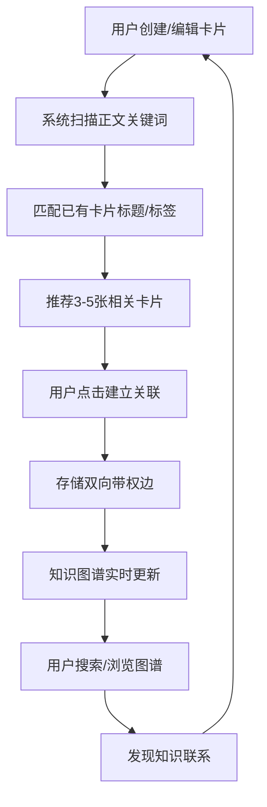

## 1. 产品概述

个人知识卡片管理及知识图谱应用，旨在解决阅读笔记分散、知识点间潜在联系难以发现的问题。用户可以创建Markdown格式的知识卡片，系统自动推荐关联卡片，并通过力导向图可视化呈现知识网络，帮助用户构建系统化的个人知识体系。

- 目标用户：知识工作者、研究者、终身学习者
- 核心价值：将碎片化笔记转化为可视化知识网络，发现隐藏的知识关联

## 2. 核心功能

### 2.1 用户角色

| 角色 | 注册方式 | 核心权限 |
|------|----------|----------|
| 个人用户 | 无需注册 | 创建、编辑、删除卡片，查看图谱，搜索节点 |

### 2.2 功能模块

1. **卡片管理页**：卡片列表（瀑布流网格）、标签筛选栏、卡片创建/编辑表单、关联推荐区
2. **知识图谱页**：力导向图可视化、节点交互（拖拽/悬停/双击）、全局搜索

### 2.3 页面详情

| 页面名称 | 模块名称 | 功能描述 |
|----------|----------|----------|
| 卡片管理页 | 吸顶标签筛选栏 | 按标签筛选卡片，平滑滚动，固定顶部 |
| 卡片管理页 | 瀑布流卡片网格 | 两列瀑布流展示卡片，圆角白色卡片，淡入动画，按创建时间倒序 |
| 卡片管理页 | 卡片创建/编辑表单 | 标题、标签、Markdown正文编辑，创建时间自动生成 |
| 卡片管理页 | 关联推荐区 | 编辑区下方横向滚动卡片，自动推荐3-5张相关卡片，点击建立双向带权边 |
| 知识图谱页 | 力导向图 | 所有卡片及关联的力导向布局，节点按标签着色，直径与字数成正比，边线粗细表示权重 |
| 知识图谱页 | 节点交互 | 拖拽节点调整布局，悬停显示标题和创建时间，双击跳转卡片详情 |
| 知识图谱页 | 全局搜索 | 关键词搜索高亮匹配节点，视口平滑移动（0.5秒），未匹配节点透明度降至0.1 |

## 3. 核心流程

用户创建知识卡片 → 系统扫描正文关键词 → 自动匹配已有卡片标题/标签 → 推荐3-5张相关卡片 → 用户点击建立关联 → 关联关系以双向带权边存储 → 知识图谱实时更新 → 用户通过图谱发现知识联系

## 4. 用户界面设计

### 4.1 设计风格

- 主色：#4A90D9（蓝色），强调色：#E67E22（橙色）
- 背景色：#F5F5F5，卡片背景：白色
- 按钮风格：圆角，主色填充，hover时强调色过渡
- 字体：标题使用 Source Serif 4（衬线），正文使用 DM Sans（无衬线）
- 布局风格：卡片式布局，顶部导航切换视图，吸顶筛选栏
- 图标风格：线性图标（lucide-react）

### 4.2 页面设计概览

| 页面名称 | 模块名称 | UI元素 |
|----------|----------|--------|
| 卡片管理页 | 吸顶标签筛选栏 | 水平滚动标签胶囊，选中态主色填充，固定顶部z-10 |
| 卡片管理页 | 瀑布流卡片网格 | 两列CSS Grid，白色圆角12px卡片，box-shadow，淡入animation |
| 卡片管理页 | 卡片创建/编辑表单 | 模态框/侧边栏，标题输入框，标签多选，Markdown编辑器+预览 |
| 卡片管理页 | 关联推荐区 | 横向滚动容器，小型卡片带标题+标签，点击添加关联 |
| 知识图谱页 | 力导向图 | SVG/Canvas渲染，圆形节点（按标签着色），边线（粗细0.2-1.0），缩放/拖拽 |
| 知识图谱页 | 搜索栏 | 顶部搜索输入框，匹配节点高亮，视口平滑过渡0.5s |
| 知识图谱页 | 节点Tooltip | 悬停显示标题+创建时间，圆角阴影浮层 |

### 4.3 响应式适配

- 桌面端（≥768px）：两列瀑布流，力导向图全屏交互
- 移动端（<768px）：单列卡片列表，图谱改为单列关联卡片展示（非力导向图），触摸优化

### 4.4 性能要求

- 图谱50个节点+100条边时，交互帧率≥45FPS
- 卡片列表平滑滚动，淡入动画不卡顿
- 搜索响应时间<200ms
