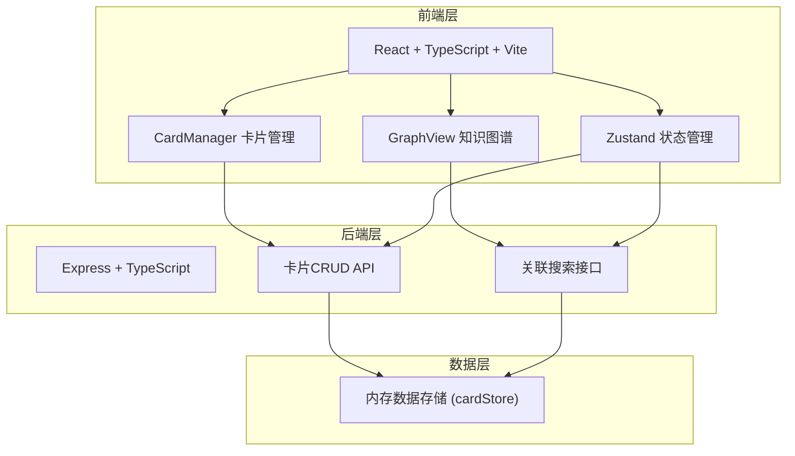
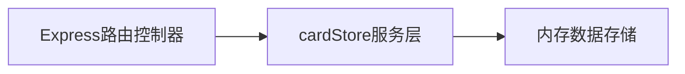
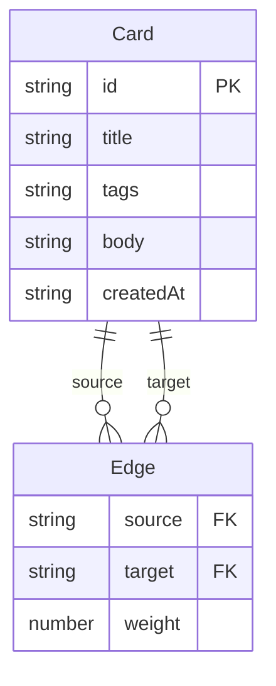

## 1. 架构设计



## 2. 技术说明

- 前端：React@18 + TypeScript + Vite + Tailwind CSS + Zustand
- 初始化工具：vite-init（react-express-ts 模板）
- 后端：Express@4 + TypeScript
- 数据库：内存数据存储（cardStore.ts）
- 图谱可视化：d3-force（力导向布局计算）+ SVG渲染
- Markdown渲染：react-markdown + rehype-highlight

## 3. 路由定义

| 路由 | 用途 |
|------|------|
| / | 卡片管理页，瀑布流展示所有卡片 |
| /graph | 知识图谱页，力导向图可视化 |

## 4. API定义

```typescript
interface Card {
  id: string;
  title: string;
  tags: string[];
  body: string;
  createdAt: string;
}

interface Edge {
  source: string;
  target: string;
  weight: number;
}

interface GraphData {
  nodes: Card[];
  edges: Edge[];
}

// GET /api/cards - 获取所有卡片
// GET /api/cards/:id - 获取单张卡片
// POST /api/cards - 创建卡片
// PUT /api/cards/:id - 更新卡片
// DELETE /api/cards/:id - 删除卡片
// GET /api/cards/:id/recommendations - 获取关联推荐
// POST /api/edges - 创建关联边
// GET /api/graph - 获取图谱数据（节点+边）
// GET /api/tags - 获取所有标签
```

## 5. 服务器架构



## 6. 数据模型

### 6.1 数据模型定义



### 6.2 数据定义

- Card表：id(UUID), title(字符串), tags(字符串数组), body(Markdown字符串), createdAt(ISO时间戳)
- Edge表：source(卡片ID), target(卡片ID), weight(0.2-1.0浮点数)
- 存储方式：内存Map结构，应用重启后数据重置
