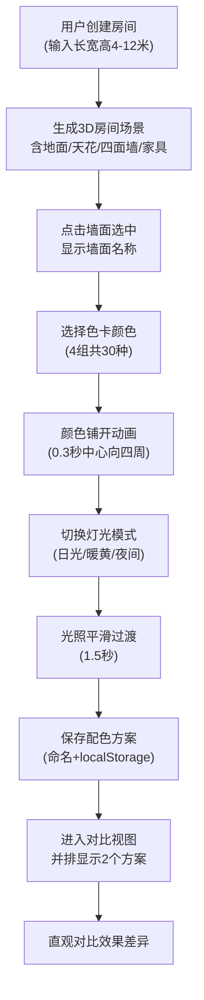

## 1. 产品概述

室内墙面配色设计应用，帮助用户在装修前直观预览不同墙面颜色搭配的整体效果，解决选择多墙面颜色时难以想象最终效果的痛点。

- 面向装修业主、室内设计师等需要进行墙面配色决策的用户
- 通过三维可视化技术，让用户实时调整墙面颜色并预览不同光照下的效果，降低决策成本

## 2. 核心功能

### 2.1 功能模块
1. **房间创建模块**：输入长宽高参数，生成带家具的三维房间场景
2. **墙面涂色模块**：点击墙面选择颜色，支持颜色铺开动画效果
3. **灯光切换模块**：三种预设灯光场景，平滑过渡切换
4. **方案对比模块**：保存配色方案并进行双方案并排对比

### 2.2 页面详情

| 页面名称 | 模块名称 | 功能描述 |
|-----------|-------------|---------------------|
| 主视图页面 | 3D场景渲染 | 实时渲染房间场景，支持鼠标拖拽旋转视角、滚轮缩放 |
| 主视图页面 | 墙面交互 | 点击墙面选中，显示当前墙面名称，支持颜色应用 |
| 主视图页面 | 灯光控制 | 三个卡片式按钮切换日光/暖黄/夜间灯光模式 |
| 主视图页面 | 色卡面板 | 4列网格布局，30种预设色卡，按风格分组 |
| 主视图页面 | 方案保存 | 保存当前配色到本地存储，支持命名 |
| 对比视图 | 方案对比 | 并排显示两个已保存方案的渲染缩略图 |

## 3. 核心流程

## 4. 用户界面设计

### 4.1 设计风格
- 主色调：浅灰#F5F5F5（侧面板）、#2B6CB5（选中状态）
- 按钮风格：圆角设计，轻微阴影（0 2px 8px rgba(0,0,0,0.1)），点击时阴影加深并缩放0.97倍
- 字体：系统默认无衬线体，标题字重600，正文400
- 布局：左侧8:2分割，80%为3D主视图，240px固定宽度侧面板
- 动效：色卡悬停放大1.15倍（0.2秒弹性动画），颜色铺开动画，灯光平滑过渡

### 4.2 页面设计概述

| 页面名称 | 模块名称 | UI元素 |
|-----------|-------------|-------------|
| 主视图页面 | 3D场景区域 | 浮层阴影效果，自适应缩放居中，宽高比保持 |
| 主视图页面 | 右侧操作面板 | 背景#F5F5F5，12px圆角，上下居中，固定240px宽度 |
| 主视图页面 | 墙面名称显示 | 面板顶部，显示当前选中墙面（如"东墙"） |
| 主视图页面 | 色卡网格 | 4列布局，40x40px圆角色卡，按风格分组显示 |
| 主视图页面 | 灯光切换按钮 | 三个并排卡片按钮，80x36px，选中时背景#2B6CB5 |
| 主视图页面 | 保存按钮 | 带📁图标，提交配色方案到本地存储 |
| 对比视图 | 缩略图区域 | 两个400x300像素窗口，同角度渲染，并排对比 |

### 4.3 响应性
- 桌面端优先设计，3D主视图随浏览器窗口尺寸自适应缩放（保持宽高比并居中）
- 右侧操作面板固定240px宽度，不随窗口缩放
- 支持鼠标交互（点击、拖拽、滚轮），触屏设备支持触摸操作

### 4.4 3D场景指引
- **环境**：简约现代风格室内场景，浅灰色木纹地面，白色天花
- **光照**：三种预设模式（日光5500K/暖黄3000K/夜间2700K），支持色温变化对墙面颜色的影响
- **相机**：OrbitControls控制器，支持环绕观察、缩放，初始视角为略微俯视的透视角度
- **家具**：灰色布艺沙发（靠窗）、金属杆落地灯、深绿色绿植，作为配色参考
- **材质**：地面使用漫反射木纹材质，墙面使用标准材质支持颜色动画，天花轻微粗糙感
- **性能**：保持40FPS以上渲染帧率，颜色切换延迟≤50ms
