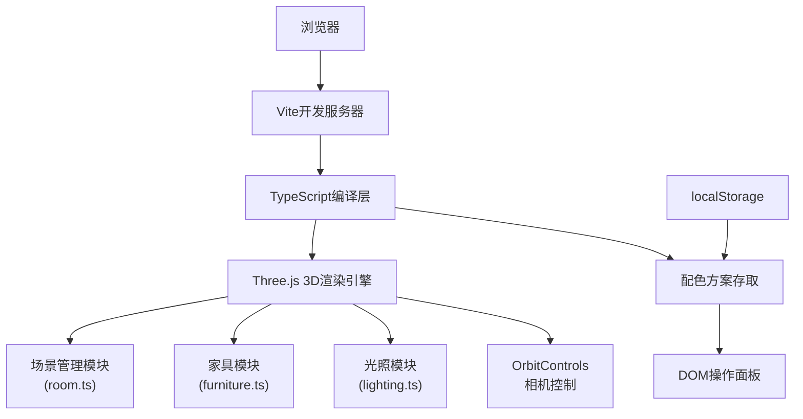

## 1. 架构设计



## 2. 技术描述

- **前端框架**：TypeScript (严格模式) + Three.js + OrbitControls
- **构建工具**：Vite 5.x
- **目标版本**：ES2020
- **后端**：无，纯前端应用
- **数据存储**：浏览器 localStorage 存储配色方案
- **核心依赖**：three, @types/three, vite, typescript

## 3. 目录结构

```
auto60/
├── package.json
├── vite.config.js
├── tsconfig.json
├── index.html
└── src/
    ├── main.ts          # 应用入口：场景初始化、渲染循环
    ├── room.ts          # 房间创建：地面/天花/墙面、颜色动画
    ├── furniture.ts     # 家具创建：沙发/落地灯/绿植
    ├── lighting.ts      # 灯光管理：三种模式切换与过渡
    └── ui.ts            # UI面板：色卡、灯光按钮、保存对比
```

## 4. 核心模块设计

### 4.1 类型定义

```typescript
// 房间尺寸
interface RoomDimensions {
  width: number;   // 4-12米
  height: number;  // 4-12米
  depth: number;   // 4-12米
}

// 墙面标识
type WallName = 'north' | 'south' | 'east' | 'west';

// 墙面颜色方案
interface WallColors {
  north: string;
  south: string;
  east: string;
  west: string;
}

// 灯光模式
type LightingMode = 'daylight' | 'warm' | 'night';

// 保存的配色方案
interface ColorScheme {
  id: string;
  name: string;
  wallColors: WallColors;
  lightingMode: LightingMode;
  roomDimensions: RoomDimensions;
  createdAt: number;
}

// 色卡分组
interface ColorPalette {
  name: string;
  colors: string[];
}
```

### 4.2 room.ts 模块

```typescript
class Room {
  constructor(dimensions: RoomDimensions);
  createMeshes(): THREE.Mesh[];
  updateWallColor(wall: WallName, color: string, animate?: boolean): Promise<void>;
  getWallByIntersect(intersect: THREE.Intersection): WallName | null;
}
```

### 4.3 lighting.ts 模块

```typescript
class LightingManager {
  constructor(scene: THREE.Scene);
  setMode(mode: LightingMode, duration?: number): Promise<void>;
  getCurrentMode(): LightingMode;
}
```

### 4.4 ui.ts 模块

```typescript
class UIManager {
  constructor(container: HTMLElement, callbacks: UICallbacks);
  setSelectedWall(wall: WallName | null): void;
  showColorPicker(position: {x: number, y: number}): void;
  hideColorPicker(): void;
  showSaveDialog(defaultName: string): Promise<string | null>;
  showCompareView(schemes: ColorScheme[]): void;
}
```

## 5. 色卡配置

30种预设色卡，分为4组：

| 组别 | 色彩数量 | 风格描述 |
|------|----------|----------|
| 现代简约 | 8种 | 灰白蓝调，清爽干净 |
| 北欧莫兰迪 | 8种 | 低饱和度，柔和高级 |
| 田园暖色 | 7种 | 暖色调，温馨舒适 |
| 工业深色 | 7种 | 深色系，沉稳个性 |

## 6. 性能指标

| 指标 | 要求 |
|------|------|
| 颜色切换响应延迟 | ≤ 50ms |
| 灯光过渡动画 | 1.5秒内完成 |
| localStorage保存 | ≤ 100ms |
| 渲染帧率 | ≥ 40FPS |
| 颜色铺开动画 | 0.3秒平滑过渡 |

## 7. 预设色卡值

```typescript
const COLOR_PALETTES: ColorPalette[] = [
  {
    name: '现代简约',
    colors: ['#FFFFFF', '#F5F5F5', '#E0E0E0', '#BDBDBD', '#9E9E9E', '#E3F2FD', '#BBDEFB', '#90CAF9']
  },
  {
    name: '北欧莫兰迪',
    colors: ['#D7CCC8', '#BCAAA4', '#A1887F', '#8D6E63', '#B0BEC5', '#90A4AE', '#78909C', '#CFD8DC']
  },
  {
    name: '田园暖色',
    colors: ['#FFF8E1', '#FFECB3', '#FFE082', '#FFD54F', '#FFCC80', '#FFB74D', '#FFA726']
  },
  {
    name: '工业深色',
    colors: ['#37474F', '#455A64', '#546E7A', '#607D8B', '#424242', '#616161', '#757575']
  }
];
```
