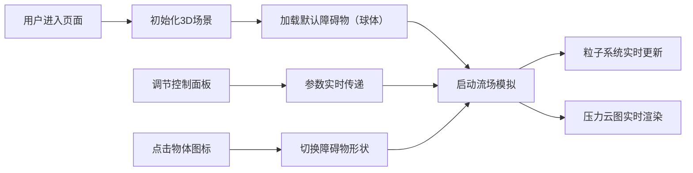

## 1. 产品概述

风洞气流模拟器（Wind Tunnel Airflow Simulator）是一款基于WebGL的3D交互式教学应用，帮助学员直观理解气流绕过不同形状物体时的压力分布与速度变化。应用通过实时粒子系统和压力云图可视化，为教育和工业培训提供沉浸式的风洞实验体验。

- **核心价值**：将抽象的流体力学概念转化为直观的3D可视化体验，降低学习门槛
- **目标用户**：航空航天专业学生、工业培训学员、物理教育工作者
- **技术特色**：纯前端WebGL实现，无需安装，浏览器即可运行

## 2. 核心功能

### 2.1 功能模块

1. **3D风洞场景**：半透明风洞管道、参考网格地面、OrbitControls相机交互
2. **流场粒子可视化**：500+发光粒子沿流线运动，速度映射为颜色变化
3. **压力云图渲染**：障碍物表面实时压力分布彩色网格
4. **交互控制面板**：风速、物体角度、粒子密度调节
5. **预设物体管理**：球体、方体、机翼截面三种障碍物切换

### 2.2 页面详情

| 页面名称 | 模块名称 | 功能描述 |
|---------|---------|---------|
| 主页面 | 3D场景画布 | 全屏风洞场景，支持鼠标交互（旋转/缩放/平移） |
| 主页面 | 右侧控制面板 | 风速滑块、角度滑块、粒子密度下拉、重置按钮 |
| 主页面 | 物体选择器 | 地面上三个半透明图标，点击切换测试物体 |
| 主页面 | 粒子系统 | 500个发光粒子，沿速度场运动，颜色随速度变化 |
| 主页面 | 压力云图 | 障碍物表面顶点着色，实时反映压力分布 |

## 3. 核心流程

**用户操作流程**：
1. 用户打开应用，看到3D风洞场景，默认球体障碍物，粒子持续流动
2. 用户拖动风速滑块，观察粒子速度和压力云图同步变化
3. 用户旋转物体角度滑块，观察流线和压力分布随角度变化
4. 用户点击地面上的物体图标，切换不同形状的障碍物
5. 用户可通过鼠标旋转/缩放/平移场景，从不同角度观察流场

## 4. 用户界面设计

### 4.1 设计风格

- **整体风格**：深空科技感、工业精密风格
- **主色调**：深空灰背景 #1a1a2e
- **辅色调**：粒子白偏蓝 #e0f0ff、高压红色 #ff4444、低压蓝色 #4444ff
- **色板**：diverging色板（蓝-青-黄-橙-红）用于压力云图
- **字体**：现代无衬线字体，清晰可读
- **交互元素**：半透明毛玻璃控制面板、渐变滑块、微动效过渡

### 4.2 页面设计概览

| 页面模块 | UI元素 | 设计要点 |
|---------|--------|---------|
| 3D场景 | 风洞管道 | 线框+玻璃质感，半透明，线色 #4a4a6a |
| 3D场景 | 粒子系统 | PointsMaterial，大小0.08，白偏蓝发光，高速偏蓝低速偏黄绿 |
| 3D场景 | 压力云图 | 顶点色网格，蓝(低压)→青→黄→橙→红(高压)渐变 |
| 3D场景 | 物体光晕 | LineLoop轮廓线，颜色随压力变化 |
| 控制面板 | 背景 | 毛玻璃效果(backdrop-filter: blur(8px))，rgba(30,30,50,0.8) |
| 控制面板 | 滑块 | 渐变条（蓝到红），圆角，悬停亮度+15%，0.2s过渡 |
| 控制面板 | 按钮 | 半透明深色，圆角12px，悬停微动效 |
| 物体选择器 | 图标 | 圆形/方形/翼形半透明图标，微光效，点击切换 |

### 4.3 响应式设计

- **桌面端**（>768px）：右侧固定280px控制面板，3D场景占满剩余空间
- **移动端**（≤768px）：控制面板折叠为左上角汉堡菜单按钮，点击弹出全屏覆盖面板
- **触控优化**：支持触摸手势操作3D场景

### 4.4 3D场景指引

- **环境**：深空灰背景，无HDRI，简洁科技感
- **光照**：环境光+方向光，突出物体轮廓和压力云图色彩
- **相机**：PerspectiveCamera，OrbitControls带阻尼效果
- **构图**：风洞管道水平居中，相机初始角度45°俯视
- **后处理**：粒子轻微辉光效果，增强视觉冲击力
- **性能**：目标帧率≥45FPS，粒子数动态调整，压力云图更新≤100ms
