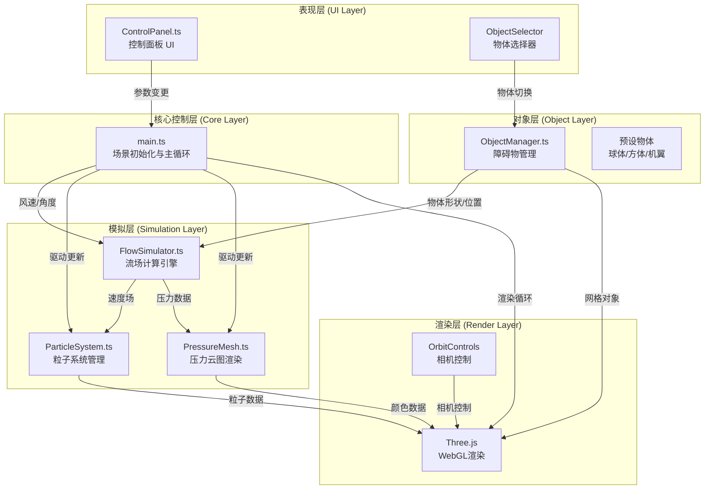

## 1. 架构设计



## 2. 技术描述

- **前端框架**：TypeScript + Three.js + Vite
- **构建工具**：Vite 5.x，启用ES模块热更新(HMR)
- **3D引擎**：Three.js r150+，包含OrbitControls
- **UI组件**：dat.gui（控制面板）+ 原生HTML/CSS（毛玻璃风格面板）
- **语言**：TypeScript 5.x，严格模式，target ES2020
- **样式方案**：原生CSS + CSS变量，实现毛玻璃和渐变效果
- **无后端**：纯前端应用，所有计算在浏览器端完成

### 2.1 依赖清单

| 依赖包 | 版本 | 用途 |
|--------|------|------|
| three | ^0.160.0 | 3D渲染引擎 |
| @types/three | ^0.160.0 | Three.js类型定义 |
| vite | ^5.0.0 | 构建工具 |
| typescript | ^5.3.0 | TypeScript编译器 |
| dat.gui | ^0.7.9 | 控制面板组件 |

## 3. 文件结构

```
auto62/
├── package.json              # 项目依赖与脚本
├── vite.config.js            # Vite构建配置
├── tsconfig.json             # TypeScript配置
├── index.html                # 入口HTML
└── src/
    ├── main.ts               # 入口文件，场景初始化与主循环
    ├── simulation/
    │   ├── FlowSimulator.ts  # 流场计算引擎
    │   ├── ParticleSystem.ts # 粒子系统管理
    │   └── PressureMesh.ts   # 压力云图渲染
    ├── ui/
    │   └── ControlPanel.ts   # 控制面板UI
    └── objects/
        └── ObjectManager.ts  # 障碍物管理
```

### 3.1 数据流向

1. **用户输入 → 控制面板**：ControlPanel接收用户交互（滑块/下拉/按钮）
2. **控制面板 → 流场模拟器**：风速向量、物体角度等参数传递给FlowSimulator
3. **流场模拟器 → 粒子系统**：速度场数据驱动ParticleSystem更新粒子位置
4. **流场模拟器 → 压力云图**：压力数据驱动PressureMesh更新顶点颜色
5. **物体管理器 → 流场模拟器**：物体形状/位置参数用于流场计算
6. **各模块 → Three.js渲染**：所有可视化数据最终通过Three.js渲染到画布

## 4. 核心类与接口

### 4.1 FlowSimulator

```typescript
interface FlowParams {
    windSpeed: Vector3;      // 风速向量
    objectPosition: Vector3; // 物体位置
    objectType: ObjectType;  // 物体类型
    objectRotation: number;  // 物体绕Y轴旋转角度
}

interface GridPoint {
    position: Vector3;       // 网格点位置
    velocity: Vector3;       // 速度向量
    pressure: number;        // 压力值
}

class FlowSimulator {
    params: FlowParams;
    grid: GridPoint[][][];   // 3D速度场网格
    gridSize: { x: number; y: number; z: number };
    
    updateParams(params: Partial<FlowParams>): void;
    compute(): void;         // 每50ms计算一次
    getVelocityAt(pos: Vector3): Vector3;
    getPressureAt(pos: Vector3): number;
    onUpdate(callback: () => void): void;
}
```

### 4.2 ParticleSystem

```typescript
class ParticleSystem {
    count: number;
    particles: THREE.Points;
    positions: Float32Array;
    velocities: Vector3[];
    trailLength: number[];
    
    setCount(count: number): void;    // 动态调整粒子数
    update(deltaTime: number): void;  // 每帧更新粒子位置
    setFlowSimulator(sim: FlowSimulator): void;
    getObject(): THREE.Points;
}
```

### 4.3 PressureMesh

```typescript
class PressureMesh {
    mesh: THREE.Mesh;
    colors: Float32Array;
    
    updatePressure(sim: FlowSimulator): void;  // 更新顶点颜色
    setObjectGeometry(geo: THREE.BufferGeometry): void;
    getObject(): THREE.Mesh;
}
```

### 4.4 ObjectManager

```typescript
type ObjectType = 'sphere' | 'cube' | 'airfoil';

class ObjectManager {
    currentObject: THREE.Group;
    highlight: THREE.LineLoop;
    selectedType: ObjectType;
    
    selectObject(type: ObjectType): void;
    setRotation(angle: number): void;
    getCurrentObject(): THREE.Group;
    onObjectChange(callback: (type: ObjectType) => void): void;
}
```

### 4.5 ControlPanel

```typescript
interface ControlParams {
    windSpeed: number;       // 0-20 m/s
    objectRotation: number;  // 0-360 度
    particleDensity: number; // 100/300/500
    selectedObject: ObjectType;
}

class ControlPanel {
    params: ControlParams;
    gui: dat.GUI;
    
    onChange(callback: (params: ControlParams) => void): void;
    onResetView(callback: () => void): void;
}
```

## 5. 性能优化策略

1. **粒子池化**：预分配粒子数组，避免频繁GC
2. **流场计算降频**：流场计算50ms一次，渲染60fps，解耦计算与渲染
3. **几何复用**：压力云图复用物体几何，仅更新顶点颜色
4. **类型化数组**：使用Float32Array存储粒子位置和颜色
5. **帧率监测**：动态调整粒子数量以维持目标帧率
6. **CSS硬件加速**：控制面板使用transform和opacity优化

## 6. 颜色映射方案

压力云图使用diverging色板（蓝-青-黄-橙-红）：

```
低压(负) → 中压 → 高压(正)
  #3366ff → #33ccff → #ffff66 → #ff9933 → #ff3333
```

粒子速度颜色映射：
```
低速 → 中速 → 高速
#ccff66 → #ffffff → #66aaff
```
